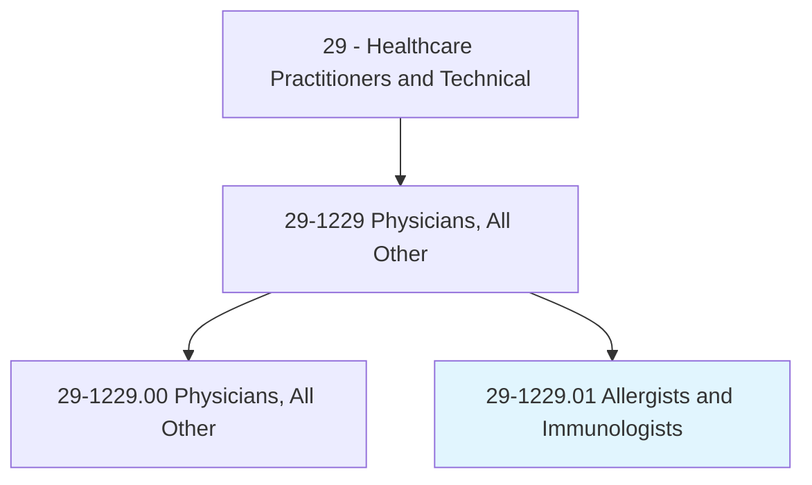
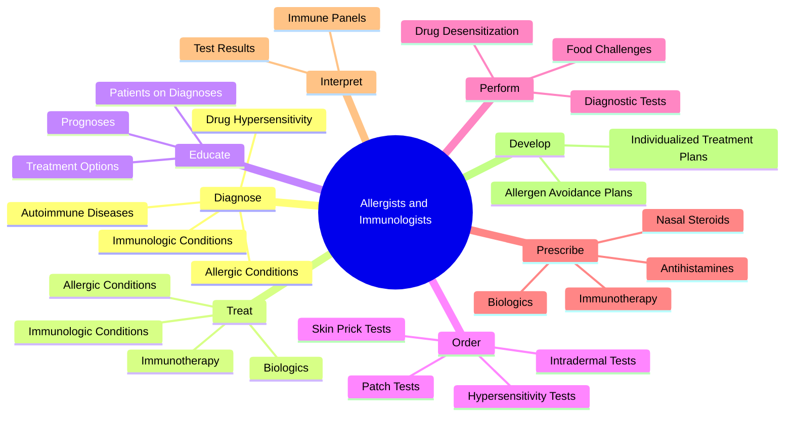
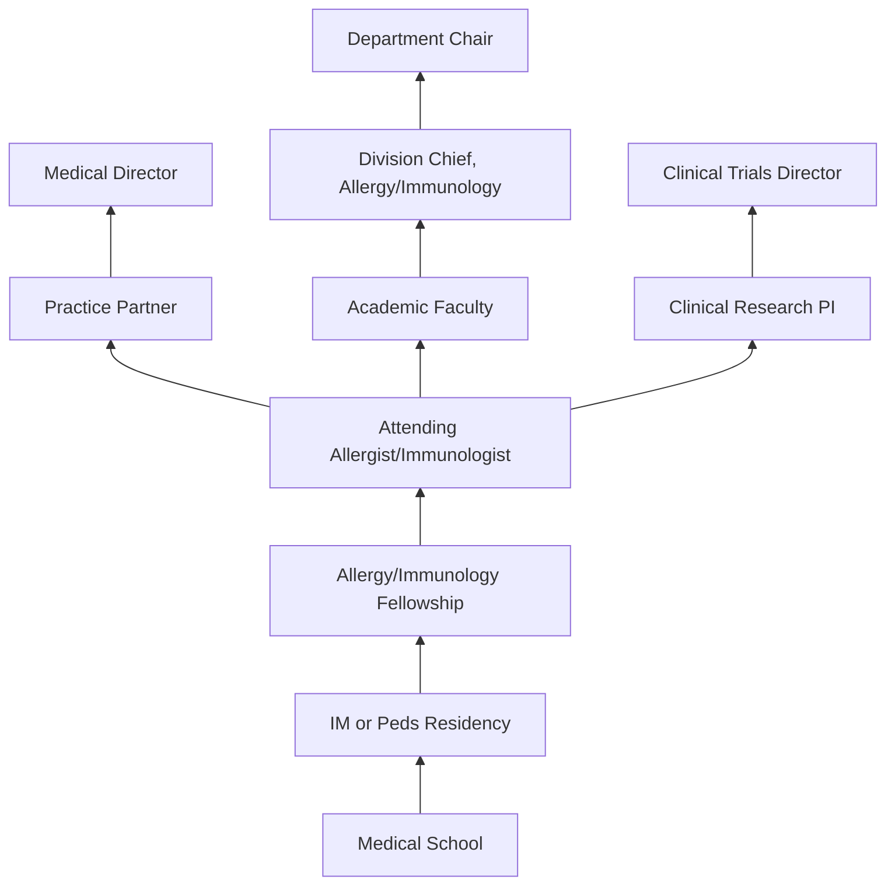
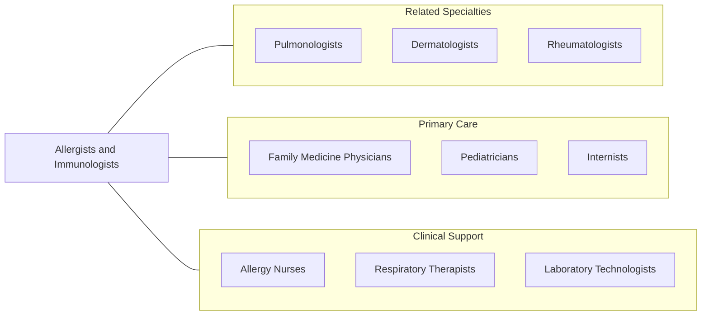

# Allergists and Immunologists

> Diagnose, treat, and help prevent allergic diseases and disease processes affecting the immune system.

## Overview

Allergists and Immunologists are physician specialists who diagnose, treat, and manage diseases involving the immune system. This includes allergic conditions such as asthma, allergic rhinitis, eczema, food allergies, drug allergies, and anaphylaxis, as well as immunological disorders including primary immunodeficiencies, autoimmune diseases, and immune-mediated inflammatory conditions. They serve as consultants to primary care physicians and other specialists for complex allergic and immunological presentations.

These specialists utilize a comprehensive array of diagnostic tools including skin prick testing, intradermal testing, patch testing, serum-specific IgE measurements, pulmonary function testing, and oral food challenges to identify allergic triggers and immune dysfunction. They develop individualized management plans that may include allergen avoidance strategies, pharmacotherapy, allergen immunotherapy (allergy shots or sublingual tablets), and biologic therapies for severe allergic disease.

The field has expanded considerably with advances in molecular diagnostics, component-resolved allergy testing, and targeted biologic therapies. Allergists and immunologists now manage patients with hereditary angioedema, eosinophilic disorders, mast cell diseases, and complex drug hypersensitivity reactions, making the specialty increasingly relevant to modern precision medicine approaches.

## Classification Hierarchy

## Key Statistics

| Metric | Value |
|--------|-------|
| SOC Code | 29-1229.01 |
| Median Annual Salary | $274,390 |
| Employment | ~5,000 |
| Projected Growth | 3% (2022-2032) |
| Job Zone | 5 (Extensive Preparation) |
| Category | [Healthcare Practitioners](/occupations/HealthcarePractitioners) |
| Core Tasks | 56 |
| Source | O*NET |

## Core Tasks

### diagnose.AllergicConditions

Allergists identify allergic triggers and immune dysfunction through systematic evaluation.

**Actions:**
- `diagnose.AllergicConditions.using.SkinPrickTesting` - Cutaneous allergy assessment
- `diagnose.ImmunologicConditions.using.ImmunePanels` - Immune evaluation
- `diagnose.FoodAllergies.using.OralFoodChallenges` - Definitive food testing
- `diagnose.DrugHypersensitivity.using.GradedChallenges` - Drug allergy assessment

### treat.AllergicConditions

Allergists deliver targeted therapies for allergic and immunological diseases.

**Actions:**
- `treat.AllergicConditions.using.AllergenImmunotherapy` - Desensitization therapy
- `treat.ImmunologicConditions.using.BiologicTherapies` - Targeted biologics
- `treat.Anaphylaxis.using.EmergencyProtocols` - Acute intervention
- `treat.PrimaryImmunodeficiency.using.ImmunoglobulinReplacement` - Immune support

### educate.Patients

Allergists educate patients on disease management and prevention.

**Actions:**
- `educate.Patients.about.Diagnoses` - Disease education
- `educate.Patients.about.Prognoses` - Outcome expectations
- `educate.Patients.about.Treatments` - Therapy options
- `educate.Patients.regarding.AllergenAvoidance` - Prevention strategies

## Practice Settings

| Setting | Description |
|---------|-------------|
| Outpatient Allergy Clinics | Primary practice setting |
| Hospital Consultation Services | Inpatient allergy/immunology consults |
| Academic Medical Centers | Teaching, research, and complex cases |
| Asthma Centers | Specialized asthma management |
| Immunodeficiency Clinics | Primary immune disorder management |
| Clinical Research Centers | Drug and immunotherapy trials |
| Pediatric Allergy Clinics | Childhood allergy management |
| Occupational Health | Workplace allergen evaluation |

## Skills & Competencies

### Technical Skills
- **Allergy Skin Testing** - Expert
- **Immunology Diagnostics** - Expert
- **Pulmonary Function Testing** - Expert
- **Allergen Immunotherapy** - Expert
- **Biologic Therapy Management** - Advanced
- **Oral Food Challenges** - Expert
- **Drug Desensitization Protocols** - Advanced
- **Spirometry Interpretation** - Expert

### Soft Skills
- **Patient Education** - Critical
- **Diagnostic Reasoning** - Critical
- **Communication** - Essential
- **Detail Orientation** - Essential
- **Empathy** - Essential
- **Interdisciplinary Collaboration** - Essential
- **Research Acumen** - Important

## Education & Training

| Requirement | Details |
|-------------|---------|
| Undergraduate | 4-year bachelor's degree (pre-med) |
| Medical School | 4-year MD or DO program |
| Residency | 3 years Internal Medicine or Pediatrics |
| Fellowship | 2 years Allergy & Immunology |
| Total Training | 13 years post-high school |
| Licensure | State medical license required |
| Board Certification | ABAI (American Board of Allergy & Immunology) |
| Continuing Education | MOC requirements per ABAI |

## Certifications

| Certification | Description |
|---------------|-------------|
| ABAI Board Certification | Primary allergy/immunology certification |
| ABIM Internal Medicine | Prerequisite for adult pathway |
| ABP Pediatrics | Prerequisite for pediatric pathway |
| ACLS | Advanced Cardiovascular Life Support |
| BLS | Basic Life Support |
| FAAAAI | Fellow of the AAAAI |
| FACAAI | Fellow of ACAAI |

## Career Progression

## Specializations

| Focus Area | Description |
|------------|-------------|
| Pediatric Allergy | Childhood food allergy, asthma, eczema |
| Clinical Immunology | Primary immunodeficiency management |
| Drug Allergy | Drug hypersensitivity and desensitization |
| Occupational Allergy | Workplace allergen exposure |
| Asthma Management | Severe and refractory asthma |
| Food Allergy | Oral immunotherapy and food challenges |
| Eosinophilic Disorders | EoE and eosinophilic GI disease |
| Hereditary Angioedema | HAE management and prevention |

## Technology & Tools

| Technology | Purpose |
|------------|---------|
| Skin Prick Testing Devices | Standardized allergen application |
| Spirometry Equipment | Pulmonary function measurement |
| ImmunoCAP / ISAC Systems | Serum-specific IgE and component testing |
| Peak Flow Meters | Asthma monitoring |
| Nebulizers & Spacers | Medication delivery devices |
| Patch Testing Systems (T.R.U.E. Test) | Contact dermatitis evaluation |
| Electronic Health Records | Documentation and allergy tracking |
| FeNO Analyzers | Exhaled nitric oxide measurement |

## Related Occupations

## Industries

- [Physician Offices](/industries/Healthcare/PhysicianOffices) - Allergy Practice
- [Hospitals](/industries/Healthcare/Hospitals/index) - Hospital Consultation
- [Academic Medical Centers](/industries/Healthcare/Hospitals/Teaching) - Research & Teaching
- [Ambulatory Care](/industries/Healthcare/AmbulatoryHealthCare) - Outpatient Clinics
- [Pharmaceutical Industry](/industries/Manufacturing/ChemicalManufacturing/Pharmaceutical) - Research & Trials

## Departments

This occupation typically works in:
- [Allergy & Immunology](/departments/AllergyImmunology)
- [Pulmonary Medicine](/departments/PulmonaryMedicine)
- [Pediatric Allergy](/departments/PediatricAllergy)
- [Clinical Immunology](/departments/ClinicalImmunology)
- [Clinical Research](/departments/ClinicalResearch)

---

*Source: O*NET 29-1229.01 - ONETOccupation*
