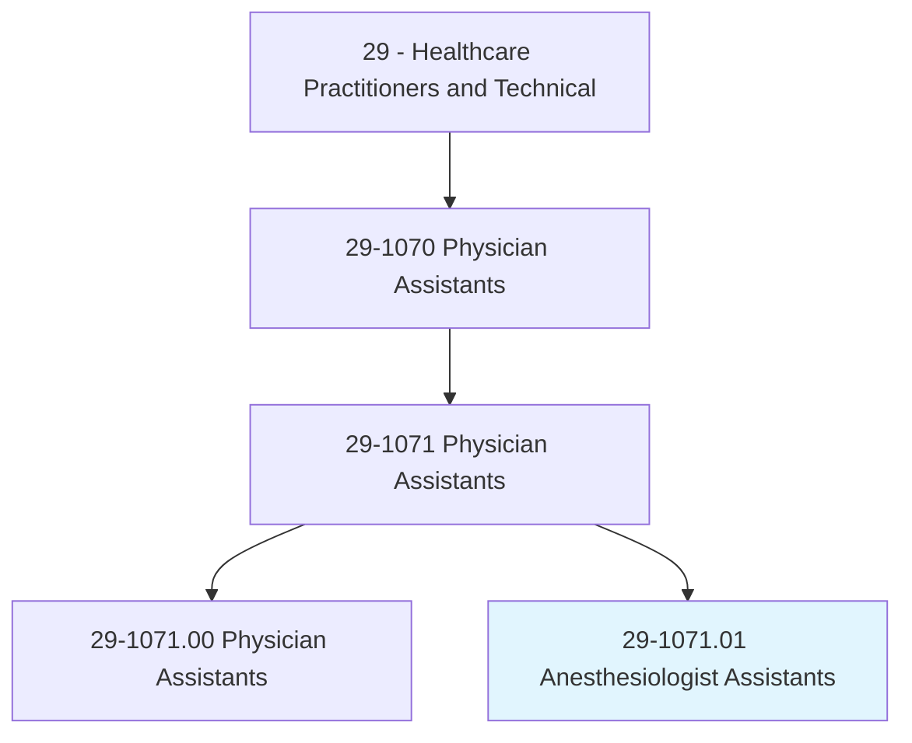
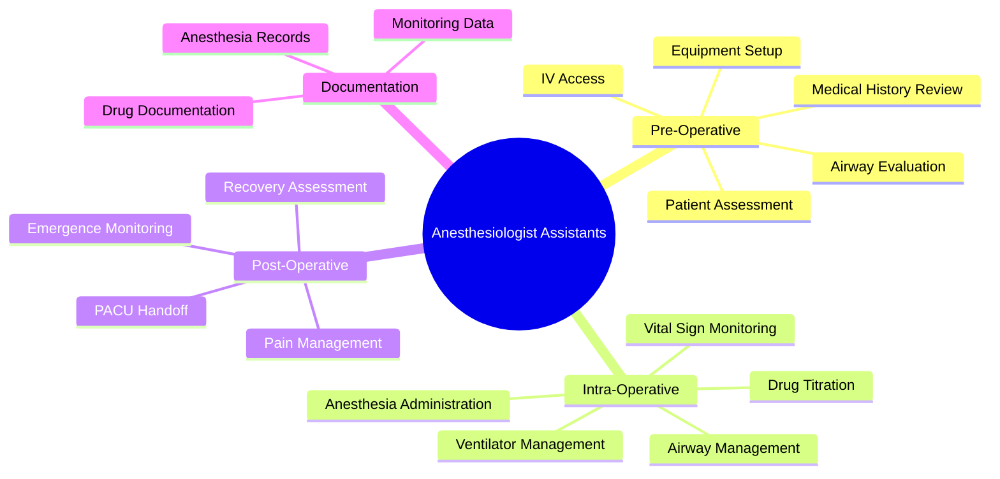
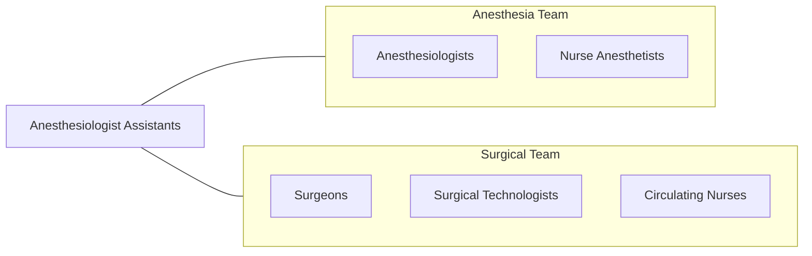
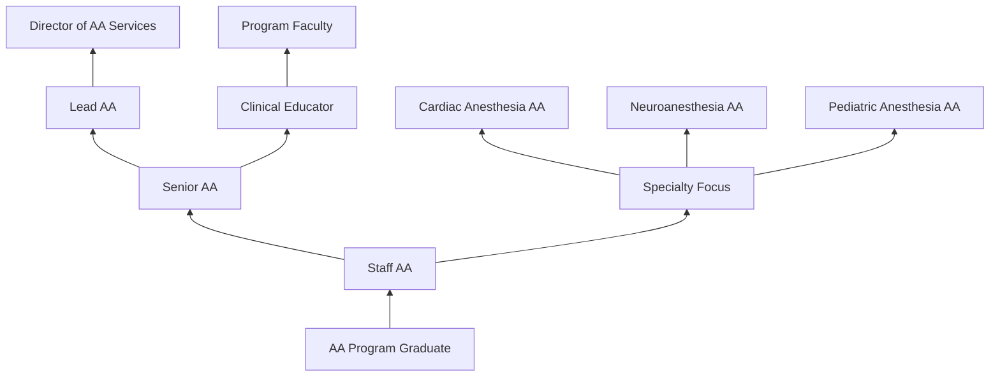

# Anesthesiologist Assistants

> Assist anesthesiologists in the administration of anesthesia for surgical and non-surgical procedures. Monitor patient status and provide patient care during surgical treatment.

## Overview

Anesthesiologist Assistants (AAs) are highly skilled healthcare professionals who work under the direction of licensed anesthesiologists. They assist in developing and implementing anesthesia care plans, administer anesthesia drugs, manage patient airways, and monitor vital signs during surgical procedures. AAs are trained specifically in anesthesiology and work exclusively in the anesthetizing environment.

## Classification Hierarchy

## Key Statistics

| Metric | Value |
|--------|-------|
| SOC Code | 29-1071.01 |
| Job Zone | 5 (Extensive Preparation) |
| Category | [Healthcare Practitioners](/occupations/HealthcarePractitioners) |
| Practice Model | Team-based with Anesthesiologist |
| Source | O*NET |

## Core Tasks

### administer.Anesthesia

AAs deliver anesthetic agents under physician supervision.

**Actions:**
- `administer.InductionAgents` - Initiate anesthesia
- `administer.MaintenanceAnesthesia` - Continue anesthesia
- `titrate.AnestheticDrugs` - Adjust dosing
- `administer.Neuromuscular.Blockers` - Manage paralysis

### manage.Airway

AAs maintain patient airway throughout procedures.

**Actions:**
- `perform.MaskVentilation` - Manual ventilation
- `insert.LaryngealMaskAirway` - LMA placement
- `assist.Intubation` - Endotracheal tube placement
- `manage.DifficultAirway` - Handle complex cases

### monitor.PatientStatus

AAs continuously assess patient condition.

**Actions:**
- `monitor.VitalSigns` - Track hemodynamics
- `monitor.Oxygenation` - Assess oxygen status
- `monitor.Ventilation` - Evaluate breathing
- `monitor.AnestheticDepth` - Assess consciousness level
- `monitor.NeuromuscularFunction` - Track paralysis

## Skills & Competencies

### Technical Skills
- **Anesthesia Administration** - Expert
- **Airway Management** - Expert
- **Patient Monitoring** - Expert
- **IV/Central Line Management** - Advanced
- **Ventilator Management** - Expert
- **Emergency Response** - Expert
- **Pharmacology** - Expert

### Soft Skills
- **Attention to Detail** - Critical
- **Crisis Management** - Critical
- **Team Communication** - Essential
- **Rapid Decision Making** - Critical
- **Composure Under Pressure** - Essential

## Related Occupations

## Industries

- [Hospitals](/industries/Healthcare/Hospitals/index) - Operating Rooms
- [Ambulatory Surgery Centers](/industries/ASC) - Outpatient Surgery
- [Pain Management Centers](/industries/PainManagement) - Interventional Procedures
- [Academic Medical Centers](/industries/AcademicMedical) - Teaching Hospitals

## Career Progression

## Education & Training

| Requirement | Details |
|-------------|---------|
| Typical Education | Master's degree from accredited AA program |
| Prerequisites | Bachelor's degree with pre-med sciences + healthcare experience |
| Program Length | 24-28 months |
| Clinical Training | Extensive rotations in anesthesia |
| Certification | NCCAA Certification required |
| Licensure | State-dependent; currently ~18 states |

## Certifications

| Certification | Description |
|---------------|-------------|
| AA-C | Anesthesiologist Assistant - Certified |
| ACLS | Advanced Cardiac Life Support |
| BLS | Basic Life Support |
| PALS | Pediatric Advanced Life Support (often required) |

## Practice Settings

| Setting | Description |
|---------|-------------|
| General OR | All surgical specialties |
| Cardiac Surgery | Heart procedures |
| Neurosurgery | Brain/spine procedures |
| Pediatrics | Children's surgery |
| Obstetrics | Labor and delivery |
| Trauma | Emergency surgery |
| Outpatient | Same-day surgery |

## Departments

This occupation typically works in:
- [Anesthesiology](/departments/Anesthesiology)
- [Operating Room](/departments/OperatingRoom)
- [Ambulatory Surgery](/departments/AmbulatorySurgery)
- [Pain Management](/departments/PainManagement)

---

*Source: O*NET 29-1071.01 - ONETOccupation*
