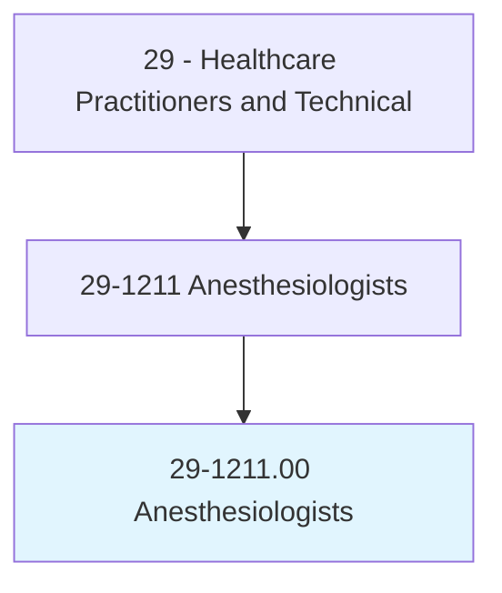
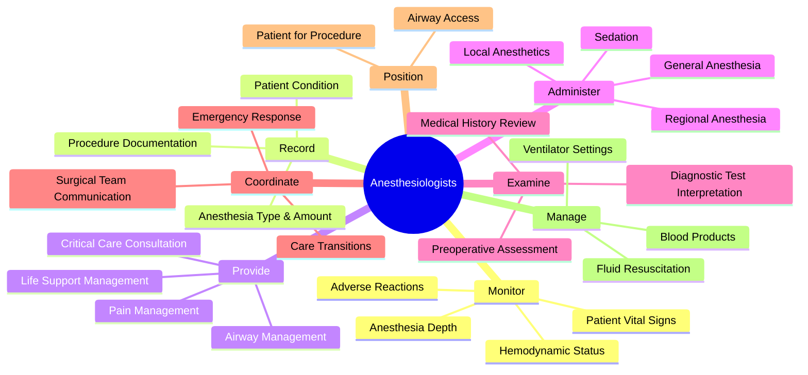
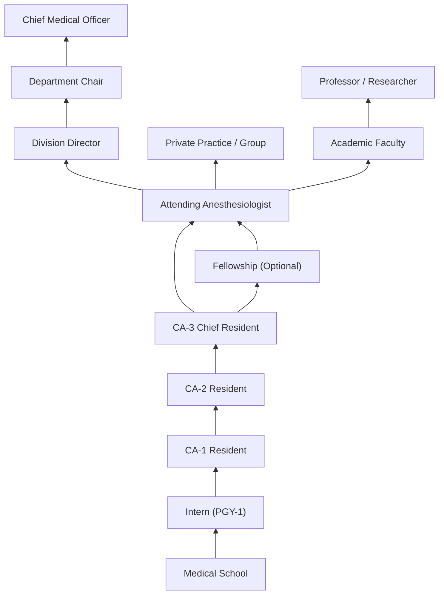
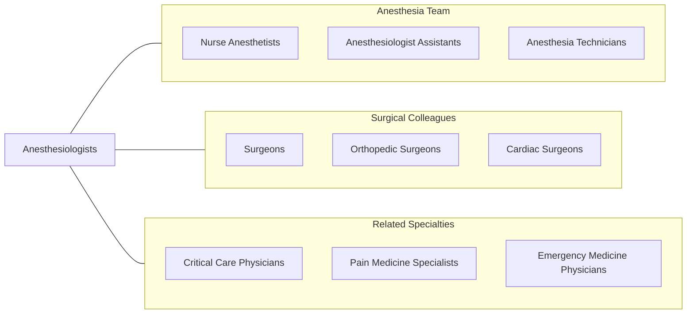

# Anesthesiologists

> Administer anesthetics and analgesics for pain management prior to, during, or after surgery.

## Overview

Anesthesiologists are physician specialists who administer anesthesia and manage pain before, during, and after surgical procedures. They are responsible for maintaining patient vital functions throughout surgery, including breathing, heart rate, blood pressure, and body temperature. Their expertise extends beyond the operating room to include preoperative assessment, postoperative pain management, critical care medicine, and chronic pain treatment.

As perioperative medicine specialists, anesthesiologists evaluate patients before surgery to assess anesthetic risk, develop individualized anesthesia plans, and ensure patient safety during procedures ranging from minor outpatient surgeries to complex multi-organ transplants. They are experts in pharmacology, physiology, and resuscitation, making them essential members of any surgical team and leaders in emergency medical response.

The field of anesthesiology has evolved significantly with advances in monitoring technology, pharmacological agents, and regional anesthesia techniques. Modern anesthesiologists employ ultrasound-guided nerve blocks, advanced hemodynamic monitoring, and point-of-care testing to deliver precise, patient-tailored anesthetic care while minimizing risks and improving recovery outcomes.

## Classification Hierarchy

## Key Statistics

| Metric | Value |
|--------|-------|
| SOC Code | 29-1211.00 |
| Median Annual Salary | $302,970 |
| Employment | ~33,000 |
| Projected Growth | 4% (2022-2032) |
| Job Zone | 5 (Extensive Preparation) |
| Category | [Healthcare Practitioners](/occupations/HealthcarePractitioners) |
| Core Tasks | 86 |
| Source | O*NET |

## Core Tasks

### monitor.Patient

Anesthesiologists continuously monitor patient status throughout procedures.

**Actions:**
- `monitor.Patient.before.AnesthesiaInduction` - Preanesthetic assessment
- `monitor.Patient.during.SurgicalProcedure` - Intraoperative vigilance
- `monitor.AdverseReactions.to.AnestheticAgents` - Detect complications
- `monitor.HemodynamicStatus.using.InvasiveMonitoring` - Track vital parameters

### record.AnesthesiaDetails

Anesthesiologists maintain detailed procedural records.

**Actions:**
- `record.Type.of.AnesthesiaAdministered` - Document anesthetic technique
- `record.Amount.of.AnestheticAgents` - Track drug dosages
- `record.PatientCondition.throughout.Procedure` - Continuous documentation
- `record.Complications.during.AnesthesiaCare` - Document adverse events

### provide.LifeSupportManagement

Anesthesiologists provide advanced life support and airway management.

**Actions:**
- `provide.LifeSupport.for.EmergencySurgery` - Emergency resuscitation
- `provide.AirwayManagement.for.DifficultAirways` - Advanced techniques
- `provide.MedicalCare.in.CriticalCareSettings` - ICU consultation
- `provide.PainManagement.using.MultimodalApproaches` - Comprehensive pain control

### administer.Anesthesia

Anesthesiologists select and deliver appropriate anesthetic techniques.

**Actions:**
- `administer.GeneralAnesthesia.using.IntravenousAgents` - IV induction
- `administer.RegionalAnesthesia.using.SpinalTechnique` - Neuraxial blockade
- `administer.Sedation.for.MinimallyInvasiveProcedures` - Conscious sedation
- `administer.NerveBlocks.using.UltrasoundGuidance` - Regional techniques

## Practice Settings

| Setting | Description |
|---------|-------------|
| Hospital Operating Rooms | Primary surgical anesthesia delivery |
| Ambulatory Surgery Centers | Outpatient anesthesia services |
| Labor and Delivery | Obstetric anesthesia and analgesia |
| Cardiac Catheterization Labs | Sedation for cardiac procedures |
| Endoscopy Suites | Procedural sedation |
| Pain Management Clinics | Chronic pain treatment |
| Intensive Care Units | Critical care medicine |
| Trauma Centers | Emergency anesthesia and resuscitation |

## Skills & Competencies

### Technical Skills
- **Pharmacology** - Expert
- **Airway Management** - Expert
- **Hemodynamic Monitoring** - Expert
- **Regional Anesthesia Techniques** - Expert
- **Critical Care Medicine** - Advanced
- **Ultrasound-Guided Procedures** - Advanced
- **Ventilator Management** - Advanced
- **Point-of-Care Testing** - Advanced

### Soft Skills
- **Decision Making Under Pressure** - Critical
- **Vigilance & Attention to Detail** - Critical
- **Crisis Management** - Critical
- **Communication** - Essential
- **Teamwork** - Essential
- **Adaptability** - Essential
- **Leadership** - Important

## Education & Training

| Requirement | Details |
|-------------|---------|
| Undergraduate | 4-year bachelor's degree (pre-med) |
| Medical School | 4-year MD or DO program |
| Residency | 4 years in Anesthesiology (after PGY-1 year) |
| Fellowship | 1 year for subspecialization (optional) |
| Total Training | 12-13 years post-high school |
| Licensure | State medical license required |
| Board Certification | American Board of Anesthesiology |
| Continuing Education | 250 CME credits per 10-year cycle (ABA MOCA) |

## Certifications

| Certification | Description |
|---------------|-------------|
| ABA Diplomate | American Board of Anesthesiology primary certification |
| ABA Critical Care | Subspecialty in critical care medicine |
| ABA Pain Medicine | Subspecialty in pain management |
| ABA Cardiac Anesthesia | Subspecialty in adult cardiothoracic anesthesia |
| ABA Pediatric Anesthesia | Subspecialty in pediatric anesthesiology |
| ABA Neurocritical Care | Subspecialty in neurocritical care |
| ACLS | Advanced Cardiovascular Life Support |
| PALS | Pediatric Advanced Life Support |

## Career Progression

## Specializations

| Subspecialty | Focus Area |
|-------------|------------|
| Cardiac Anesthesiology | Open heart, ECMO, transplant cases |
| Pediatric Anesthesiology | Neonatal and pediatric surgical patients |
| Neuroanesthesiology | Neurosurgical and neurointerventional cases |
| Obstetric Anesthesiology | Labor analgesia and cesarean anesthesia |
| Regional & Acute Pain | Nerve blocks and acute pain protocols |
| Critical Care Medicine | Surgical and medical ICU management |
| Pain Medicine | Chronic pain interventional procedures |
| Transplant Anesthesiology | Multi-organ transplant cases |

## Technology & Tools

| Technology | Purpose |
|------------|---------|
| Anesthesia Workstations (Drager, GE) | Gas delivery and ventilation |
| Physiologic Monitors | Vital sign surveillance |
| Ultrasound (Point-of-Care) | Nerve blocks, vascular access, cardiac assessment |
| Arterial Line Transducers | Invasive blood pressure monitoring |
| Bispectral Index (BIS) Monitor | Anesthesia depth monitoring |
| Transesophageal Echocardiography | Intraoperative cardiac imaging |
| Infusion Pumps (TCI) | Target-controlled drug delivery |
| Electronic Anesthesia Records (AIMS) | Automated documentation |

## Related Occupations

## Industries

- [Hospitals](/industries/Healthcare/Hospitals/index) - Primary Employment
- [Ambulatory Surgery Centers](/industries/Healthcare/AmbulatoryHealthCare) - Outpatient Surgery
- [Physician Offices](/industries/Healthcare/PhysicianOffices) - Pain Clinics
- [Academic Medical Centers](/industries/Healthcare/Hospitals/Teaching) - Teaching & Research
- [Veterans Affairs](/industries/Government/Federal) - VA Healthcare System
- [Military](/industries/Government/Military) - Combat & Field Anesthesia

## Departments

This occupation typically works in:
- [Anesthesiology](/departments/Anesthesiology)
- [Perioperative Services](/departments/PerioperativeServices)
- [Surgical Services](/departments/SurgicalServices)
- [Critical Care](/departments/CriticalCare)
- [Pain Management](/departments/PainManagement)
- [Obstetric Anesthesia](/departments/ObstetricAnesthesia)

---

*Source: O*NET 29-1211.00 - ONETOccupation*
