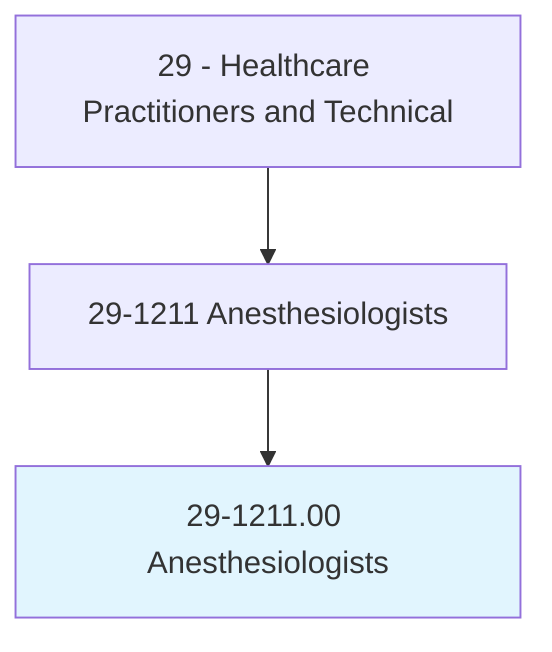
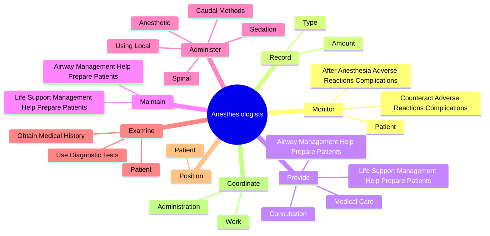
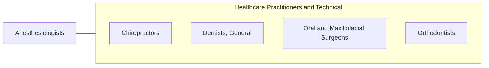

# Anesthesiologists

> Administer anesthetics and analgesics for pain management prior to, during, or after surgery.

## Overview

Anesthesiologists is classified under Healthcare Practitioners and Technical (SOC 29). Administer anesthetics and analgesics for pain management prior to, during, or after surgery.

## Classification Hierarchy

## Key Statistics

| Metric | Value |
|--------|-------|
| SOC Code | 29-1211.00 |
| Category | [Healthcare Practitioners and Technical](/occupations/HealthcarePractitioners) |
| Task Count | 86 |
| Source | O*NET |

## Core Tasks

### monitor.Patient

Anesthesiologists monitor patient as part of their core responsibilities.

**Actions:**
- `monitor.Patient.before`
- `monitor.AfterAnesthesiaAdverseReactionsComplications`
- `monitor.CounteractAdverseReactionsComplications`

### record.Type

Anesthesiologists record type as part of their core responsibilities.

**Actions:**
- `record.Type.of.AnesthesiaConditionThroughoutProcedure`
- `record.Type.of.PatientConditionThroughoutProcedure`
- `record.Amount.of.AnesthesiaConditionThroughoutProcedure`
- `record.Amount.of.PatientConditionThroughoutProcedure`

### provide.LifeSupportManagementHelpPreparePatients

Anesthesiologists provide life support management help prepare patients as part of their core responsibilities.

**Actions:**
- `provide.LifeSupportManagementHelpPreparePatients.for.EmergencySurgery`
- `provide.AirwayManagementHelpPreparePatients.for.EmergencySurgery`
- `provide.MedicalCare.in.Settings`
- `provide.MedicalCare.in.PrescribingMedication`

## Skills & Competencies

### Technical Skills
- **Clinical Skills** - Advanced
- **Diagnostic Procedures** - Advanced
- **Patient Care** - Advanced

### Soft Skills
- **Communication** - Essential
- **Problem Solving** - Essential
- **Critical Thinking** - Important
- **Teamwork** - Important
- **Adaptability** - Important

## Related Occupations

## Industries

This occupation is found across multiple industries. See [Industries](/industries) for sector-specific employment data.

## Career Progression

---

*Source: O*NET 29-1211.00 - ONETOccupation*
