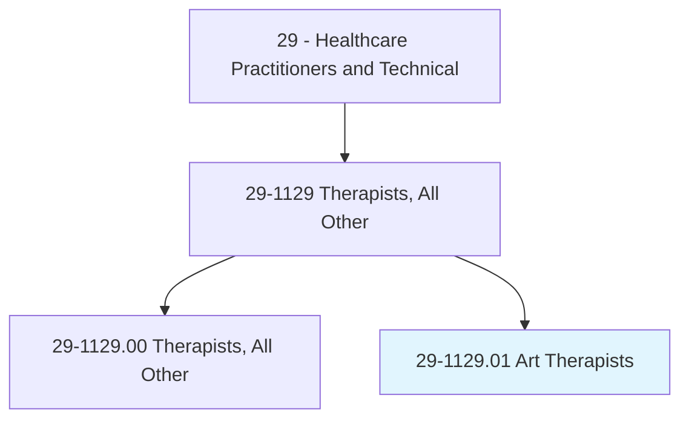
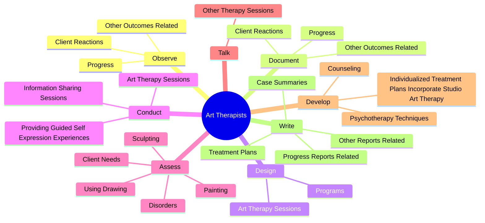
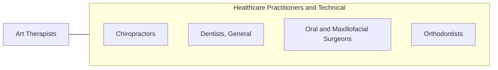

# Art Therapists

> Plan or conduct art therapy sessions or programs to improve clients' physical, cognitive, or emotional well-being.

## Overview

Art Therapists is classified under Healthcare Practitioners and Technical (SOC 29). Plan or conduct art therapy sessions or programs to improve clients' physical, cognitive, or emotional well-being.

## Classification Hierarchy

## Key Statistics

| Metric | Value |
|--------|-------|
| SOC Code | 29-1129.01 |
| Category | [Healthcare Practitioners and Technical](/occupations/HealthcarePractitioners) |
| Task Count | 115 |
| Source | O*NET |

## Core Tasks

### observe.ClientReactions

Art Therapists observe client reactions as part of their core responsibilities.

**Actions:**
- `observe.ClientReactions.to.ArtTherapy`
- `observe.Progress.to.ArtTherapy`
- `observe.OtherOutcomesRelated.to.ArtTherapy`

### document.ClientReactions

Art Therapists document client reactions as part of their core responsibilities.

**Actions:**
- `document.ClientReactions.to.ArtTherapy`
- `document.Progress.to.ArtTherapy`
- `document.OtherOutcomesRelated.to.ArtTherapy`

### design.ArtTherapySessions

Art Therapists design art therapy sessions as part of their core responsibilities.

**Actions:**
- `design.ArtTherapySessions.to.meet.ClientsGoals`
- `design.ArtTherapySessions.to.Objectives`
- `design.Programs.to.meet.ClientsGoals`
- `design.Programs.to.Objectives`

## Skills & Competencies

### Technical Skills
- **Clinical Skills** - Advanced
- **Diagnostic Procedures** - Advanced
- **Patient Care** - Advanced

### Soft Skills
- **Communication** - Essential
- **Problem Solving** - Essential
- **Critical Thinking** - Important
- **Teamwork** - Important
- **Adaptability** - Important

## Related Occupations

## Industries

This occupation is found across multiple industries. See [Industries](/industries) for sector-specific employment data.

## Career Progression

---

*Source: O*NET 29-1129.01 - ONETOccupation*
