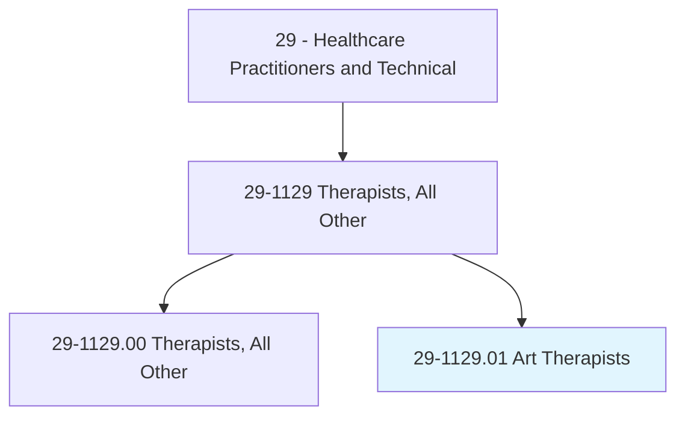
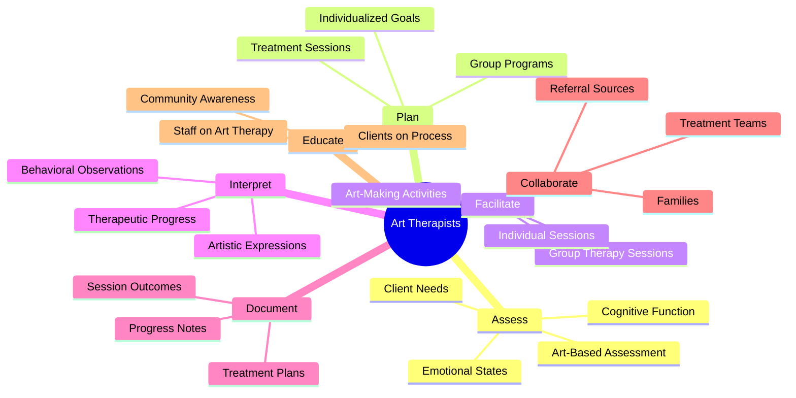
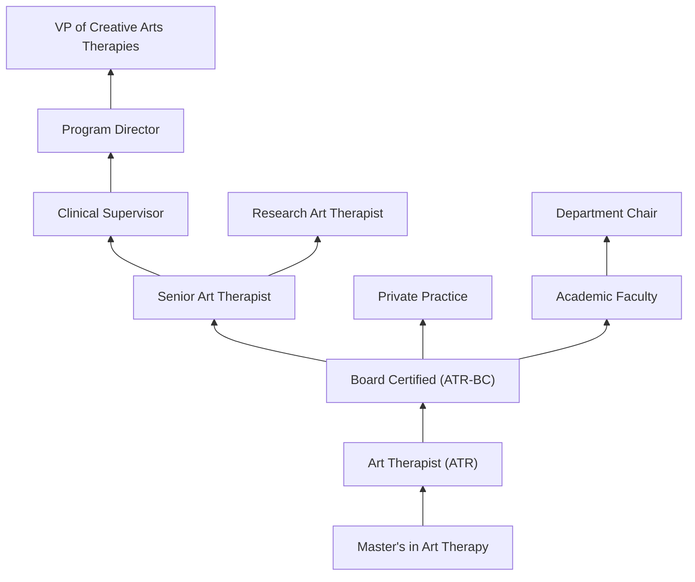
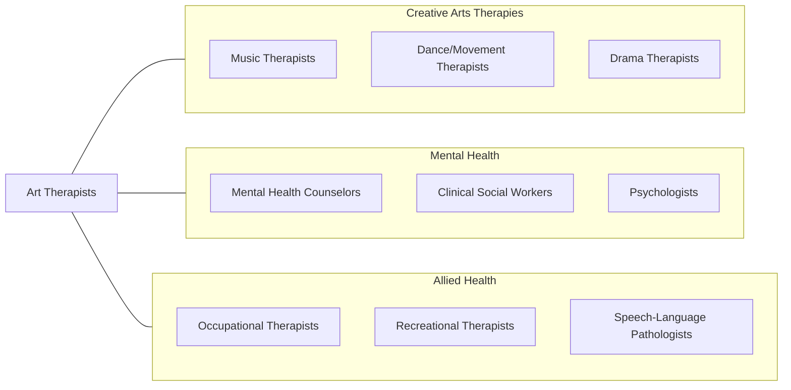

# Art Therapists

> Plan and conduct art therapy sessions or programs to improve clients' physical, cognitive, or emotional well-being.

## Overview

Art Therapists are licensed mental health professionals who use creative art-making processes to help individuals explore emotions, develop self-awareness, cope with stress, boost self-esteem, and work on social skills. They integrate psychotherapeutic theory with understanding of the psychological and healing properties of visual art to provide a unique therapeutic approach for clients across the lifespan, including children, adolescents, adults, and older adults.

These practitioners assess clients through both clinical interviews and observation of their artistic expressions, using art as a diagnostic and treatment tool. They work with individuals experiencing anxiety, depression, trauma, grief, substance abuse, cognitive impairment, developmental disabilities, and chronic illness. Art therapy is particularly effective for clients who have difficulty expressing themselves verbally, including trauma survivors, children, and individuals with neurodevelopmental conditions.

Art therapists practice in diverse settings and often work as part of multidisciplinary treatment teams alongside psychologists, psychiatrists, social workers, and occupational therapists. The field has grown substantially as research validates the neurobiological mechanisms underlying creative expression's therapeutic effects, including stress hormone reduction, neural pathway activation, and emotion regulation enhancement.

## Classification Hierarchy

## Key Statistics

| Metric | Value |
|--------|-------|
| SOC Code | 29-1129.01 |
| Median Annual Salary | $52,520 |
| Employment | ~6,000 |
| Projected Growth | 8% (2022-2032) |
| Job Zone | 5 (Extensive Preparation) |
| Category | [Healthcare Practitioners](/occupations/HealthcarePractitioners) |
| Core Tasks | 35+ |
| Source | O*NET |

## Core Tasks

### assess.ClientNeeds

Art Therapists evaluate clients through clinical and art-based methods.

**Actions:**
- `assess.ClientNeeds.using.ClinicalInterview` - Intake assessment
- `assess.EmotionalStates.through.ArtExpression` - Art-based evaluation
- `assess.CognitiveFunction.using.DrawingAssessments` - Cognitive screening
- `assess.TraumaHistory.through.ProjectiveArtTasks` - Trauma assessment

### plan.TherapySessions

Art Therapists design individualized creative therapeutic interventions.

**Actions:**
- `plan.TreatmentSessions.for.IndividualClients` - Individual planning
- `plan.GroupPrograms.for.SharedTherapeuticGoals` - Group design
- `plan.ArtActivities.based.on.ClinicalObjectives` - Activity selection
- `develop.TreatmentPlans.with.MeasurableGoals` - Goals documentation

### facilitate.ArtMakingActivities

Art Therapists guide clients through creative therapeutic processes.

**Actions:**
- `facilitate.ArtMaking.for.EmotionalExpression` - Expressive therapy
- `facilitate.GroupTherapy.using.CollaborativeArtProjects` - Group work
- `interpret.ArtisticExpressions.for.ClinicalInsight` - Art interpretation
- `document.TherapeuticProgress.in.ClinicalRecords` - Progress documentation

## Practice Settings

| Setting | Description |
|---------|-------------|
| Mental Health Centers | Outpatient counseling and therapy |
| Hospitals (Psychiatric Units) | Inpatient psychiatric care |
| Schools | Student counseling and special education |
| Rehabilitation Centers | Physical and cognitive rehabilitation |
| Nursing Homes | Geriatric cognitive stimulation |
| Veterans Affairs | Military trauma and PTSD treatment |
| Correctional Facilities | Inmate mental health services |
| Private Practice | Independent art therapy practice |

## Skills & Competencies

### Technical Skills
- **Art Therapy Techniques** - Expert
- **Psychotherapeutic Theory** - Advanced
- **Art-Based Assessment** - Expert
- **Group Facilitation** - Advanced
- **Crisis Intervention** - Advanced
- **Clinical Documentation** - Advanced
- **Diverse Art Media Proficiency** - Expert
- **Developmental Psychology** - Advanced

### Soft Skills
- **Empathy & Compassion** - Critical
- **Creative Thinking** - Critical
- **Verbal & Nonverbal Communication** - Essential
- **Cultural Sensitivity** - Essential
- **Patience** - Essential
- **Observational Skills** - Critical
- **Flexibility** - Important

## Education & Training

| Requirement | Details |
|-------------|---------|
| Undergraduate | Bachelor's degree (art, psychology, or related field) |
| Graduate | Master's degree in Art Therapy (2-3 years, 60+ credits) |
| Clinical Hours | 600+ supervised direct client contact hours |
| Practicum | 100+ hours during graduate program |
| Licensure | Varies by state (LCAT, LPAT, or equivalent) |
| Board Certification | ATR (Registered Art Therapist) through ATCB |
| Continuing Education | Typically 20-40 hours per renewal cycle |

## Certifications

| Certification | Description |
|---------------|-------------|
| ATR | Art Therapist Registered (ATCB) |
| ATR-BC | Art Therapist Registered - Board Certified |
| LCAT | Licensed Creative Arts Therapist (state-specific) |
| LPAT | Licensed Professional Art Therapist |
| NCC | National Certified Counselor (optional) |
| BLS | Basic Life Support |

## Career Progression

## Specializations

| Focus Area | Description |
|------------|-------------|
| Trauma & PTSD | Art-based trauma processing |
| Child & Adolescent | Youth mental health through art |
| Geriatric Art Therapy | Dementia and aging-related cognitive care |
| Oncology Art Therapy | Cancer patient emotional support |
| Substance Abuse | Addiction recovery and relapse prevention |
| Autism Spectrum | Neurodiverse client engagement |
| Forensic Art Therapy | Correctional and forensic populations |
| Medical Art Therapy | Chronic illness and pain management |

## Technology & Tools

| Technology | Purpose |
|------------|---------|
| Art Materials (Paint, Clay, Collage) | Primary therapeutic media |
| Digital Art Tablets | Digital art creation |
| Electronic Health Records | Clinical documentation |
| Telehealth Platforms | Remote art therapy sessions |
| Art-Based Assessment Tools (PPAT, DAS) | Standardized art evaluations |
| Photography & Documentation Equipment | Session recording and progress |
| Sensory Integration Materials | Multi-sensory therapeutic tools |

## Related Occupations

## Industries

- [Mental Health Centers](/industries/Healthcare/MentalHealth) - Primary Employment
- [Hospitals](/industries/Healthcare/Hospitals/index) - Psychiatric Units
- [Schools](/industries/Education/ElementarySecondary) - Student Services
- [Nursing Facilities](/industries/Healthcare/NursingCare) - Geriatric Care
- [Rehabilitation Centers](/industries/Healthcare/RehabilitationCenters) - Rehab Programs
- [Government](/industries/PublicAdministration) - VA and Corrections

## Departments

This occupation typically works in:
- Creative Arts Therapy
- Behavioral Health
- Rehabilitation Services
- Child & Adolescent Services
- Geriatric Services

---

*Source: O*NET 29-1129.01 - ONETOccupation*
