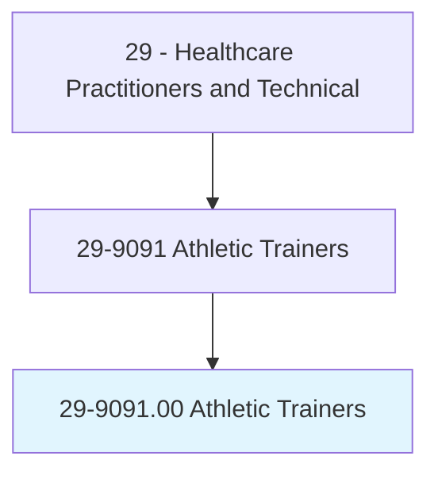
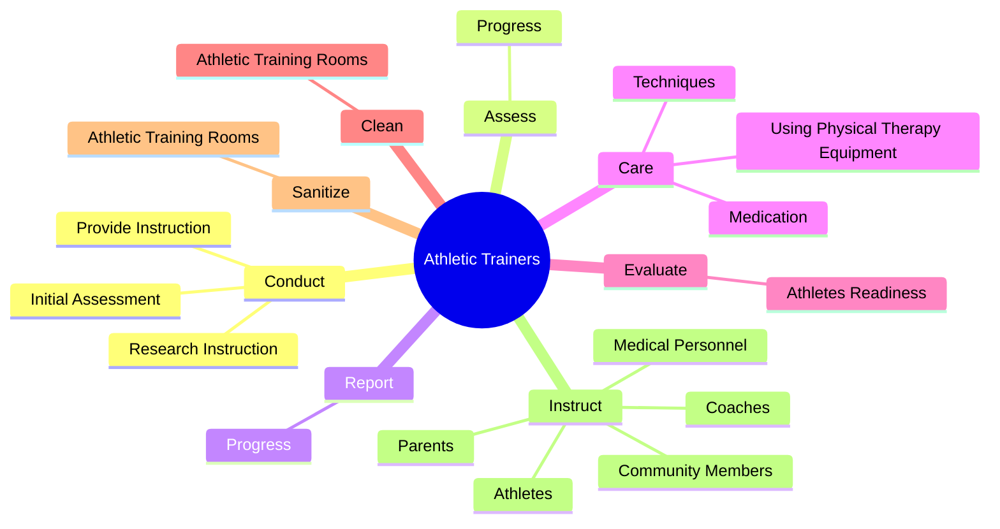
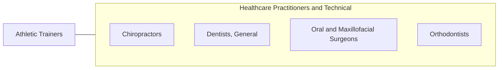

# Athletic Trainers

> Evaluate and treat musculoskeletal injuries or illnesses. Provide preventive, therapeutic, emergency, and rehabilitative care.

## Overview

Athletic Trainers is an occupation within the Healthcare Practitioners and Technical category. Evaluate and treat musculoskeletal injuries or illnesses. 

## Classification Hierarchy

## Key Statistics

| Metric | Value |
|--------|-------|
| SOC Code | 29-9091.00 |
| Category | [Healthcare Practitioners and Technical](/occupations/HealthcarePractitioners) |
| Task Count | 71 |
| Source | O*NET |

## Core Tasks

### conduct.InitialAssessment

Athletic Trainers conduct initial assessment as part of their core responsibilities.

**Actions:**
- `conduct.InitialAssessment.of.AthletesInjury.to.provide.EmergencyContinuedCareToDetermineWhetherTheyShouldBeReferredToPhysiciansForDefinitiveDiagnosisTreatment`
- `conduct.InitialAssessment.of.Illness.to.provide.EmergencyContinuedCareToDetermineWhetherTheyShouldBeReferredToPhysiciansForDefinitiveDiagnosisTreatment`
- `conduct.ResearchInstruction.on.SubjectMatterRelatedToAthleticTrainingMedicine`
- `conduct.ResearchInstruction.on.SportsMedicine`

### assess.Progress

Athletic Trainers assess progress as part of their core responsibilities.

**Actions:**
- `assess.Progress.of.RecoveringAthletes.to.Coaches`
- `assess.Progress.of.Physicians`

### report.Progress

Athletic Trainers report progress as part of their core responsibilities.

**Actions:**
- `report.Progress.of.RecoveringAthletes.to.Coaches`
- `report.Progress.of.Physicians`

## Skills & Competencies

### Technical Skills
- **Clinical Skills** - Advanced
- **Diagnostic Procedures** - Advanced
- **Patient Care** - Advanced

### Soft Skills
- **Communication** - Essential
- **Problem Solving** - Essential
- **Critical Thinking** - Important
- **Teamwork** - Important
- **Adaptability** - Important

## Related Occupations

## Industries

This occupation is found across multiple industries. See [Industries](/industries) for sector-specific employment data.

## Career Progression

---

*Source: O*NET 29-9091.00 - ONETOccupation*
