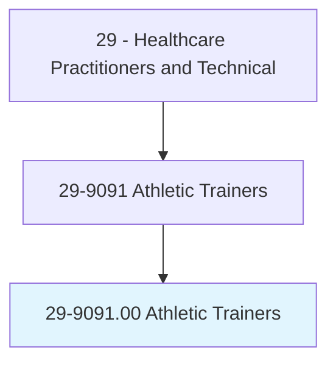
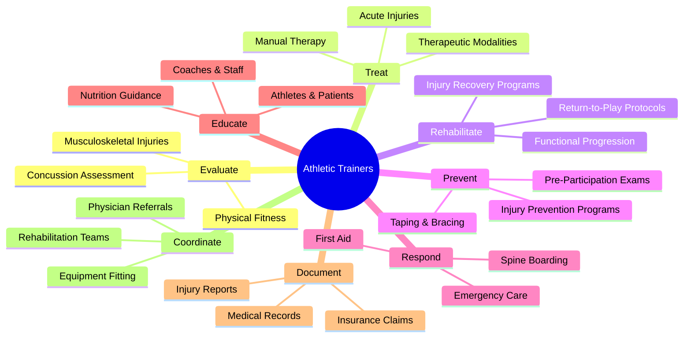
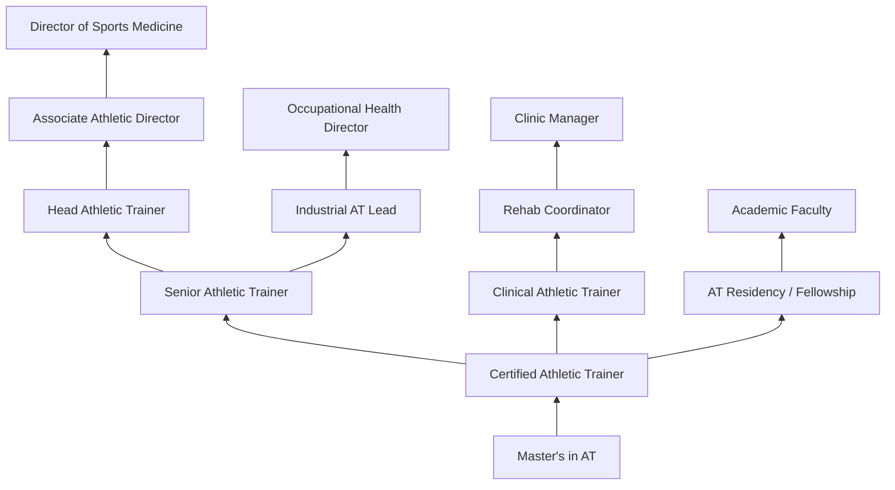
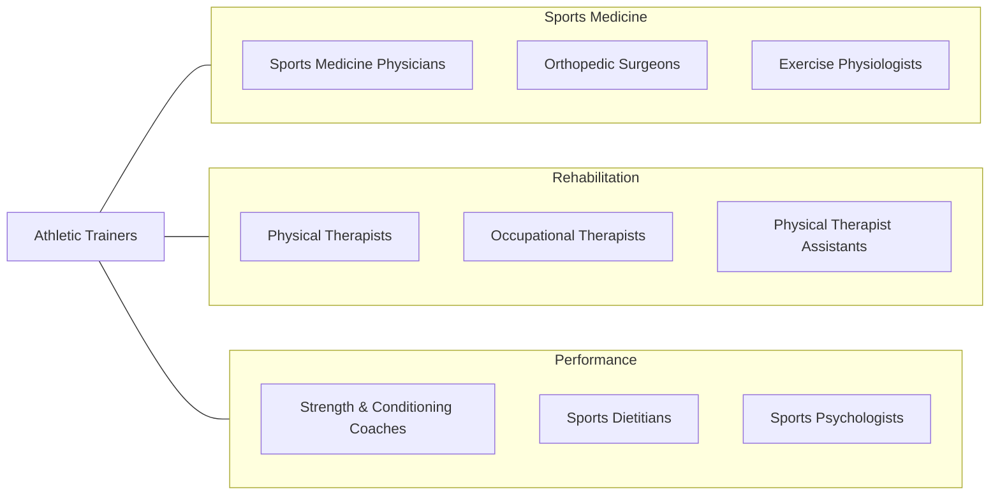

# Athletic Trainers

> Evaluate and advise individuals to assist recovery from or avoid athletic-related injuries or illnesses, or maintain peak physical fitness. May provide first aid or emergency care.

## Overview

Athletic Trainers are licensed healthcare professionals who specialize in the prevention, examination, diagnosis, treatment, and rehabilitation of musculoskeletal injuries and medical conditions in physically active populations. They work closely with athletes, military personnel, performing artists, and the general public to optimize physical performance, prevent injuries, and facilitate recovery through evidence-based therapeutic interventions and rehabilitation programs.

As frontline healthcare providers in sports and occupational settings, athletic trainers serve as first responders for acute injuries and medical emergencies. They perform orthopedic assessments, apply therapeutic modalities (cryotherapy, ultrasound, electrical stimulation), design rehabilitation exercises, and manage concussion protocols. Athletic trainers also address environmental conditions such as heat illness, hypothermia, and lightning safety, making real-time decisions about return-to-play and activity modification.

The profession has expanded well beyond traditional team sports into industrial and occupational health, performing arts medicine, military health, and clinical rehabilitation settings. Athletic trainers are recognized as allied health professionals by the American Medical Association and increasingly integrated into primary care practices, orthopedic clinics, and hospital-based sports medicine programs where they provide comprehensive musculoskeletal care.

## Classification Hierarchy

## Key Statistics

| Metric | Value |
|--------|-------|
| SOC Code | 29-9091.00 |
| Median Annual Salary | $53,840 |
| Employment | ~35,000 |
| Projected Growth | 14% (2022-2032, much faster than average) |
| Job Zone | 4 (Considerable Preparation) |
| Category | [Healthcare Practitioners](/occupations/HealthcarePractitioners) |
| Core Tasks | 40+ |
| Source | O*NET |

## Core Tasks

### evaluate.MusculoskeletalInjuries

Athletic Trainers assess injuries through clinical examination.

**Actions:**
- `evaluate.MusculoskeletalInjuries.using.SpecialTests` - Orthopedic assessment
- `evaluate.ConcussionStatus.using.SCAT5Protocol` - Concussion evaluation
- `evaluate.PhysicalFitness.using.FunctionalScreening` - Movement assessment
- `evaluate.ReturnToPlayReadiness.using.FunctionalTesting` - Clearance testing

### treat.AcuteInjuries

Athletic Trainers provide immediate care and therapeutic interventions.

**Actions:**
- `treat.AcuteInjuries.using.PRICE.Protocol` - Immediate care
- `treat.MusculoskeletalConditions.using.TherapeuticModalities` - Modality application
- `treat.SoftTissueInjuries.using.ManualTherapy` - Hands-on treatment
- `apply.TapingAndBracing.for.InjuryPrevention` - Prophylactic support

### rehabilitate.InjuredAthletes

Athletic Trainers design progressive recovery programs.

**Actions:**
- `rehabilitate.InjuredAthletes.using.TherapeuticExercise` - Rehab programs
- `rehabilitate.PostSurgicalPatients.using.Protocols` - Post-op rehab
- `develop.ReturnToPlayProtocols.for.ConcussedAthletes` - Concussion management
- `progress.FunctionalActivities.toward.SportSpecificDemands` - Sport return

## Practice Settings

| Setting | Description |
|---------|-------------|
| Colleges & Universities | Collegiate athletics programs |
| High Schools | Secondary school sports medicine |
| Professional Sports Teams | Elite athlete care |
| Sports Medicine Clinics | Outpatient rehabilitation |
| Hospitals & Health Systems | Clinical athletic training |
| Industrial/Occupational | Workplace injury prevention |
| Military | Active duty and veteran care |
| Performing Arts | Dance, theater, music injury care |

## Skills & Competencies

### Technical Skills
- **Musculoskeletal Evaluation** - Expert
- **Therapeutic Exercise Design** - Expert
- **Taping & Bracing** - Expert
- **Emergency Care & Splinting** - Expert
- **Therapeutic Modalities** - Advanced
- **Concussion Management** - Advanced
- **Manual Therapy** - Advanced
- **Injury Prevention Programming** - Advanced

### Soft Skills
- **Rapid Decision Making** - Critical
- **Communication** - Essential
- **Empathy** - Essential
- **Teamwork** - Essential
- **Time Management** - Essential
- **Adaptability** - Essential
- **Leadership** - Important

## Education & Training

| Requirement | Details |
|-------------|---------|
| Education | Master's degree in Athletic Training (required since 2023) |
| Undergraduate | Bachelor's degree in related field |
| Clinical Hours | Extensive supervised clinical rotations |
| Licensure | BOC Certification required |
| State License | Required in most states |
| Continuing Education | 50 CEUs per 2-year certification cycle |
| First Aid/CPR/AED | Current certification required |

## Certifications

| Certification | Description |
|---------------|-------------|
| ATC (BOC Certified) | Board of Certification credential (required) |
| CSCS | Certified Strength and Conditioning Specialist |
| CES | Corrective Exercise Specialist |
| PES | Performance Enhancement Specialist |
| ACLS | Advanced Cardiovascular Life Support |
| BLS | Basic Life Support |
| ITAT | Industrial AT credential |
| Graston Technique | Instrument-assisted soft tissue mobilization |

## Career Progression

## Specializations

| Focus Area | Description |
|------------|-------------|
| Orthopedic Rehabilitation | Post-surgical and injury rehab |
| Concussion Management | Assessment, management, and return-to-play |
| Industrial/Occupational | Workplace ergonomics and injury prevention |
| Performing Arts Medicine | Dance and musician injury care |
| Pediatric Sports Medicine | Youth athlete care |
| Emergency & Acute Care | On-field emergency response |
| Strength & Conditioning | Performance optimization |
| Upper Extremity Specialist | Shoulder, elbow, hand injuries |

## Technology & Tools

| Technology | Purpose |
|------------|---------|
| Therapeutic Modalities (Ultrasound, E-Stim) | Treatment devices |
| Concussion Assessment Tools (SCAT5, ImPACT) | Neurocognitive testing |
| Athletic Training Software (SportsWare, Presagia) | Documentation and tracking |
| Movement Analysis Systems (Dartfish) | Video-based assessment |
| Taping & Bracing Supplies | Injury prevention and support |
| Splinting & Immobilization Equipment | Emergency care |
| Body Composition Analyzers | Physical assessment |
| Cold/Hot Therapy Systems (Game Ready) | Recovery modalities |

## Related Occupations

## Industries

- [Educational Institutions](/industries/Education) - Colleges & High Schools
- [Spectator Sports](/industries/ArtsEntertainment/SpectatorSports) - Professional Teams
- [Hospitals](/industries/Healthcare/Hospitals/index) - Sports Medicine Programs
- [Physician Offices](/industries/Healthcare/PhysicianOffices) - Orthopedic Clinics
- [Fitness Centers](/industries/ArtsEntertainment/FitnessRecreation) - Wellness Programs
- [Government](/industries/Government) - Military Health

## Departments

This occupation typically works in:
- [Sports Medicine](/departments/SportsMedicine)
- [Athletic Training](/departments/AthleticTraining)
- [Orthopedic Rehabilitation](/departments/OrthoRehab)
- [Occupational Health](/departments/OccupationalHealth)
- [Emergency Services](/departments/EmergencyServices)

---

*Source: O*NET 29-9091.00 - ONETOccupation*
