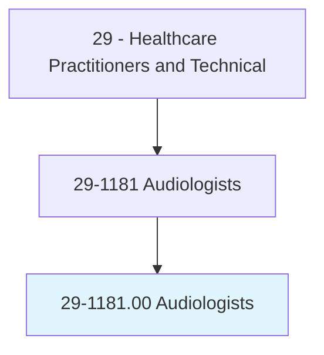
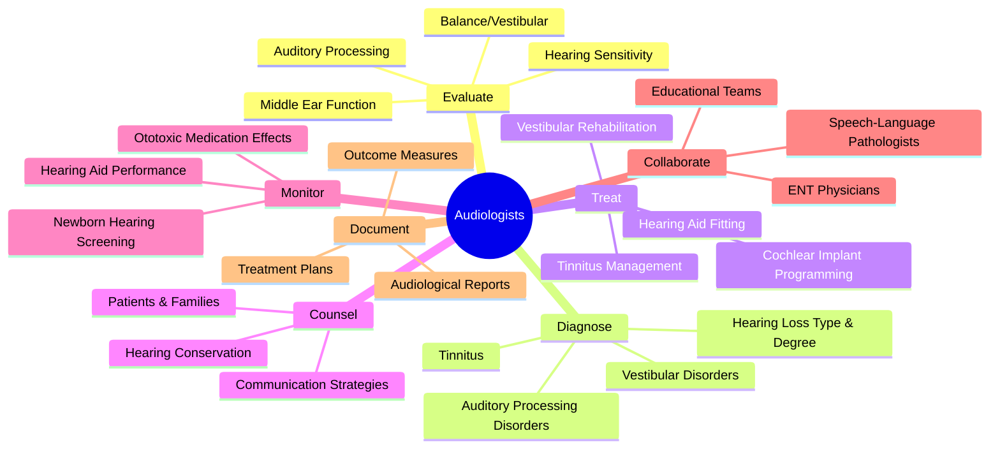
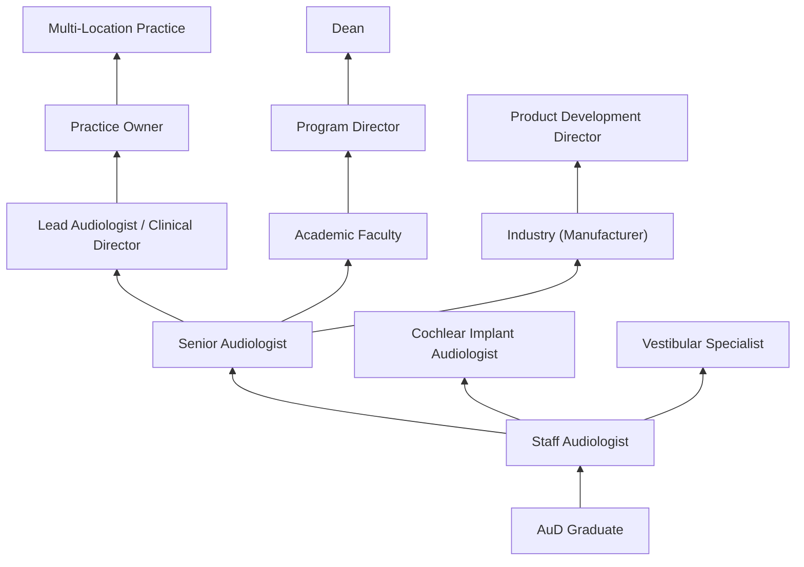
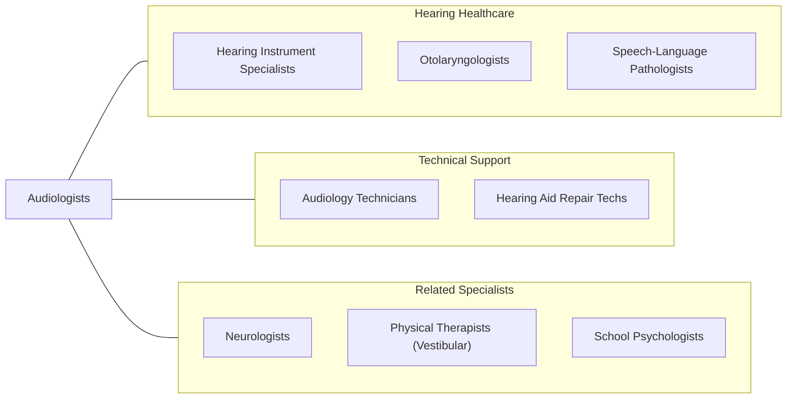

# Audiologists

> Assess and treat persons with hearing and related disorders. May fit hearing aids and provide auditory training. May perform research related to hearing problems.

## Overview

Audiologists are doctoral-level healthcare professionals who diagnose, treat, and manage hearing and balance disorders across the lifespan. They conduct comprehensive audiological evaluations using specialized equipment to assess hearing sensitivity, middle ear function, auditory processing capabilities, and vestibular (balance) system integrity. Audiologists are the primary providers of hearing rehabilitation services, including hearing aid selection and fitting, cochlear implant programming, and auditory training.

These specialists evaluate patients ranging from newborns through older adults, identifying hearing loss that can impact speech and language development in children, communication and social engagement in adults, and cognitive function and safety in the elderly. They perform diagnostic procedures including pure-tone audiometry, speech audiometry, otoacoustic emissions testing, auditory brainstem response testing, and videonystagmography for balance assessment.

Modern audiology has been transformed by advances in digital hearing aid technology, cochlear implantation, bone-anchored hearing devices, and teleaudiology. Audiologists now leverage real-ear measurement systems, AI-enhanced hearing devices, and sophisticated vestibular diagnostic equipment to deliver increasingly personalized hearing healthcare. The profession has grown in scope to include cerumen management, tinnitus treatment, auditory processing disorder evaluation, and intraoperative neurophysiological monitoring.

## Classification Hierarchy

## Key Statistics

| Metric | Value |
|--------|-------|
| SOC Code | 29-1181.00 |
| Median Annual Salary | $82,680 |
| Employment | ~14,300 |
| Projected Growth | 10% (2022-2032, faster than average) |
| Job Zone | 5 (Extensive Preparation) |
| Category | [Healthcare Practitioners](/occupations/HealthcarePractitioners) |
| Core Tasks | 45+ |
| Source | O*NET |

## Core Tasks

### evaluate.HearingSensitivity

Audiologists conduct comprehensive hearing assessments.

**Actions:**
- `evaluate.HearingSensitivity.using.PureToneAudiometry` - Hearing threshold testing
- `evaluate.MiddleEarFunction.using.Tympanometry` - Middle ear assessment
- `evaluate.AuditoryProcessing.using.SpeechAudiometry` - Speech perception testing
- `evaluate.VestibularFunction.using.Videonystagmography` - Balance assessment

### treat.HearingLoss

Audiologists provide hearing rehabilitation services.

**Actions:**
- `treat.HearingLoss.using.HearingAidFitting` - Amplification devices
- `treat.HearingLoss.using.CochlearImplantProgramming` - CI mapping
- `treat.Tinnitus.using.SoundTherapy` - Tinnitus management
- `treat.VestibularDisorders.using.RehabilitationExercises` - Balance therapy

### counsel.PatientsAndFamilies

Audiologists educate on hearing health and communication strategies.

**Actions:**
- `counsel.Patients.regarding.HearingLossImpact` - Impact education
- `counsel.Families.regarding.CommunicationStrategies` - Communication coaching
- `counsel.Patients.regarding.HearingConservation` - Prevention education
- `educate.Parents.regarding.PediatricHearingLoss` - Family support

## Practice Settings

| Setting | Description |
|---------|-------------|
| Private Audiology Practices | Independent hearing healthcare |
| ENT/Otolaryngology Offices | Physician-based audiology |
| Hospitals | Inpatient/outpatient diagnostic services |
| Cochlear Implant Centers | CI evaluation and programming |
| Schools & Educational Programs | Pediatric hearing services |
| VA Medical Centers | Veteran hearing healthcare |
| Industrial/Occupational | Hearing conservation programs |
| Research Institutions | Hearing science research |

## Skills & Competencies

### Technical Skills
- **Audiometric Testing** - Expert
- **Hearing Aid Technology** - Expert
- **Cochlear Implant Programming** - Advanced
- **Vestibular Assessment** - Advanced
- **Real-Ear Measurement** - Expert
- **Electrophysiological Testing (ABR, OAE)** - Expert
- **Cerumen Management** - Advanced
- **Tinnitus Assessment & Treatment** - Advanced

### Soft Skills
- **Patient Communication** - Critical
- **Counseling Skills** - Essential
- **Empathy** - Essential
- **Detail Orientation** - Critical
- **Problem Solving** - Essential
- **Cultural Competency** - Essential
- **Business Acumen** - Important

## Education & Training

| Requirement | Details |
|-------------|---------|
| Undergraduate | 4-year bachelor's degree (pre-audiology or related) |
| Doctoral Degree | Doctor of Audiology (AuD) - 4 years |
| Clinical Externship | 12-month full-time clinical placement |
| Total Training | 8+ years post-high school |
| Licensure | Must pass Praxis exam in Audiology |
| State License | Required in all states |
| Continuing Education | Varies by state; typically 20-30 hours biennially |

## Certifications

| Certification | Description |
|---------------|-------------|
| CCC-A | Certificate of Clinical Competence in Audiology (ASHA) |
| ABA Board Certification | American Board of Audiology certification |
| State Hearing Aid Dispensing License | Required in some states |
| BLS | Basic Life Support |
| Cochlear Implant Specialist | Manufacturer-specific training |
| Vestibular Specialist | Advanced vestibular assessment certification |

## Career Progression

## Specializations

| Focus Area | Description |
|------------|-------------|
| Pediatric Audiology | Newborn screening, pediatric diagnostics |
| Cochlear Implants | CI candidacy, programming, rehabilitation |
| Vestibular Audiology | Balance disorder diagnosis and treatment |
| Tinnitus Management | Tinnitus evaluation and sound therapy |
| Intraoperative Monitoring | Surgical neurophysiological monitoring |
| Industrial Audiology | Hearing conservation programs |
| Auditory Processing Disorders | Central auditory dysfunction |
| Geriatric Audiology | Age-related hearing loss management |

## Technology & Tools

| Technology | Purpose |
|------------|---------|
| Audiometers (Clinical & Diagnostic) | Hearing threshold measurement |
| Tympanometers | Middle ear function assessment |
| OAE Systems | Otoacoustic emissions testing |
| ABR/ASSR Equipment | Electrophysiological hearing assessment |
| Real-Ear Measurement Systems | Hearing aid verification |
| Hearing Aid Fitting Software | Programming and adjustment |
| VNG/ENG Systems | Vestibular diagnostic testing |
| Cochlear Implant Programming Systems | CI mapping and adjustment |

## Related Occupations

## Industries

- [Health Practitioner Offices](/industries/Healthcare/PhysicianOffices) - Audiology Practices
- [Hospitals](/industries/Healthcare/Hospitals/index) - Diagnostic Audiology
- [Schools](/industries/Education/ElementarySecondary) - Educational Audiology
- [Government](/industries/Government) - VA Audiology
- [Manufacturing](/industries/Manufacturing/MedicalDevices) - Hearing Device Companies
- [Rehabilitation Centers](/industries/Healthcare/RehabilitationCenters) - Aural Rehabilitation

## Departments

This occupation typically works in:
- [Audiology](/departments/Audiology)
- [Otolaryngology (ENT)](/departments/ENT)
- [Speech & Hearing Center](/departments/SpeechHearing)
- [Cochlear Implant Program](/departments/CochlearImplant)
- [Vestibular Services](/departments/VestibularServices)

---

*Source: O*NET 29-1181.00 - ONETOccupation*
