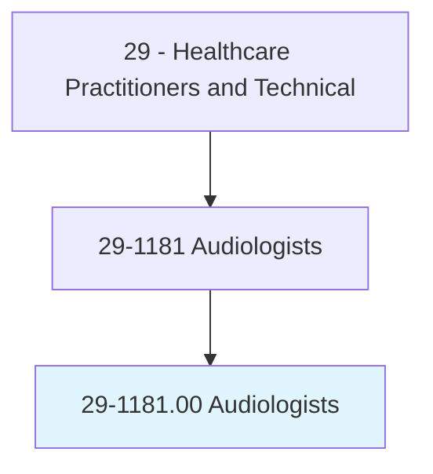
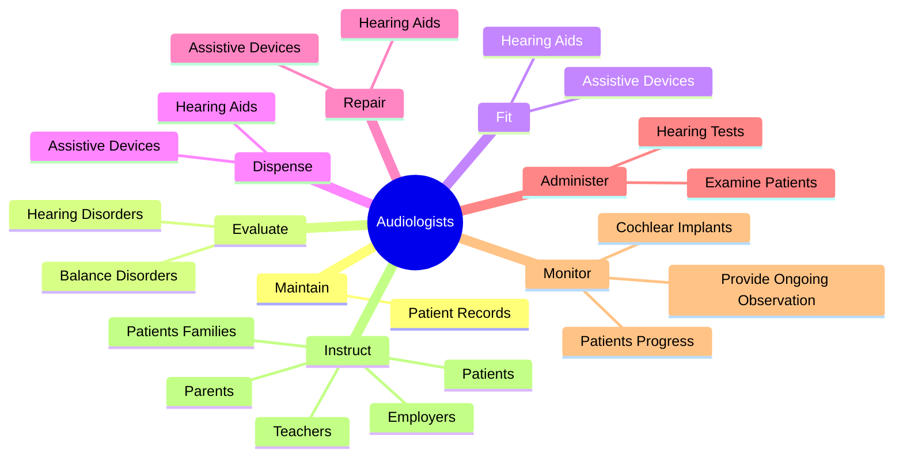
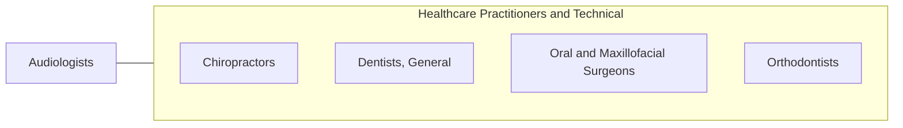

# Audiologists

> Assess and treat persons with hearing and related disorders. May fit hearing aids and provide auditory training. May perform research related to hearing problems.

## Overview

Audiologists is an occupation within the Healthcare Practitioners and Technical category. Assess and treat persons with hearing and related disorders. May fit hearing aids and provide auditory training.

## Classification Hierarchy

## Key Statistics

| Metric | Value |
|--------|-------|
| SOC Code | 29-1181.00 |
| Category | [Healthcare Practitioners and Technical](/occupations/HealthcarePractitioners) |
| Task Count | 93 |
| Source | O*NET |

## Core Tasks

### maintain.PatientRecords

Audiologists maintain patient records as part of their core responsibilities.

**Actions:**
- `maintain.PatientRecords.at.Stages`
- `maintain.PatientRecords.at.IncludingInitial`
- `maintain.PatientRecords.at.SubsequentEvaluationActivities`
- `maintain.PatientRecords.at.TreatmentActivities`

### evaluate.HearingDisorders

Audiologists evaluate hearing disorders as part of their core responsibilities.

**Actions:**
- `evaluate.HearingDisorders.to.determine.DiagnosesOfTreatment`
- `evaluate.HearingDisorders.to.CoursesOfTreatment`
- `evaluate.BalanceDisorders.to.determine.DiagnosesOfTreatment`
- `evaluate.BalanceDisorders.to.CoursesOfTreatment`

### fit.AssistiveDevices

Audiologists fit assistive devices as part of their core responsibilities.

**Actions:**
- `fit.AssistiveDevices`
- `fit.HearingAids`

## Skills & Competencies

### Technical Skills
- **Clinical Skills** - Advanced
- **Diagnostic Procedures** - Advanced
- **Patient Care** - Advanced

### Soft Skills
- **Communication** - Essential
- **Problem Solving** - Essential
- **Critical Thinking** - Important
- **Teamwork** - Important
- **Adaptability** - Important

## Related Occupations

## Industries

This occupation is found across multiple industries. See [Industries](/industries) for sector-specific employment data.

## Career Progression

---

*Source: O*NET 29-1181.00 - ONETOccupation*
