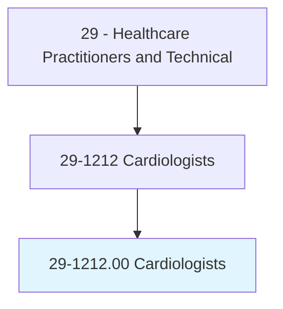
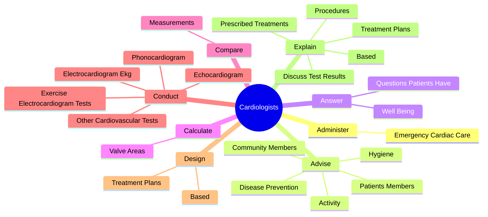
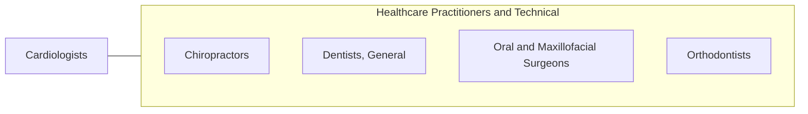

# Cardiologists

> Diagnose, treat, manage, and prevent diseases or conditions of the cardiovascular system. May further subspecialize in interventional procedures (e.g., balloon angioplasty and stent placement), echocardiography, or electrophysiology.

## Overview

Cardiologists is an occupation within the Healthcare Practitioners and Technical category. Diagnose, treat, manage, and prevent diseases or conditions of the cardiovascular system. 

## Classification Hierarchy

## Key Statistics

| Metric | Value |
|--------|-------|
| SOC Code | 29-1212.00 |
| Category | [Healthcare Practitioners and Technical](/occupations/HealthcarePractitioners) |
| Task Count | 104 |
| Source | O*NET |

## Core Tasks

### administer.EmergencyCardiacCare

Cardiologists administer emergency cardiac care as part of their core responsibilities.

**Actions:**
- `administer.EmergencyCardiacCare.for.LifeThreateningHeartProblems`
- `administer.EmergencyCardiacCare.for.CardiacArrest`
- `administer.EmergencyCardiacCare.for.HeartAttack`

### advise.PatientsMembers

Cardiologists advise patients members as part of their core responsibilities.

**Actions:**
- `advise.PatientsMembers.concerning.Diet`
- `advise.CommunityMembers.concerning.Diet`
- `advise.Activity`
- `advise.Hygiene`

### answer.QuestionsPatientsHave

Cardiologists answer questions patients have as part of their core responsibilities.

**Actions:**
- `answer.QuestionsPatientsHave.about.Health`
- `answer.WellBeing`

## Skills & Competencies

### Technical Skills
- **Clinical Skills** - Advanced
- **Diagnostic Procedures** - Advanced
- **Patient Care** - Advanced

### Soft Skills
- **Communication** - Essential
- **Problem Solving** - Essential
- **Critical Thinking** - Important
- **Teamwork** - Important
- **Adaptability** - Important

## Related Occupations

## Industries

This occupation is found across multiple industries. See [Industries](/industries) for sector-specific employment data.

## Career Progression

---

*Source: O*NET 29-1212.00 - ONETOccupation*
