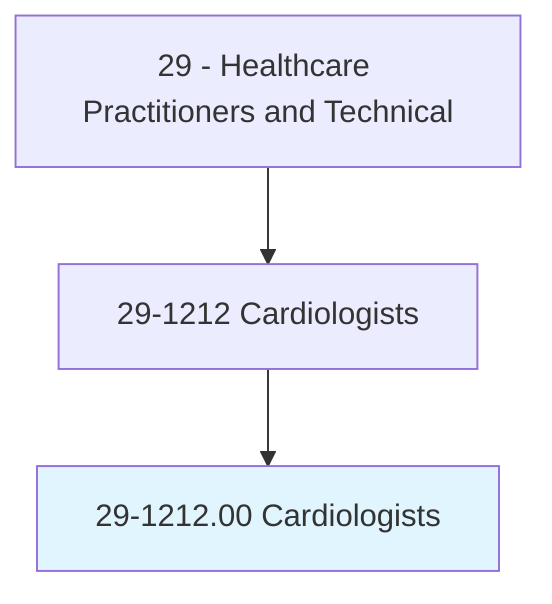
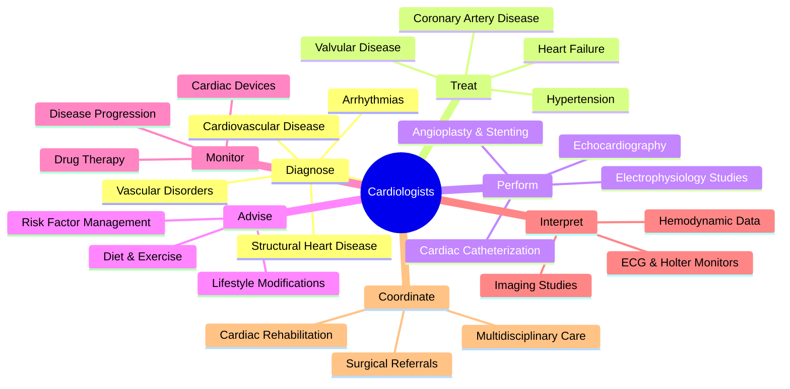
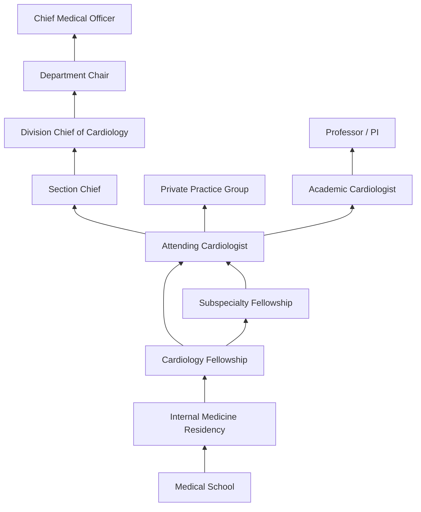
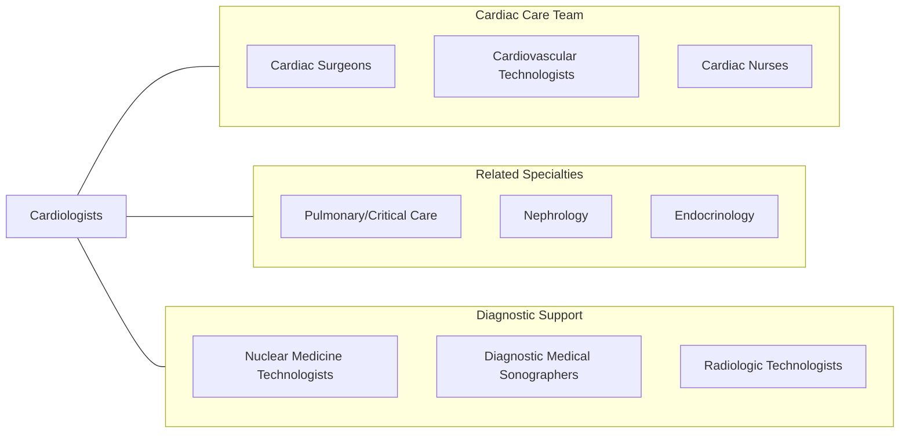

# Cardiologists

> Diagnose, treat, manage, and prevent diseases or conditions of the cardiovascular system. May further subspecialize in interventional procedures (e.g., balloon angioplasty and stent placement), echocardiography, or electrophysiology.

## Overview

Cardiologists are physician specialists who diagnose, treat, and manage diseases of the heart and blood vessels. They evaluate patients with conditions ranging from hypertension and heart failure to complex arrhythmias and coronary artery disease. Cardiologists perform comprehensive cardiovascular assessments including physical examinations, electrocardiograms, echocardiograms, stress tests, and cardiac catheterizations to determine the nature and severity of cardiovascular disorders.

As the prevalence of cardiovascular disease remains the leading cause of death worldwide, cardiologists play a pivotal role in both acute intervention and long-term disease management. They develop treatment plans that integrate medications, lifestyle modifications, interventional procedures, and surgical referrals. Cardiologists also focus heavily on preventive cardiology, helping patients manage risk factors such as hyperlipidemia, diabetes, obesity, and smoking.

Modern cardiology has advanced significantly with innovations in cardiac imaging, minimally invasive interventions, structural heart procedures, and electrophysiology mapping systems. Cardiologists increasingly utilize artificial intelligence for ECG interpretation, advanced hemodynamic monitoring, and precision medicine approaches to tailor therapies based on genetic and biomarker profiles.

## Classification Hierarchy

## Key Statistics

| Metric | Value |
|--------|-------|
| SOC Code | 29-1212.00 |
| Median Annual Salary | $421,330 |
| Employment | ~28,000 |
| Projected Growth | 5% (2022-2032) |
| Job Zone | 5 (Extensive Preparation) |
| Category | [Healthcare Practitioners](/occupations/HealthcarePractitioners) |
| Core Tasks | 104 |
| Source | O*NET |

## Core Tasks

### administer.EmergencyCardiacCare

Cardiologists provide emergency cardiac care for life-threatening conditions.

**Actions:**
- `administer.EmergencyCardiacCare.for.LifeThreateningHeartProblems` - Acute MI management
- `administer.EmergencyCardiacCare.for.CardiacArrest` - Code team response
- `administer.EmergencyCardiacCare.for.HeartAttack` - Emergent catheterization
- `perform.CardiacCatheterization.for.AcuteCoronarySyndrome` - Interventional treatment

### advise.PatientsMembers

Cardiologists counsel patients on cardiovascular health.

**Actions:**
- `advise.Patients.concerning.Diet` - Nutritional counseling
- `advise.Patients.concerning.Exercise` - Activity prescriptions
- `advise.Patients.concerning.RiskFactorModification` - Preventive strategies
- `advise.CommunityMembers.concerning.HeartDiseasePrevention` - Public health education

### conduct.CardiovascularTests

Cardiologists perform and interpret diagnostic studies.

**Actions:**
- `conduct.Electrocardiogram.for.CardiacAssessment` - ECG analysis
- `conduct.Echocardiogram.for.StructuralAssessment` - Cardiac ultrasound
- `conduct.ExerciseStressTest.for.IschemiaEvaluation` - Functional testing
- `conduct.CardiacCatheterization.for.HemodynamicAssessment` - Invasive diagnostics

## Practice Settings

| Setting | Description |
|---------|-------------|
| Hospital Cardiology Units | Inpatient cardiac care |
| Cardiac Catheterization Labs | Interventional procedures |
| Electrophysiology Labs | Arrhythmia diagnosis and treatment |
| Outpatient Cardiology Clinics | Ambulatory consultations |
| Cardiac Rehabilitation Centers | Post-event recovery programs |
| Heart Failure Clinics | Specialized HF management |
| Academic Medical Centers | Research and teaching |
| Cardiac Imaging Centers | Advanced diagnostic imaging |

## Skills & Competencies

### Technical Skills
- **Cardiovascular Diagnostics** - Expert
- **Cardiac Catheterization** - Expert
- **Echocardiography** - Expert
- **Electrocardiogram Interpretation** - Expert
- **Interventional Procedures** - Advanced
- **Electrophysiology** - Advanced
- **Hemodynamic Assessment** - Expert
- **Cardiac Pharmacotherapy** - Expert

### Soft Skills
- **Clinical Decision Making** - Critical
- **Patient Communication** - Essential
- **Emergency Response** - Critical
- **Leadership** - Essential
- **Interdisciplinary Collaboration** - Essential
- **Empathy** - Essential
- **Attention to Detail** - Critical

## Education & Training

| Requirement | Details |
|-------------|---------|
| Undergraduate | 4-year bachelor's degree (pre-med) |
| Medical School | 4-year MD or DO program |
| Internal Medicine Residency | 3 years |
| Cardiology Fellowship | 3 years (general cardiology) |
| Subspecialty Fellowship | 1-2 additional years (interventional, EP, imaging) |
| Total Training | 14-16 years post-high school |
| Licensure | State medical license required |
| Board Certification | ABIM Cardiovascular Disease |
| Continuing Education | MOC requirements per ABIM |

## Certifications

| Certification | Description |
|---------------|-------------|
| ABIM Cardiovascular Disease | Primary cardiology board certification |
| ABIM Interventional Cardiology | Subspecialty in coronary intervention |
| ABIM Electrophysiology | Subspecialty in cardiac electrophysiology |
| FASE | Fellow of the American Society of Echocardiography |
| FACC | Fellow of the American College of Cardiology |
| FAHA | Fellow of the American Heart Association |
| ACLS | Advanced Cardiovascular Life Support |
| NBE Nuclear Cardiology | Nuclear imaging certification |

## Career Progression

## Specializations

| Subspecialty | Focus Area |
|-------------|------------|
| Interventional Cardiology | Catheter-based coronary and structural procedures |
| Electrophysiology | Arrhythmia management, ablation, device implantation |
| Advanced Heart Failure & Transplant | LVAD, heart transplantation |
| Structural Heart Disease | TAVR, MitraClip, congenital repairs |
| Cardiac Imaging | CT, MRI, nuclear, and echo specialization |
| Preventive Cardiology | Risk assessment and lifestyle medicine |
| Cardio-Oncology | Cancer treatment cardiac side effects |
| Adult Congenital Heart Disease | Lifelong management of CHD |

## Technology & Tools

| Technology | Purpose |
|------------|---------|
| Cardiac Catheterization Systems | Coronary angiography and intervention |
| Echocardiography Machines | Cardiac ultrasound imaging |
| Electrophysiology Mapping Systems (CARTO, EnSite) | 3D cardiac mapping |
| Intravascular Ultrasound (IVUS) | Coronary artery imaging |
| Fractional Flow Reserve (FFR) | Physiologic lesion assessment |
| Cardiac MRI | Advanced tissue characterization |
| Implantable Device Programmers | Pacemaker/ICD management |
| Electronic Health Records | Documentation and decision support |

## Related Occupations

## Industries

- [Hospitals](/industries/Healthcare/Hospitals/index) - Primary Employment
- [Physician Offices](/industries/Healthcare/PhysicianOffices) - Cardiology Groups
- [Academic Medical Centers](/industries/Healthcare/Hospitals/Teaching) - Teaching & Research
- [Ambulatory Care Centers](/industries/Healthcare/AmbulatoryHealthCare) - Outpatient Cardiology
- [Veterans Affairs](/industries/Government/Federal) - VA Cardiology Services
- [Cardiac Rehabilitation Centers](/industries/Healthcare/RehabilitationCenters) - Post-Event Care

## Departments

This occupation typically works in:
- Cardiology
- Cardiac Catheterization Lab
- Electrophysiology
- Heart Failure Program
- Cardiac Rehabilitation
- Cardiovascular Imaging

---

*Source: O*NET 29-1212.00 - ONETOccupation*
