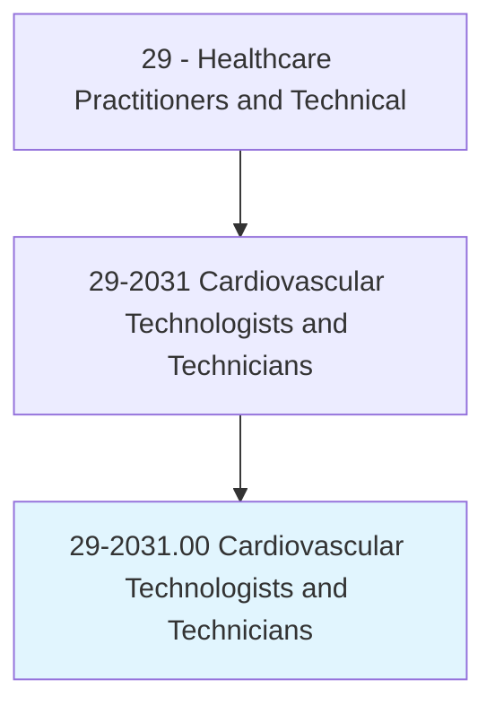
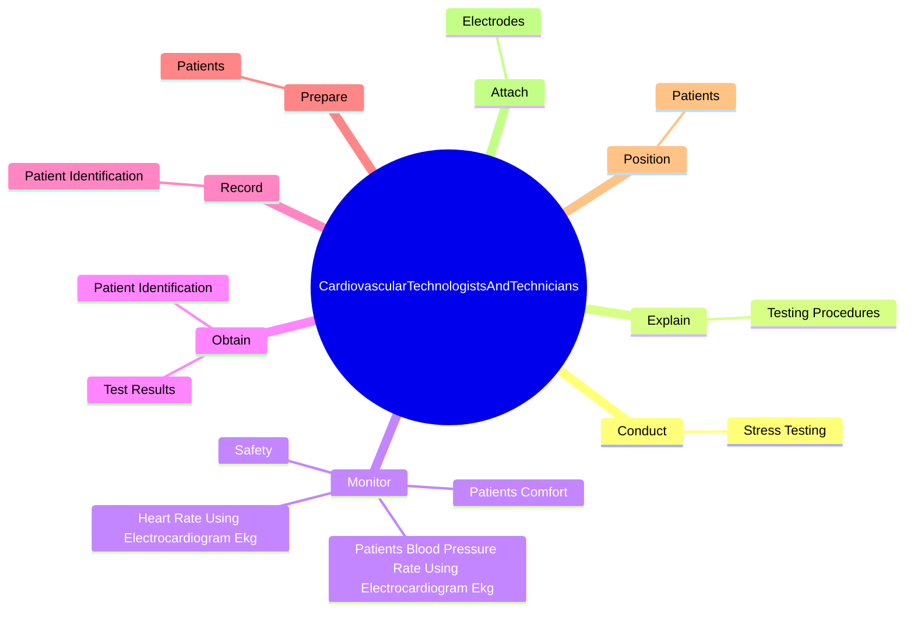
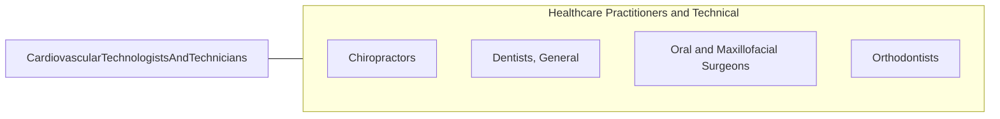

# Cardiovascular Technologists and Technicians

> Conduct tests on pulmonary or cardiovascular systems of patients for diagnostic, therapeutic, or research purposes. May conduct or assist in electrocardiograms, cardiac catheterizations, pulmonary functions, lung capacity, and similar tests.

## Overview

Cardiovascular Technologists and Technicians is an occupation within the Healthcare Practitioners and Technical category. Conduct tests on pulmonary or cardiovascular systems of patients for diagnostic, therapeutic, or research purposes. 

## Classification Hierarchy

## Key Statistics

| Metric | Value |
|--------|-------|
| SOC Code | 29-2031.00 |
| Category | [Healthcare Practitioners and Technical](/occupations/HealthcarePractitioners) |
| Task Count | 57 |
| Source | O*NET |

## Core Tasks

### conduct.StressTesting

Cardiovascular Technologists and Technicians conduct stress testing as part of their core responsibilities.

**Actions:**
- `conduct.StressTesting.to.record.PatientsCardiacActivity`
- `conduct.StressTesting.to.UsingSpecializedElectronicTestEquipment`
- `conduct.StressTesting.to.RecordingDevices`
- `conduct.StressTesting.to.LaboratoryInstruments`

### explain.TestingProcedures

Cardiovascular Technologists and Technicians explain testing procedures as part of their core responsibilities.

**Actions:**
- `explain.TestingProcedures.to.PatientsToObtainCooperation`
- `explain.TestingProcedures.to.reduce.Anxiety`

### monitor.PatientsBloodPressureRateUsingElectrocardiogramEkg

Cardiovascular Technologists and Technicians monitor patients blood pressure rate using electrocardiogram ekg as part of their core responsibilities.

**Actions:**
- `monitor.PatientsBloodPressureRateUsingElectrocardiogramEkg`
- `monitor.HeartRateUsingElectrocardiogramEkg`
- `monitor.PatientsComfort.during.TestsAlertingPhysicians.to.Abnormalities`
- `monitor.PatientsComfort.during.TestsAlertingPhysicians.to.changes.InPatientResponses`

## Skills & Competencies

### Technical Skills
- **Clinical Skills** - Advanced
- **Diagnostic Procedures** - Advanced
- **Patient Care** - Advanced

### Soft Skills
- **Communication** - Essential
- **Problem Solving** - Essential
- **Critical Thinking** - Important
- **Teamwork** - Important
- **Adaptability** - Important

## Related Occupations

## Industries

This occupation is found across multiple industries. See [Industries](/industries) for sector-specific employment data.

## Career Progression

---

*Source: O*NET 29-2031.00 - ONETOccupation*
