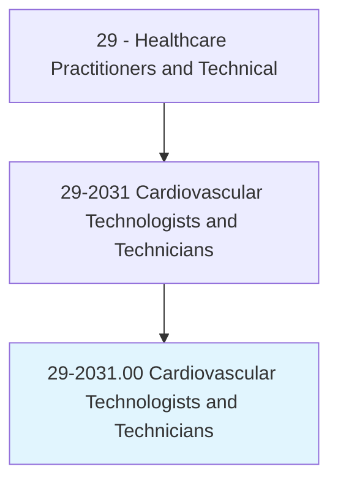
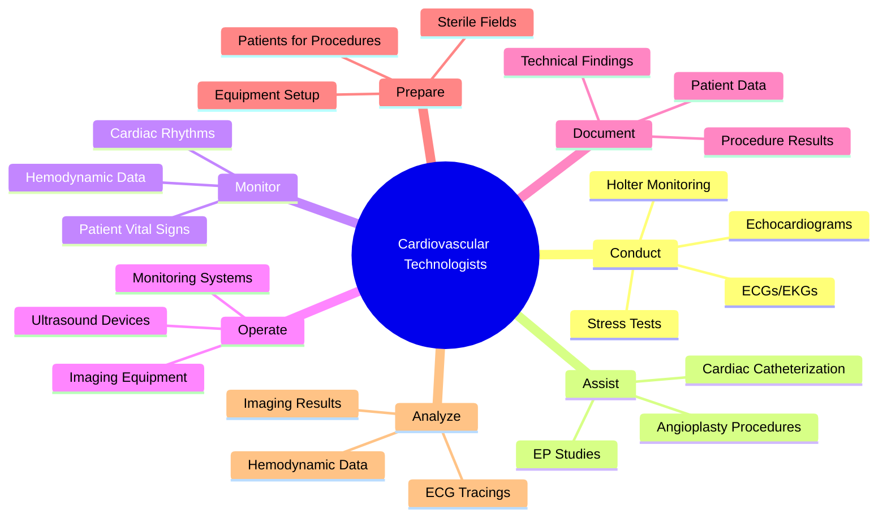
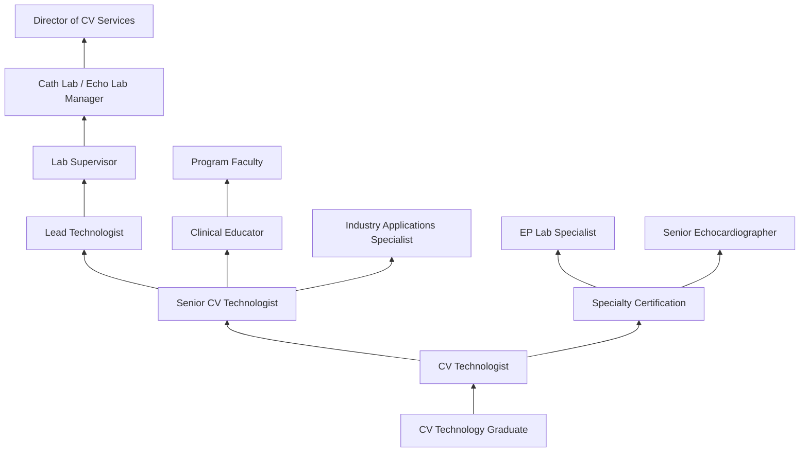
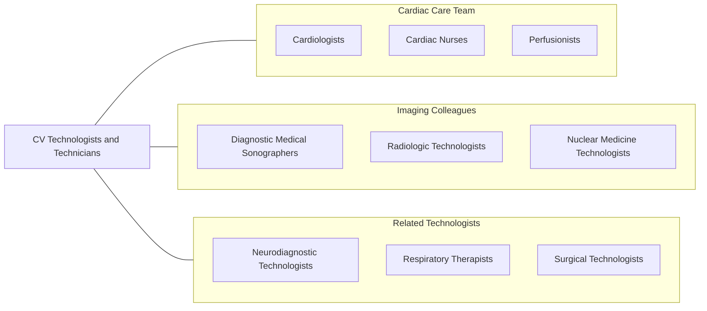

# Cardiovascular Technologists and Technicians

> Conduct tests on pulmonary or cardiovascular systems of patients for diagnostic, therapeutic, or research purposes. May conduct or assist in electrocardiograms, cardiac catheterizations, pulmonary functions, lung capacity, and similar tests.

## Overview

Cardiovascular Technologists and Technicians are allied health professionals who perform diagnostic tests and therapeutic procedures on the heart and vascular system under the supervision of physicians. They operate sophisticated imaging and monitoring equipment to help cardiologists and other physicians diagnose and treat cardiovascular diseases. Their work is essential for identifying conditions such as coronary artery disease, heart valve disorders, arrhythmias, and peripheral vascular disease.

These professionals specialize in one or more areas including invasive cardiology (cardiac catheterization), noninvasive cardiology (echocardiography, stress testing, Holter monitoring), and vascular technology (duplex ultrasound, arterial/venous studies). In the cardiac catheterization laboratory, they assist physicians during coronary angiography, angioplasty, stent placement, and electrophysiology studies, monitoring patients and operating imaging equipment throughout procedures.

The field has evolved with advances in cardiac imaging, interventional techniques, and monitoring technology. Cardiovascular technologists increasingly work with 3D echocardiography, intracardiac echocardiography, fractional flow reserve measurements, and structural heart intervention equipment, requiring continuous professional development to maintain competency with emerging technologies.

## Classification Hierarchy

## Key Statistics

| Metric | Value |
|--------|-------|
| SOC Code | 29-2031.00 |
| Median Annual Salary | $62,250 |
| Employment | ~58,000 |
| Projected Growth | 5% (2022-2032) |
| Job Zone | 3 (Medium Preparation) |
| Category | [Healthcare Practitioners](/occupations/HealthcarePractitioners) |
| Core Tasks | 35+ |
| Source | O*NET |

## Core Tasks

### conduct.CardiovascularTests

Cardiovascular Technologists perform diagnostic cardiac evaluations.

**Actions:**
- `conduct.Echocardiograms.for.CardiacAssessment` - Cardiac ultrasound
- `conduct.Electrocardiograms.for.RhythmAnalysis` - ECG recording
- `conduct.StressTests.for.IschemiaDetection` - Exercise testing
- `conduct.HolterMonitoring.for.ArrhythmiaDetection` - Ambulatory monitoring

### assist.CardiacCatheterization

Cardiovascular Technologists support invasive cardiac procedures.

**Actions:**
- `assist.CardiacCatheterization.with.PhysicianGuidance` - Cath lab support
- `assist.AngioplastyProcedures.with.EquipmentOperation` - PCI support
- `monitor.PatientVitalSigns.during.InvasiveProcedures` - Patient monitoring
- `operate.ImagingEquipment.for.Fluoroscopy` - Imaging operation

### document.ProcedureResults

Cardiovascular Technologists record and report findings.

**Actions:**
- `document.ProcedureResults.in.PatientRecords` - Clinical documentation
- `analyze.ECGTracings.for.AbnormalFindings` - Rhythm interpretation
- `analyze.HemodynamicData.for.PhysicianReview` - Data analysis
- `prepare.TechnicalReports.for.CardiologistInterpretation` - Report preparation

## Practice Settings

| Setting | Description |
|---------|-------------|
| Hospital Cardiac Catheterization Labs | Invasive cardiac procedures |
| Hospital Echocardiography Labs | Noninvasive cardiac imaging |
| Outpatient Cardiology Clinics | Ambulatory diagnostic testing |
| Electrophysiology Labs | Arrhythmia procedures |
| Vascular Labs | Peripheral vascular studies |
| Mobile Cardiac Testing Services | On-site diagnostic services |
| Research Institutions | Clinical trials and studies |

## Skills & Competencies

### Technical Skills
- **Echocardiography** - Expert
- **Electrocardiography** - Expert
- **Cardiac Catheterization Lab Support** - Advanced
- **Hemodynamic Monitoring** - Advanced
- **Vascular Ultrasound** - Advanced
- **Stress Testing Protocols** - Expert
- **Sterile Technique** - Advanced
- **Patient Monitoring Equipment** - Expert

### Soft Skills
- **Attention to Detail** - Critical
- **Patient Communication** - Essential
- **Teamwork** - Essential
- **Adaptability** - Essential
- **Stress Management** - Essential
- **Problem Solving** - Important
- **Professionalism** - Essential

## Education & Training

| Requirement | Details |
|-------------|---------|
| Minimum Education | Associate degree in Cardiovascular Technology |
| Preferred Education | Bachelor's degree in Cardiovascular Technology |
| Clinical Training | 1-2 years supervised clinical experience |
| Certification | CCI or ARDMS credentialing |
| State Requirements | Varies by state |
| Continuing Education | Per credentialing organization requirements |

## Certifications

| Certification | Description |
|---------------|-------------|
| RCIS | Registered Cardiovascular Invasive Specialist (CCI) |
| RCES | Registered Cardiac Electrophysiology Specialist |
| RCS | Registered Cardiac Sonographer (CCI) |
| RDCS | Registered Diagnostic Cardiac Sonographer (ARDMS) |
| RVT | Registered Vascular Technologist |
| CCT | Certified Cardiographic Technician |
| BLS | Basic Life Support |
| ACLS | Advanced Cardiovascular Life Support |

## Career Progression

## Specializations

| Focus Area | Description |
|------------|-------------|
| Invasive Cardiology | Cardiac catheterization lab procedures |
| Echocardiography | Transthoracic and transesophageal echo |
| Electrophysiology | EP studies, ablation, device implant support |
| Vascular Technology | Arterial and venous duplex studies |
| Pediatric Cardiology | Congenital heart disease imaging |
| Structural Heart | TAVR, MitraClip procedure support |
| Cardiac CT/MRI | Advanced cardiac imaging |
| Nuclear Cardiology | Myocardial perfusion imaging |

## Technology & Tools

| Technology | Purpose |
|------------|---------|
| Echocardiography Machines (GE, Philips, Siemens) | Cardiac ultrasound imaging |
| ECG/EKG Machines | Cardiac rhythm recording |
| Cardiac Catheterization Systems | Fluoroscopy and hemodynamic recording |
| Intravascular Ultrasound (IVUS) | Coronary artery imaging |
| Holter Monitors & Event Recorders | Ambulatory rhythm monitoring |
| Stress Testing Systems | Exercise and pharmacologic testing |
| EP Mapping Systems (CARTO, EnSite) | Electrophysiology navigation |
| Hemodynamic Recording Systems | Pressure and flow measurement |

## Related Occupations

## Industries

- [Hospitals](/industries/Healthcare/Hospitals/index) - Primary Employment
- [Physician Offices](/industries/Healthcare/PhysicianOffices) - Cardiology Practices
- [Outpatient Care Centers](/industries/Healthcare/AmbulatoryHealthCare) - Diagnostic Centers
- [Medical Laboratories](/industries/Healthcare/MedicalLaboratories) - Testing Services
- [Medical Device Companies](/industries/Manufacturing/MedicalDevices) - Applications Support

## Departments

This occupation typically works in:
- Cardiac Catheterization Lab
- Echocardiography Lab
- Electrophysiology Lab
- Vascular Lab
- Cardiology

---

*Source: O*NET 29-2031.00 - ONETOccupation*
