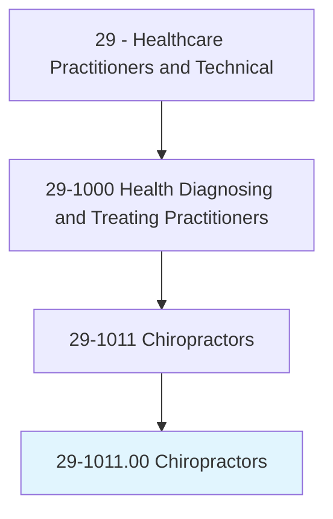
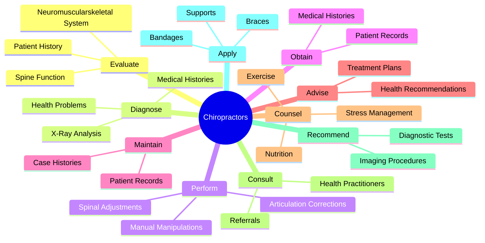
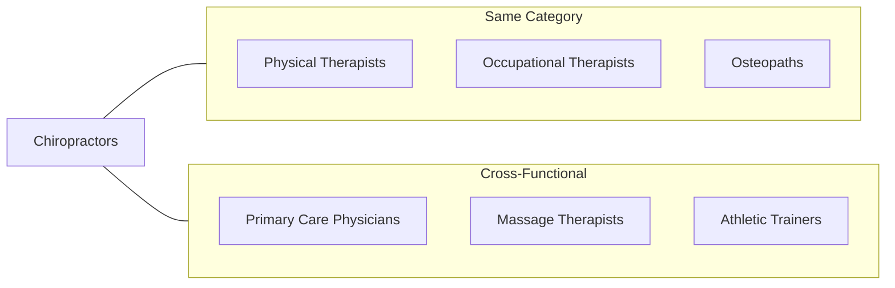
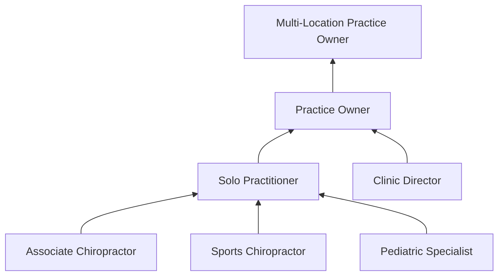

# Chiropractors

> Assess, treat, and care for patients by manipulation of spine and musculoskeletal system. May provide spinal adjustment or address sacral or pelvic misalignment.

## Overview

Chiropractors are healthcare professionals who specialize in diagnosing and treating neuromuscular disorders through manual adjustment and manipulation of the spine. They focus on the relationship between the body's structure, primarily the spine, and its function. Chiropractors use a hands-on, drug-free approach to patient care, often incorporating lifestyle counseling, exercise recommendations, and nutritional guidance into their treatment plans.

## Classification Hierarchy

## Key Statistics

| Metric | Value |
|--------|-------|
| SOC Code | 29-1011.00 |
| Job Zone | 5 (Extensive Preparation) |
| Category | [Healthcare Practitioners](/occupations/HealthcarePractitioners) |
| Core Tasks | 12+ |
| Source | O*NET |

## Core Tasks

### evaluate.Functioning

Chiropractors assess patient musculoskeletal health using specialized diagnostic techniques.

**Actions:**
- `evaluate.Functioning.of.NeuromuscularskeletalSystem` - Assess overall musculoskeletal function
- `evaluate.Functioning.of.SpineUsingSystems.of.ChiropracticDiagnosis` - Apply chiropractic diagnostic methods

### diagnose.HealthProblems

Chiropractors identify conditions through comprehensive patient evaluation.

**Actions:**
- `diagnose.HealthProblems.by.ReviewingPatientsHealthHistories` - Analyze patient medical background
- `diagnose.HealthProblems.by.MedicalHistories` - Review complete medical records
- `diagnose.HealthProblems.by.Questioning` - Conduct patient interviews
- `diagnose.HealthProblems.by.Observing` - Perform visual assessments
- `diagnose.HealthProblems.by.ExaminingPatients` - Conduct physical examinations
- `diagnose.HealthProblems.by.InterpretingXRays` - Analyze diagnostic imaging

### perform.Series

Chiropractors deliver manual treatment through skilled spinal manipulation.

**Actions:**
- `perform.Series.of.ManualAdjustmentsToSpineArticulationsOfBody` - Execute spinal adjustments
- `perform.Series.of.OtherArticulationsOfBody.to.correct.MusculoskeletalSystem` - Treat joint dysfunction

### maintain.AccurateCaseHistories

Chiropractors document patient care through detailed record-keeping.

**Actions:**
- `obtain.PatientsMedicalHistories` - Gather comprehensive patient history
- `record.PatientsMedicalHistories` - Document medical information
- `maintain.AccurateCaseHistories.of.Patients` - Keep detailed treatment records

### advise.Patients

Chiropractors guide patients through their treatment journey.

**Actions:**
- `advise.Patients.about.RecommendedCourses.of.Treatment` - Explain treatment options
- `counsel.Patients.about.Nutrition` - Provide dietary guidance
- `counsel.Exercise` - Recommend exercise programs
- `counsel.SleepingHabits` - Address sleep hygiene
- `counsel.StressManagement` - Teach stress reduction techniques

### analyze.XRays

Chiropractors use diagnostic imaging to support treatment decisions.

**Actions:**
- `analyze.XRays.to.locate.SourcesOfPatientsDifficulties` - Identify problem areas
- `analyze.XRays.to.ToRuleOutFracturesDiseasesAsSourcesOfProblems` - Exclude contraindications

### recommend.DiagnosticProcedures

Chiropractors coordinate appropriate diagnostic testing.

**Actions:**
- `recommend.BloodChemistryTests` - Order blood work when indicated
- `recommend.XRays` - Request radiographic imaging
- `recommend.OtherImagingProcedures` - Coordinate advanced imaging
- `arrange.XRays` - Schedule diagnostic imaging

### apply.Supports

Chiropractors provide supportive care through bracing and taping.

**Actions:**
- `suggest.Use.of.Supports` - Recommend supportive devices
- `suggest.Use.of.Braces` - Prescribe bracing when needed
- `apply.Use.of.Tapes` - Apply therapeutic taping
- `apply.Use.of.Bandages` - Use bandaging techniques

## Skills & Competencies

### Technical Skills
- **Spinal Manipulation** - Expert
- **Diagnostic Imaging Interpretation** - Advanced
- **Musculoskeletal Assessment** - Expert
- **Physical Examination** - Expert
- **Rehabilitation Techniques** - Advanced
- **Ergonomic Assessment** - Advanced

### Soft Skills
- **Patient Communication** - Critical
- **Empathy** - Essential
- **Active Listening** - Critical
- **Critical Thinking** - Essential
- **Manual Dexterity** - Critical

## Related Occupations

## Industries

- [Healthcare and Social Assistance](/industries/Healthcare/index) - High Employment
- [Private Practice](/industries/PrivatePractice) - Primary Employment
- [Ambulatory Healthcare Services](/industries/AmbulatoryHealthcare) - High Employment
- [Sports Medicine](/industries/SportsMedicine) - Moderate Employment
- [Wellness Centers](/industries/WellnessCenters) - Growing Employment

## Career Progression

## Education & Training

| Requirement | Details |
|-------------|---------|
| Typical Education | Doctor of Chiropractic (D.C.) degree from accredited college |
| Work Experience | Clinical internship required during education |
| On-the-Job Training | None - fully trained upon licensure |
| Common Certifications | State licensure required; specialty certifications available (CCSP, DACBSP) |

## Departments

This occupation typically works in:
- [Chiropractic Services](/departments/Chiropractic)
- [Physical Medicine](/departments/PhysicalMedicine)
- [Rehabilitation Services](/departments/Rehabilitation)
- [Sports Medicine](/departments/SportsMedicine)

---

*Source: O*NET 29-1011.00 - ONETOccupation*
