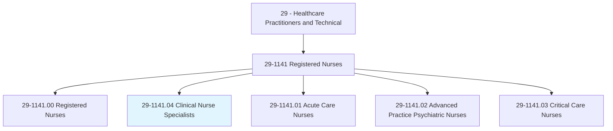
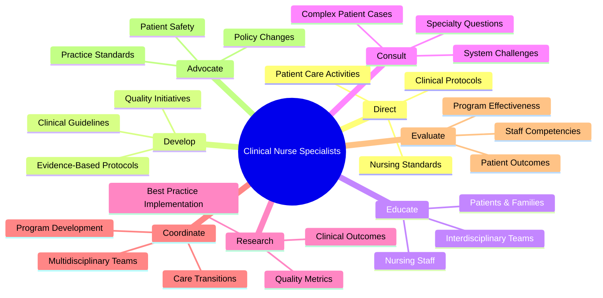
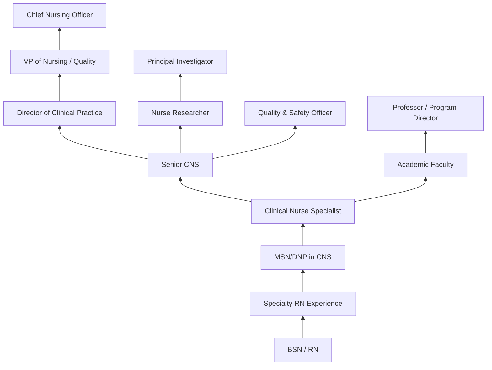
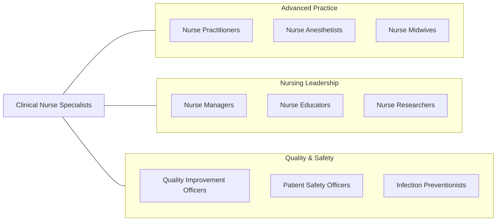

# Clinical Nurse Specialists

> Plan, direct, or coordinate the daily patient care activities in a clinical practice. Ensure adherence to established clinical policies, protocols, regulations, and standards.

## Overview

Clinical Nurse Specialists (CNSs) are advanced practice registered nurses who serve as expert clinicians, educators, consultants, researchers, and leaders within their specialty area. They hold master's or doctoral degrees and are uniquely positioned to influence patient care at three spheres: the individual patient, nursing practice and personnel, and organizational systems. CNSs are the only advanced practice role specifically designed to improve healthcare systems from within.

Operating at the intersection of direct patient care and systems improvement, CNSs develop and implement evidence-based clinical protocols, mentor nursing staff, conduct quality improvement initiatives, and serve as clinical experts for complex patient populations. They diagnose and treat patient conditions within their specialty, prescribe medications in many states, and provide expert consultation to healthcare teams managing challenging clinical situations.

CNSs have been instrumental in driving improvements in patient outcomes, reducing hospital-acquired conditions, decreasing length of stay, and implementing evidence-based practice changes across healthcare organizations. They lead initiatives in areas such as wound care, fall prevention, sepsis management, diabetes education, and palliative care, translating research findings into clinical practice. The role continues to evolve as healthcare systems seek leaders who can bridge the gap between bedside nursing and organizational quality goals.

## Classification Hierarchy

## Key Statistics

| Metric | Value |
|--------|-------|
| SOC Code | 29-1141.04 |
| Median Annual Salary | $82,750 |
| Employment | ~72,000 |
| Projected Growth | 6% (2022-2032) |
| Job Zone | 5 (Extensive Preparation) |
| Category | [Healthcare Practitioners](/occupations/HealthcarePractitioners) |
| Core Tasks | 50+ |
| Source | O*NET |

## Core Tasks

### direct.PatientCareActivities

CNSs lead and oversee clinical care delivery.

**Actions:**
- `direct.PatientCareActivities.using.EvidenceBasedProtocols` - Clinical leadership
- `direct.ClinicalProtocols.for.SpecialtyPopulations` - Protocol development
- `ensure.Adherence.to.ClinicalPoliciesAndStandards` - Compliance oversight
- `evaluate.PatientOutcomes.using.QualityMetrics` - Outcome measurement

### develop.EvidenceBasedProtocols

CNSs translate research into clinical practice.

**Actions:**
- `develop.EvidenceBasedProtocols.for.ClinicalPractice` - Protocol creation
- `develop.ClinicalGuidelines.based.on.CurrentResearch` - Guideline development
- `implement.QualityImprovement.initiatives.across.Units` - QI leadership
- `evaluate.PracticeChanges.using.OutcomeData` - Impact assessment

### educate.NursingStaff

CNSs mentor and educate clinical teams.

**Actions:**
- `educate.NursingStaff.on.BestPractices` - Staff education
- `educate.Patients.regarding.DiseaseManagement` - Patient teaching
- `consult.InterdisciplinaryTeams.on.ComplexCases` - Expert consultation
- `mentor.NoviceNurses.through.ClinicalPreceptorship` - Professional development

## Practice Settings

| Setting | Description |
|---------|-------------|
| Hospitals | System-wide clinical leadership |
| Academic Medical Centers | Teaching, research, and complex care |
| Outpatient Clinics | Specialty ambulatory care |
| Long-Term Care | Chronic disease management |
| Home Health | Home-based clinical oversight |
| Public Health | Population health management |
| Insurance/Managed Care | Utilization review and case management |
| Corporate Health Systems | Multi-facility clinical standards |

## Skills & Competencies

### Technical Skills
- **Advanced Clinical Assessment** - Expert
- **Evidence-Based Practice** - Expert
- **Quality Improvement Methods** - Expert
- **Clinical Protocol Development** - Expert
- **Research Methodology** - Advanced
- **Pharmacology** - Advanced
- **Data Analysis** - Advanced
- **Clinical Education Design** - Expert

### Soft Skills
- **Leadership** - Critical
- **Communication** - Critical
- **Change Management** - Essential
- **Mentoring** - Essential
- **Systems Thinking** - Essential
- **Collaboration** - Essential
- **Advocacy** - Essential

## Education & Training

| Requirement | Details |
|-------------|---------|
| BSN | Bachelor of Science in Nursing |
| MSN or DNP | Master's or doctoral degree with CNS focus |
| Clinical Hours | 500+ supervised advanced practice hours |
| RN Experience | Typically 2+ years in specialty area |
| Licensure | NCLEX-RN + state APRN licensure (where applicable) |
| Certification | ANCC or AACN specialty certification |
| Continuing Education | Per certifying body requirements |

## Certifications

| Certification | Description |
|---------------|-------------|
| CCNS | Adult Critical Care CNS (AACN) |
| ACCNS-AG | Acute Care CNS - Adult-Gerontology |
| ACCNS-P | Acute Care CNS - Pediatric |
| AGCNS-BC | Adult-Gerontology CNS - Board Certified (ANCC) |
| PCNS-BC | Pediatric CNS - Board Certified |
| CWOCN | Certified Wound, Ostomy, Continence Nurse |
| OCN | Oncology Certified Nurse |

## Career Progression

## Specializations

| Focus Area | Description |
|------------|-------------|
| Critical Care | ICU patient population and systems |
| Oncology | Cancer care protocols and support |
| Wound Care / Ostomy | Wound, ostomy, and continence management |
| Diabetes Management | Diabetes education and protocols |
| Neonatal | NICU patient care and family support |
| Psychiatric-Mental Health | Behavioral health systems |
| Gerontology | Older adult care optimization |
| Palliative Care | End-of-life and symptom management |

## Technology & Tools

| Technology | Purpose |
|------------|---------|
| Electronic Health Records (Epic, Cerner) | Documentation and order entry |
| Quality Dashboard Systems | Performance metrics tracking |
| Literature Database Systems (PubMed, CINAHL) | Evidence retrieval |
| Statistical Software (SPSS, REDCap) | Outcomes research |
| Learning Management Systems | Staff education delivery |
| Clinical Decision Support Tools | Evidence-based alerting |
| Simulation Equipment | Skills training and education |
| Telehealth Platforms | Remote consultation |

## Related Occupations

## Industries

- [Hospitals](/industries/Healthcare/Hospitals/index) - Primary Employment
- [Academic Medical Centers](/industries/Healthcare/Hospitals/Teaching) - Teaching & Research
- [Home Health Services](/industries/Healthcare/HomeHealth) - Home-Based Care
- [Long-Term Care](/industries/Healthcare/NursingCare) - Chronic Care Management
- [Insurance/Managed Care](/industries/Finance/Insurance) - Utilization Management
- [Government](/industries/PublicAdministration) - VA and Public Health

## Departments

This occupation typically works in:
- Nursing Practice & Quality
- Clinical Education
- Quality Improvement
- Specialty Nursing Services
- Research & Evidence-Based Practice

---

*Source: O*NET 29-1141.04 - ONETOccupation*
