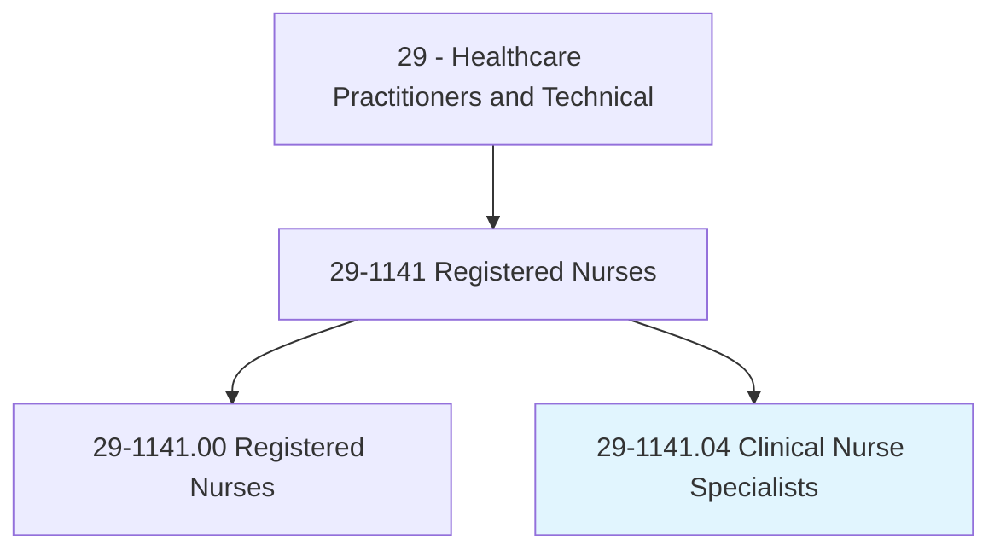
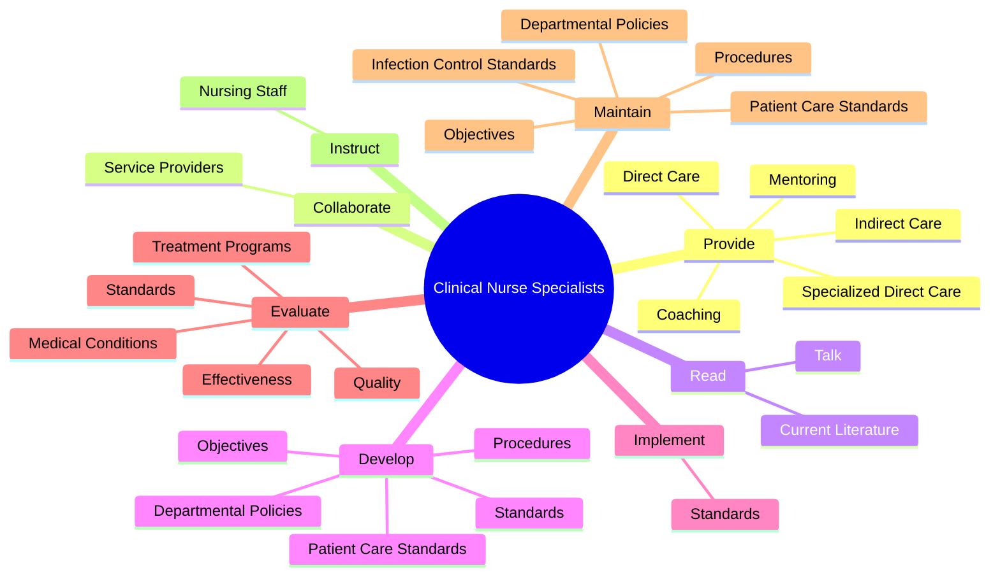
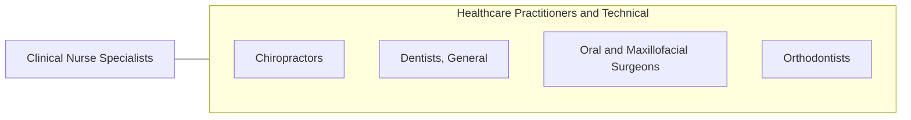

# Clinical Nurse Specialists

> Direct nursing staff in the provision of patient care in a clinical practice setting, such as a hospital, hospice, clinic, or home. Ensure adherence to established clinical policies, protocols, regulations, and standards.

## Overview

Clinical Nurse Specialists is a specialized variant within the Healthcare Practitioners and Technical category. Direct nursing staff in the provision of patient care in a clinical practice setting, such as a hospital, hospice, clinic, or home. 

## Classification Hierarchy

## Key Statistics

| Metric | Value |
|--------|-------|
| SOC Code | 29-1141.04 |
| Category | [Healthcare Practitioners and Technical](/occupations/HealthcarePractitioners) |
| Task Count | 144 |
| Source | O*NET |

## Core Tasks

### provide.SpecializedDirectCare

Clinical Nurse Specialists provide specialized direct care as part of their core responsibilities.

**Actions:**
- `provide.SpecializedDirectCare.to.InpatientsWithinDesignatedSpecialty`
- `provide.SpecializedDirectCare.to.OutpatientsWithinDesignatedSpecialty`
- `provide.SpecializedDirectCare.to.Obstetrics`
- `provide.SpecializedDirectCare.to.Neurology`

### collaborate.ServiceProviders

Clinical Nurse Specialists collaborate service providers as part of their core responsibilities.

**Actions:**
- `collaborate.ServiceProviders.to.ensure.OptimalPatientCare`

### read.CurrentLiterature

Clinical Nurse Specialists read current literature as part of their core responsibilities.

**Actions:**
- `read.CurrentLiterature.with.Conferences.to.keep.AbreastOfDevelopmentsInNursing`
- `read.Talk.with.Conferences.to.keep.AbreastOfDevelopmentsInNursing`

## Skills & Competencies

### Technical Skills
- **Clinical Skills** - Advanced
- **Diagnostic Procedures** - Advanced
- **Patient Care** - Advanced

### Soft Skills
- **Communication** - Essential
- **Problem Solving** - Essential
- **Critical Thinking** - Important
- **Teamwork** - Important
- **Adaptability** - Important

## Related Occupations

## Industries

This occupation is found across multiple industries. See [Industries](/industries) for sector-specific employment data.

## Career Progression

---

*Source: O*NET 29-1141.04 - ONETOccupation*
