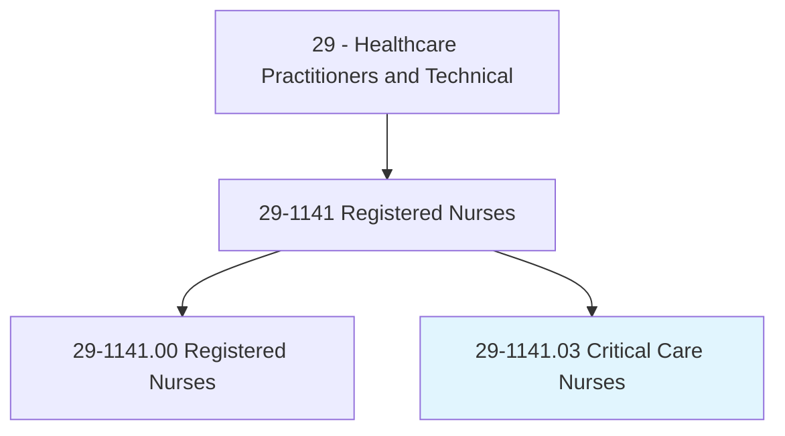
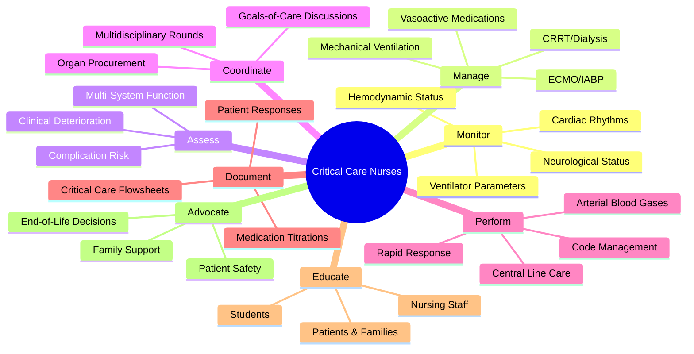
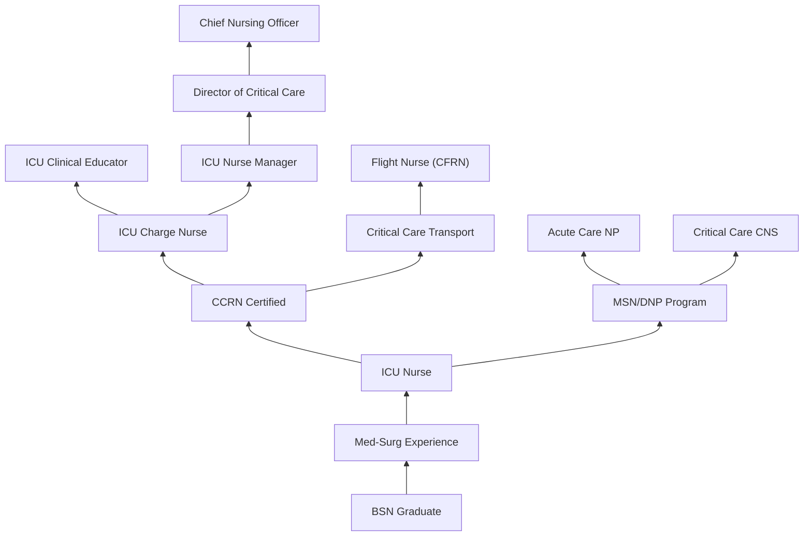
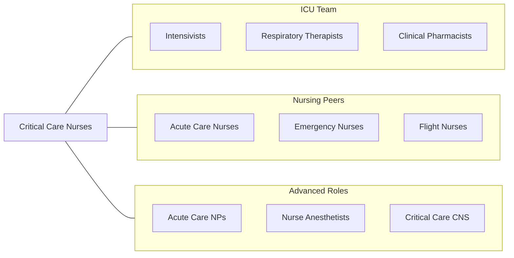

# Critical Care Nurses

> Provide advanced nursing care for patients in critical or coronary care units. Identify patients at risk of complications, recognize complications, and provide care to prevent further complications.

## Overview

Critical Care Nurses are specialized registered nurses who provide complex, high-acuity care to patients with life-threatening conditions in intensive care units (ICUs). They manage patients experiencing multi-organ failure, severe sepsis, acute respiratory distress syndrome, traumatic injuries, post-cardiac surgery recovery, and other critical illnesses that require continuous monitoring and rapid clinical intervention. These nurses function with a high degree of autonomy and clinical judgment in the most acute healthcare settings.

The critical care environment demands mastery of advanced technologies including mechanical ventilators, hemodynamic monitoring systems, continuous renal replacement therapy, intra-aortic balloon pumps, extracorporeal membrane oxygenation (ECMO), and targeted temperature management devices. Critical care nurses continuously assess patient neurological, cardiovascular, respiratory, and metabolic status, making real-time decisions about medication titration, ventilator adjustments, and escalation of care.

Beyond technical expertise, critical care nurses serve as patient and family advocates during some of the most difficult experiences in healthcare. They facilitate goals-of-care conversations, support families through end-of-life decisions, coordinate multidisciplinary rounds, and serve as the communication hub between physicians, respiratory therapists, pharmacists, and other members of the critical care team. The emotional demands of this work require exceptional resilience and access to professional support systems.

## Classification Hierarchy

## Key Statistics

| Metric | Value |
|--------|-------|
| SOC Code | 29-1141.03 |
| Median Annual Salary | $89,500 |
| Employment | ~500,000+ |
| Projected Growth | 6% (2022-2032) |
| Job Zone | 4 (Considerable Preparation) |
| Category | [Healthcare Practitioners](/occupations/HealthcarePractitioners) |
| Core Tasks | 60+ |
| Source | O*NET |

## Core Tasks

### monitor.CriticalPatients

Critical Care Nurses maintain continuous surveillance of unstable patients.

**Actions:**
- `monitor.HemodynamicStatus.using.InvasiveMonitoring` - Arterial and CVP monitoring
- `monitor.VentilatorParameters.for.RespiratoryOptimization` - Ventilator management
- `monitor.NeurologicalStatus.using.GCS.and.PupilChecks` - Neuro surveillance
- `monitor.CardiacRhythms.for.LifeThreateningArrhythmias` - Rhythm analysis

### manage.AdvancedTherapies

Critical Care Nurses operate complex life-support technologies.

**Actions:**
- `manage.VasoactiveMedications.with.ContinuousTitration` - Hemodynamic support
- `manage.MechanicalVentilation.per.LungProtectiveProtocols` - Vent management
- `manage.ContinuousRenalReplacementTherapy.for.AcuteKidneyInjury` - CRRT care
- `manage.ECMO.for.CardiopulmonaryFailure` - Extracorporeal support

### coordinate.CriticalCareTeam

Critical Care Nurses lead interdisciplinary communication.

**Actions:**
- `coordinate.MultidisciplinaryRounds.in.ICU` - Team rounds
- `coordinate.GoalsOfCareDiscussions.with.Families` - Family conferences
- `coordinate.OrganProcurement.with.TransplantTeam` - Donor management
- `advocate.PatientWishes.during.EndOfLifeCare` - End-of-life advocacy

## Practice Settings

| Setting | Description |
|---------|-------------|
| Medical ICU | Medical critical illness management |
| Surgical ICU | Post-operative critical care |
| Cardiac ICU / CCU | Acute cardiac conditions |
| Neuro ICU | Neurological critical illness |
| Trauma ICU | Traumatic injury management |
| Burn ICU | Severe burn patient care |
| Pediatric ICU (PICU) | Critically ill children |
| Neonatal ICU (NICU) | Premature and critically ill newborns |

## Skills & Competencies

### Technical Skills
- **Hemodynamic Monitoring** - Expert
- **Mechanical Ventilation** - Expert
- **Vasoactive Medication Management** - Expert
- **Advanced Cardiac Life Support** - Expert
- **Arterial & Central Line Management** - Expert
- **CRRT/Dialysis Management** - Advanced
- **ECMO/IABP Management** - Advanced
- **Point-of-Care Ultrasound** - Advanced

### Soft Skills
- **Clinical Judgment** - Critical
- **Crisis Management** - Critical
- **Communication** - Essential
- **Emotional Resilience** - Essential
- **Teamwork** - Essential
- **Family Support & Advocacy** - Essential
- **Leadership** - Essential

## Education & Training

| Requirement | Details |
|-------------|---------|
| Minimum Education | BSN (strongly preferred for ICU) |
| Advanced Education | MSN/DNP for ACNP or CNS roles |
| Licensure | NCLEX-RN |
| ICU Experience | Minimum 1 year for CCRN eligibility |
| ICU Orientation | 12-16 week precepted orientation |
| Continuing Education | Per AACN certification requirements |
| Competency Validation | Annual skills assessment |

## Certifications

| Certification | Description |
|---------------|-------------|
| CCRN | Critical Care Registered Nurse (AACN) |
| CCRN-K | CCRN Knowledge-based (non-bedside) |
| CCRN-E | CCRN for tele-ICU nurses |
| CSC | Cardiac Surgery Certification |
| CMC | Cardiac Medicine Certification |
| PCCN | Progressive Care Certified Nurse |
| ACLS | Advanced Cardiovascular Life Support |
| TNCC | Trauma Nursing Core Course |

## Career Progression

## Specializations

| Focus Area | Description |
|------------|-------------|
| Cardiac Critical Care | CABG, LVAD, transplant patients |
| Neuroscience Critical Care | Stroke, TBI, status epilepticus |
| Surgical Critical Care | Complex post-surgical patients |
| Trauma Critical Care | Multi-system trauma |
| Burn Critical Care | Major burn management |
| Neonatal Critical Care | NICU premature/critically ill infants |
| Pediatric Critical Care | PICU critically ill children |
| Critical Care Transport | Flight and ground transport nursing |

## Technology & Tools

| Technology | Purpose |
|------------|---------|
| Hemodynamic Monitoring Systems (Swan-Ganz, PiCCO) | Invasive cardiac monitoring |
| Mechanical Ventilators (Hamilton, Drager, PB840) | Respiratory support |
| ECMO Circuits | Extracorporeal life support |
| CRRT Machines (Prismax, NxStage) | Continuous dialysis |
| Intra-Aortic Balloon Pumps | Mechanical circulatory support |
| EEG Monitoring Systems | Continuous brain monitoring |
| Electronic ICU Flowsheets | Critical care documentation |
| Tele-ICU Systems | Remote ICU monitoring |

## Related Occupations

## Industries

- [Hospitals](/industries/Healthcare/Hospitals/index) - Primary Employment
- [Academic Medical Centers](/industries/Healthcare/Hospitals/Teaching) - Level I Trauma Centers
- [Veterans Affairs](/industries/Government/Federal) - VA ICUs
- [Air Medical Services](/industries/Transportation/AirAmbulance) - Flight Nursing
- [Travel Nursing Agencies](/industries/Healthcare/StaffingAgencies) - ICU Contracts

## Departments

This occupation typically works in:
- Intensive Care Unit
- Cardiac Care Unit
- Surgical ICU
- Neuro ICU
- Trauma ICU

---

*Source: O*NET 29-1141.03 - ONETOccupation*
