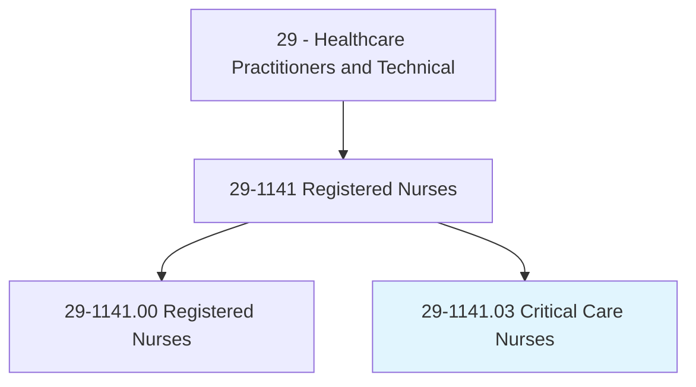
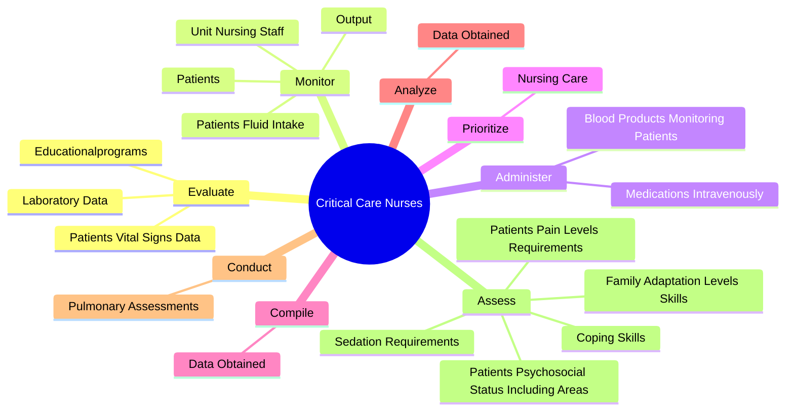
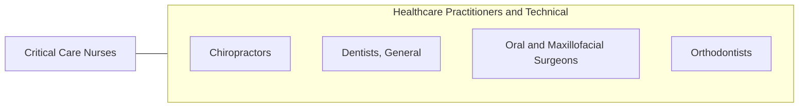

# Critical Care Nurses

> Provide specialized nursing care for patients in critical or coronary care units.

## Overview

Critical Care Nurses is classified under Healthcare Practitioners and Technical (SOC 29). Provide specialized nursing care for patients in critical or coronary care units.

## Classification Hierarchy

## Key Statistics

| Metric | Value |
|--------|-------|
| SOC Code | 29-1141.03 |
| Category | [Healthcare Practitioners and Technical](/occupations/HealthcarePractitioners) |
| Task Count | 86 |
| Source | O*NET |

## Core Tasks

### evaluate.PatientsVitalSignsData

Critical Care Nurses evaluate patients vital signs data as part of their core responsibilities.

**Actions:**
- `evaluate.PatientsVitalSignsData.to.determine.EmergencyInterventionNeeds`
- `evaluate.LaboratoryData.to.determine.EmergencyInterventionNeeds`
- `evaluate.Educationalprograms.for.NursingStaff`
- `evaluate.Educationalprograms.for.InterdisciplinaryHealthCareTeamMembers`

### monitor.Patients

Critical Care Nurses monitor patients as part of their core responsibilities.

**Actions:**
- `monitor.Patients.for.Changes.in.StatusOfConditions`
- `monitor.Patients.for.Indications.of.Conditions`
- `monitor.Patients.for.Sepsis`
- `monitor.Patients.for.Shock`

### administer.MedicationsIntravenously

Critical Care Nurses administer medications intravenously as part of their core responsibilities.

**Actions:**
- `administer.MedicationsIntravenously.by.Injection`
- `administer.MedicationsIntravenously.by.Orally`
- `administer.MedicationsIntravenously.by.ThroughGastricTubes`
- `administer.MedicationsIntravenously.by.ByOtherMethods`

## Skills & Competencies

### Technical Skills
- **Clinical Skills** - Advanced
- **Diagnostic Procedures** - Advanced
- **Patient Care** - Advanced

### Soft Skills
- **Communication** - Essential
- **Problem Solving** - Essential
- **Critical Thinking** - Important
- **Teamwork** - Important
- **Adaptability** - Important

## Related Occupations

## Industries

This occupation is found across multiple industries. See [Industries](/industries) for sector-specific employment data.

## Career Progression

---

*Source: O*NET 29-1141.03 - ONETOccupation*
