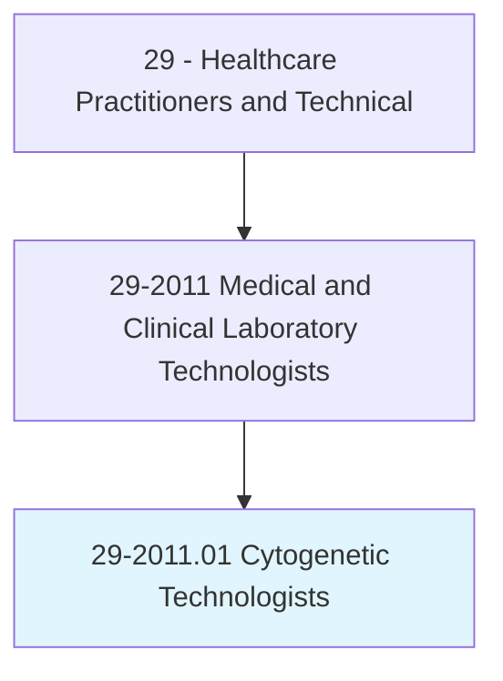
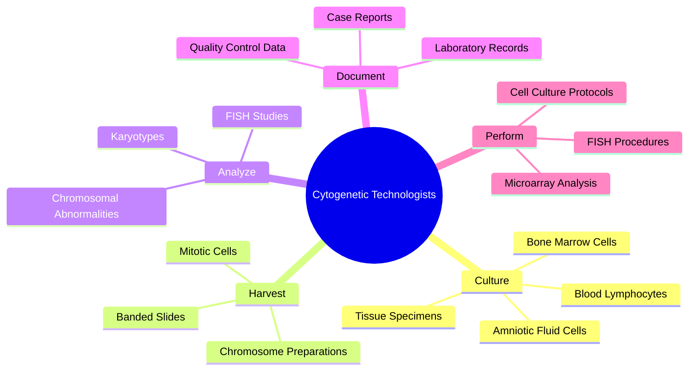
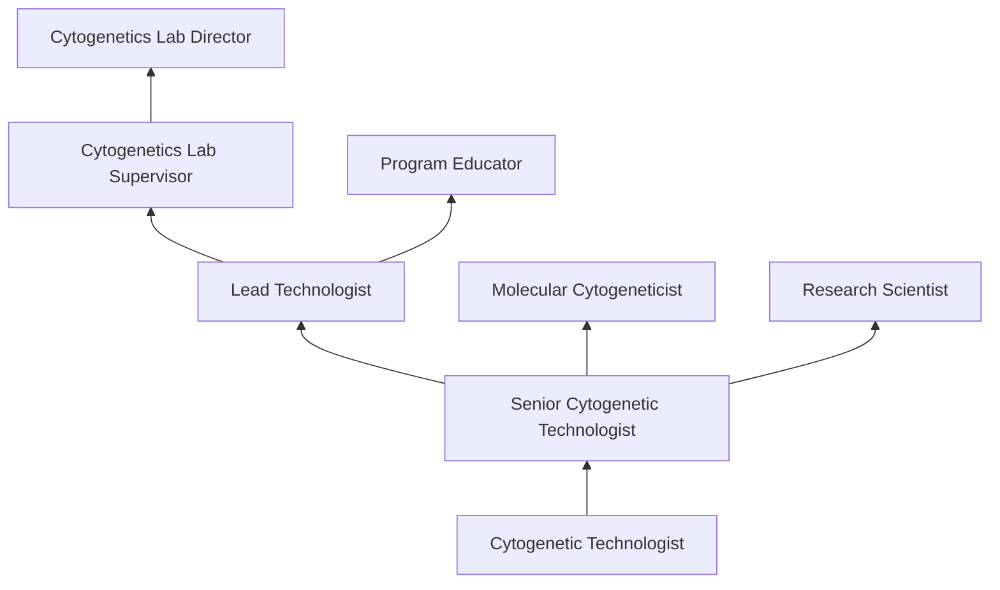
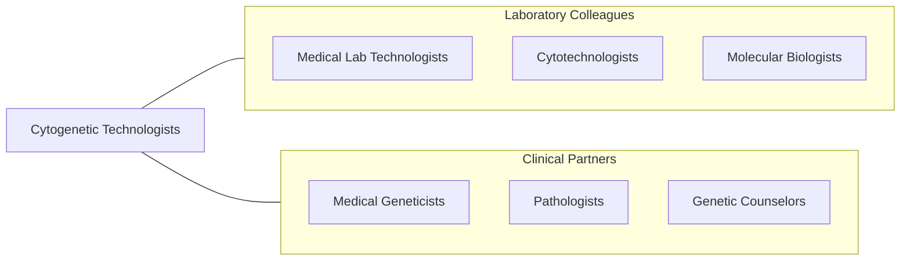

# Cytogenetic Technologists

> Analyze chromosomes found in biological specimens such as amniotic fluids, bone marrow, and blood to aid in the study, diagnosis, or treatment of genetic diseases.

## Overview

Cytogenetic Technologists are specialized laboratory professionals who analyze human chromosomes to identify genetic abnormalities associated with congenital disorders, cancer, infertility, and other medical conditions. They culture cells from patient specimens (blood, bone marrow, amniotic fluid, tissue biopsies), harvest chromosomes at specific mitotic stages, prepare microscopic slides, and analyze banded chromosome patterns to detect numerical and structural abnormalities.

The scope of cytogenetic technology encompasses conventional karyotyping, fluorescence in situ hybridization (FISH), chromosomal microarray analysis (CMA), and increasingly, correlation with molecular genetic findings. Cytogenetic technologists identify conditions such as Down syndrome (trisomy 21), Turner syndrome (monosomy X), Philadelphia chromosome in chronic myeloid leukemia, and complex chromosomal rearrangements in hematologic malignancies.

Advances in genomic medicine have expanded the role of cytogenetic technologists to include next-generation sequencing (NGS) support, array-based comparative genomic hybridization (aCGH), and integration of cytogenetic data with molecular pathology findings. The field remains essential for prenatal diagnosis, cancer cytogenetics, and constitutional genetic analysis.

## Classification Hierarchy

## Key Statistics

| Metric | Value |
|--------|-------|
| SOC Code | 29-2011.01 |
| Median Annual Salary | $57,800 |
| Employment | ~5,000 |
| Projected Growth | 5% (2022-2032) |
| Job Zone | 4 (Considerable Preparation) |
| Category | [Healthcare Practitioners](/occupations/HealthcarePractitioners) |
| Core Tasks | 25+ |
| Source | O*NET |

## Core Tasks

### culture.CellSpecimens

Cytogenetic Technologists prepare and maintain cell cultures.

**Actions:**
- `culture.BloodLymphocytes.using.MitogenStimulation` - Blood cultures
- `culture.BoneMarrowCells.for.CancerCytogenetics` - Oncology specimens
- `culture.AmnioticFluidCells.for.PrenatalDiagnosis` - Prenatal cultures
- `harvest.MitoticCells.using.ColchicineArrest` - Chromosome harvest

### analyze.Chromosomes

Cytogenetic Technologists identify chromosomal abnormalities.

**Actions:**
- `analyze.Karyotypes.for.NumericalAbnormalities` - Aneuploidy detection
- `analyze.BandedChromosomes.for.StructuralRearrangements` - Structural analysis
- `perform.FISH.for.TargetedGeneDetection` - Molecular cytogenetics
- `interpret.ChromosomalFindings.for.ClinicalCorrelation` - Clinical reporting

## Practice Settings

| Setting | Description |
|---------|-------------|
| Hospital Laboratories | Clinical cytogenetics services |
| Reference Laboratories | High-volume genetic testing |
| Academic Medical Centers | Research and clinical testing |
| Prenatal Diagnostic Centers | Amniocentesis and CVS analysis |
| Cancer Centers | Oncology cytogenetics |
| Research Institutions | Genomic research |

## Skills & Competencies

### Technical Skills
- **Karyotype Analysis** - Expert
- **Cell Culture Techniques** - Expert
- **FISH Methodology** - Expert
- **Chromosome Banding** - Expert
- **Microarray Analysis** - Advanced
- **Microscopy** - Expert
- **Quality Control** - Advanced

### Soft Skills
- **Attention to Detail** - Critical
- **Analytical Thinking** - Essential
- **Problem Solving** - Essential
- **Communication** - Essential
- **Organization** - Essential

## Education & Training

| Requirement | Details |
|-------------|---------|
| Education | Bachelor's degree in cytogenetic technology or related science |
| Clinical Training | 12-month cytogenetics training program |
| Certification | CLSp(CG) through ASCP Board of Certification |
| Continuing Education | Per certification requirements |

## Certifications

| Certification | Description |
|---------------|-------------|
| CLSp(CG) | Cytogenetic Technologist Specialist (ASCP) |
| CG(ASCP) | Cytogeneticist certification |
| MB(ASCP) | Molecular Biology certification |
| FISH Competency | Laboratory-specific FISH certification |

## Career Progression

## Specializations

| Focus Area | Description |
|------------|-------------|
| Cancer Cytogenetics | Hematologic malignancy analysis |
| Prenatal Cytogenetics | Fetal chromosome analysis |
| Constitutional Cytogenetics | Birth defect diagnosis |
| Molecular Cytogenetics (FISH) | Targeted probe analysis |
| Array CGH | Genomic microarray testing |

## Technology & Tools

| Technology | Purpose |
|------------|---------|
| Automated Karyotyping Systems (MetaSystems, Leica) | Digital chromosome analysis |
| FISH Imaging Systems | Fluorescence microscopy |
| Microarray Platforms (Agilent, Illumina) | Genomic arrays |
| CO2 Incubators | Cell culture maintenance |
| Biological Safety Cabinets | Sterile specimen handling |
| LIS (Laboratory Information Systems) | Data management |

## Related Occupations

## Industries

- [Hospitals](/industries/Healthcare/Hospitals/index) - Clinical Cytogenetics
- [Reference Laboratories](/industries/Healthcare/MedicalLaboratories) - High-Volume Testing
- [Academic Medical Centers](/industries/Education) - Research and Teaching
- [Pharmaceutical](/industries/Manufacturing/ChemicalManufacturing/Pharmaceutical) - Drug Development

## Departments

This occupation typically works in:
- Cytogenetics Laboratory
- Pathology
- Genetics
- Clinical Laboratory

---

*Source: O*NET 29-2011.01 - ONETOccupation*
