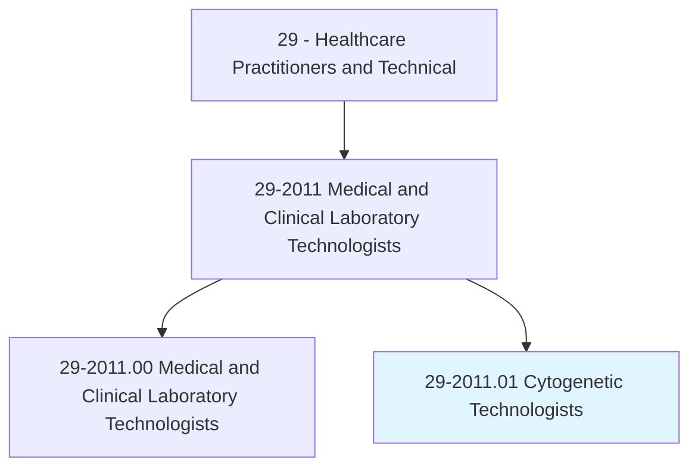
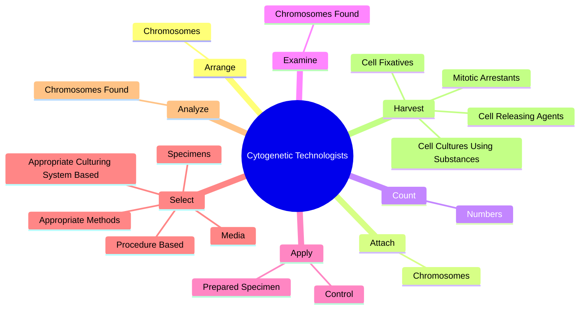
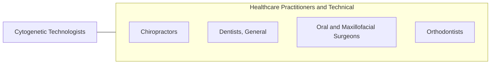

# Cytogenetic Technologists

> Analyze chromosomes or chromosome segments found in biological specimens, such as amniotic fluids, bone marrow, solid tumors, and blood to aid in the study, diagnosis, classification, or treatment of inherited or acquired genetic diseases. Conduct analyses through classical cytogenetic, fluorescent in situ hybridization (FISH) or array comparative genome hybridization (aCGH) techniques.

## Overview

Cytogenetic Technologists is a specialized variant within the Healthcare Practitioners and Technical category. Analyze chromosomes or chromosome segments found in biological specimens, such as amniotic fluids, bone marrow, solid tumors, and blood to aid in the study, diagnosis, classification, or treatment of inherited or acquired genetic diseases. 

## Classification Hierarchy

## Key Statistics

| Metric | Value |
|--------|-------|
| SOC Code | 29-2011.01 |
| Category | [Healthcare Practitioners and Technical](/occupations/HealthcarePractitioners) |
| Task Count | 127 |
| Source | O*NET |

## Core Tasks

### arrange.Chromosomes

Cytogenetic Technologists arrange chromosomes as part of their core responsibilities.

**Actions:**
- `arrange.Chromosomes.in.NumberedPairs.on.KaryotypeCharts`
- `arrange.Chromosomes.in.UsingStandardGeneticsLaboratoryPractices`
- `arrange.Chromosomes.in.Nomenclature`
- `arrange.Chromosomes.in.identify.Normal`

### attach.Chromosomes

Cytogenetic Technologists attach chromosomes as part of their core responsibilities.

**Actions:**
- `attach.Chromosomes.in.NumberedPairs.on.KaryotypeCharts`
- `attach.Chromosomes.in.UsingStandardGeneticsLaboratoryPractices`
- `attach.Chromosomes.in.Nomenclature`
- `attach.Chromosomes.in.identify.Normal`

### count.Numbers

Cytogenetic Technologists count numbers as part of their core responsibilities.

**Actions:**
- `count.Numbers.of.Chromosomes`
- `count.Numbers.of.IdentifyStructuralAbnormalities.by.ViewingCultureSlidesThroughMicroscopes`
- `count.Numbers.of.LightMicroscopes`
- `count.Numbers.of.Photomicroscopes`

## Skills & Competencies

### Technical Skills
- **Clinical Skills** - Advanced
- **Diagnostic Procedures** - Advanced
- **Patient Care** - Advanced

### Soft Skills
- **Communication** - Essential
- **Problem Solving** - Essential
- **Critical Thinking** - Important
- **Teamwork** - Important
- **Adaptability** - Important

## Related Occupations

## Industries

This occupation is found across multiple industries. See [Industries](/industries) for sector-specific employment data.

## Career Progression

---

*Source: O*NET 29-2011.01 - ONETOccupation*
