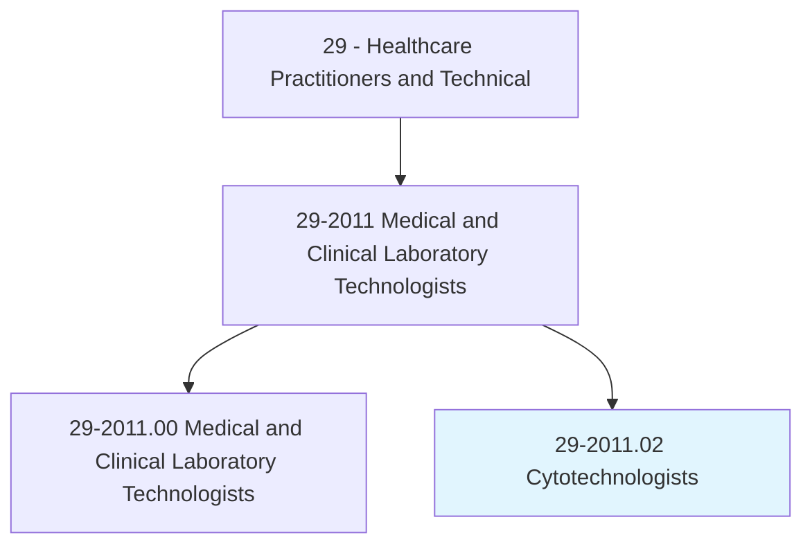
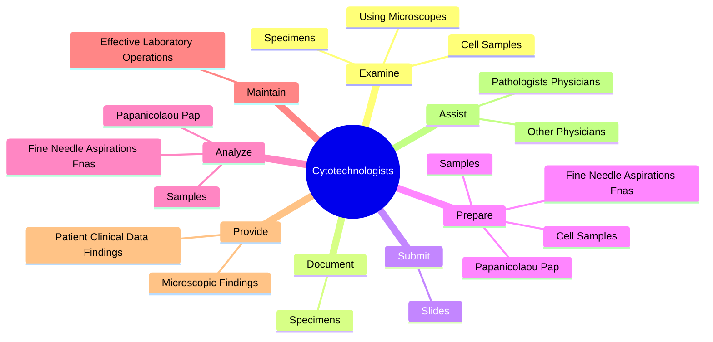
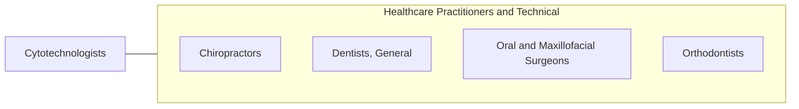

# Cytotechnologists

> Stain, mount, and study cells to detect evidence of cancer, hormonal abnormalities, and other pathological conditions following established standards and practices.

## Overview

Cytotechnologists is classified under Healthcare Practitioners and Technical (SOC 29). Stain, mount, and study cells to detect evidence of cancer, hormonal abnormalities, and other pathological conditions following established standards and practices.

## Classification Hierarchy

## Key Statistics

| Metric | Value |
|--------|-------|
| SOC Code | 29-2011.02 |
| Category | [Healthcare Practitioners and Technical](/occupations/HealthcarePractitioners) |
| Task Count | 34 |
| Source | O*NET |

## Core Tasks

### examine.CellSamples

Cytotechnologists examine cell samples as part of their core responsibilities.

**Actions:**
- `examine.CellSamples.to.detect.AbnormalitiesInColor`
- `examine.CellSamples.to.shape`
- `examine.CellSamples.to.size.OfCellularComponents`
- `examine.CellSamples.to.Patterns`

### document.Specimens

Cytotechnologists document specimens as part of their core responsibilities.

**Actions:**
- `document.Specimens.by.VerifyingPatientsInformation`
- `document.Specimens.by.SpecimensInformation`

### submit.Slides

Cytotechnologists submit slides as part of their core responsibilities.

**Actions:**
- `submit.Slides.with.AbnormalCellStructuresToPathologistsForFurtherExamination`

## Skills & Competencies

### Technical Skills
- **Clinical Skills** - Advanced
- **Diagnostic Procedures** - Advanced
- **Patient Care** - Advanced

### Soft Skills
- **Communication** - Essential
- **Problem Solving** - Essential
- **Critical Thinking** - Important
- **Teamwork** - Important
- **Adaptability** - Important

## Related Occupations

## Industries

This occupation is found across multiple industries. See [Industries](/industries) for sector-specific employment data.

## Career Progression

---

*Source: O*NET 29-2011.02 - ONETOccupation*
