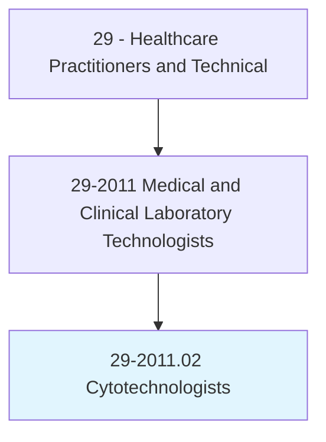
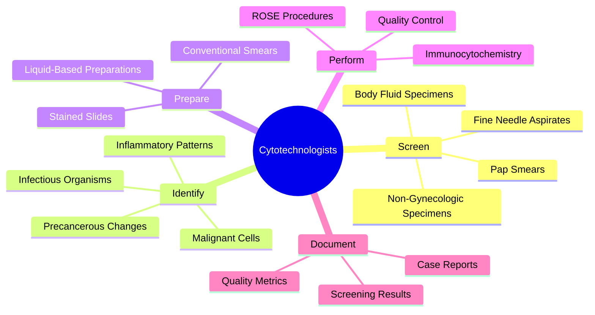
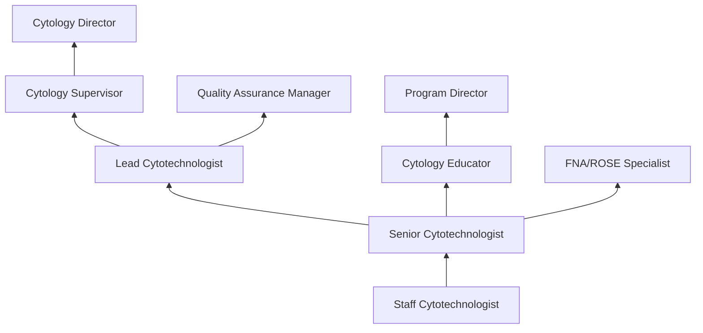
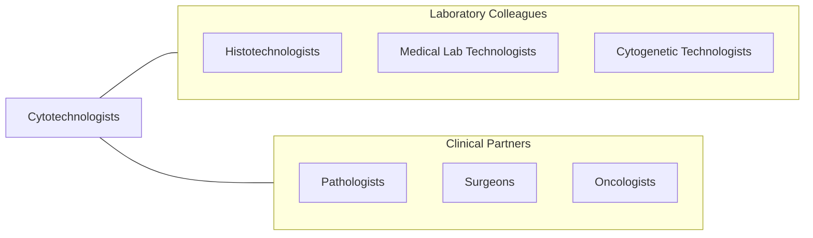

# Cytotechnologists

> Stain, mount, and study cells to detect evidence of cancer, hormonal abnormalities, and other pathological conditions following established standards and practices.

## Overview

Cytotechnologists are specialized laboratory professionals who microscopically examine cellular specimens to detect abnormalities indicative of cancer, precancerous conditions, infectious diseases, and inflammatory processes. They screen Pap smears (cervical cytology), fine needle aspirates, body fluid specimens, and non-gynecologic preparations, identifying cellular changes that require further evaluation by a pathologist.

The role requires extensive knowledge of normal and abnormal cell morphology across multiple organ systems. Cytotechnologists assess specimen adequacy, screen slides systematically using light microscopy, identify atypical and malignant cells, and classify findings using standardized reporting systems such as the Bethesda System for cervical cytology. They also perform and interpret ancillary testing including immunocytochemistry and molecular markers.

Modern cytotechnology has evolved with liquid-based cytology preparations, computer-assisted screening systems, HPV co-testing, and rapid on-site evaluation (ROSE) of fine needle aspiration biopsies. Despite advances in automated screening, the cytotechnologist's expertise in pattern recognition and morphologic interpretation remains essential for accurate cancer detection and prevention.

## Classification Hierarchy

## Key Statistics

| Metric | Value |
|--------|-------|
| SOC Code | 29-2011.02 |
| Median Annual Salary | $60,780 |
| Employment | ~8,000 |
| Projected Growth | 5% (2022-2032) |
| Job Zone | 4 (Considerable Preparation) |
| Category | [Healthcare Practitioners](/occupations/HealthcarePractitioners) |
| Core Tasks | 25+ |
| Source | O*NET |

## Core Tasks

### screen.CytologySpecimens

Cytotechnologists systematically examine cellular specimens.

**Actions:**
- `screen.PapSmears.for.CervicalAbnormalities` - Gynecologic screening
- `screen.BodyFluids.for.MalignantCells` - Non-gyn cytology
- `evaluate.FineNeedleAspirates.for.DiagnosticAdequacy` - FNA assessment
- `classify.CellularFindings.using.BethesdaSystem` - Standardized reporting

### perform.AncillaryTesting

Cytotechnologists conduct supplementary analyses.

**Actions:**
- `perform.Immunocytochemistry.for.CellTyping` - ICC staining
- `perform.RapidOnSiteEvaluation.for.SpecimenAdequacy` - ROSE
- `operate.AutomatedScreeningSystems.for.QualityAssurance` - Computer-assisted screening
- `prepare.LiquidBasedCytology.using.ThinPrepOrSurePath` - LBC processing

## Practice Settings

| Setting | Description |
|---------|-------------|
| Hospital Pathology Labs | Clinical cytology services |
| Reference Laboratories | High-volume Pap screening |
| Academic Medical Centers | Teaching and research |
| Cancer Centers | Oncology cytology |
| Independent Pathology Labs | Outpatient cytology |
| Public Health Laboratories | Population screening |

## Skills & Competencies

### Technical Skills
- **Microscopic Screening** - Expert
- **Cell Morphology Recognition** - Expert
- **Bethesda Classification** - Expert
- **Specimen Preparation** - Expert
- **Immunocytochemistry** - Advanced
- **Fine Needle Aspiration ROSE** - Advanced
- **Quality Control** - Advanced

### Soft Skills
- **Attention to Detail** - Critical
- **Visual Acuity** - Critical
- **Concentration** - Essential
- **Analytical Thinking** - Essential
- **Communication** - Essential

## Education & Training

| Requirement | Details |
|-------------|---------|
| Education | Bachelor's degree with cytotechnology program |
| Clinical Training | 12-month accredited cytotechnology program |
| Certification | CT(ASCP) through ASCP Board of Certification |
| State Licensure | Required in some states |
| Continuing Education | Per certification and state requirements |

## Certifications

| Certification | Description |
|---------------|-------------|
| CT(ASCP) | Cytotechnologist (ASCP Board of Certification) |
| SCT(ASCP) | Specialist in Cytotechnology |
| CT(IAC) | International Academy of Cytology certification |
| QIHC | Qualification in Immunohistochemistry |

## Career Progression

## Specializations

| Focus Area | Description |
|------------|-------------|
| Gynecologic Cytology | Cervical cancer screening |
| Non-Gynecologic Cytology | Body fluids and brushings |
| Fine Needle Aspiration | FNA biopsy assessment |
| ROSE | Rapid on-site evaluation |
| Molecular Cytology | HPV and molecular testing |

## Technology & Tools

| Technology | Purpose |
|------------|---------|
| Light Microscopes (Olympus, Nikon) | Slide screening |
| Automated Screening Systems (ThinPrep, FocalPoint) | Computer-assisted screening |
| Liquid-Based Cytology Processors | Specimen preparation |
| Immunocytochemistry Stainers | Ancillary testing |
| Digital Pathology Systems | Whole-slide imaging |
| LIS Systems | Result reporting |

## Related Occupations

## Industries

- [Hospitals](/industries/Healthcare/Hospitals/index) - Clinical Cytology
- [Reference Laboratories](/industries/Healthcare/MedicalLaboratories) - High-Volume Screening
- [Academic Medical Centers](/industries/Education) - Teaching and Research
- [Public Health](/industries/PublicAdministration) - Population Screening

## Departments

This occupation typically works in:
- Cytology Laboratory
- Pathology
- Clinical Laboratory
- Anatomic Pathology

---

*Source: O*NET 29-2011.02 - ONETOccupation*
