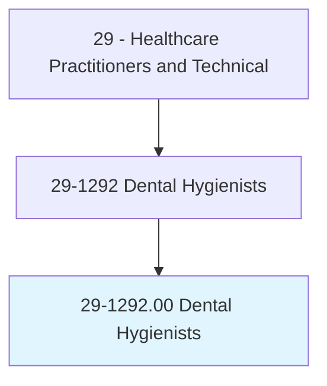
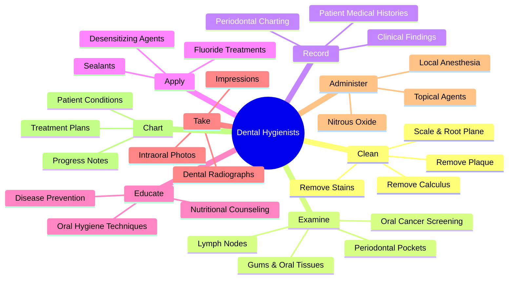
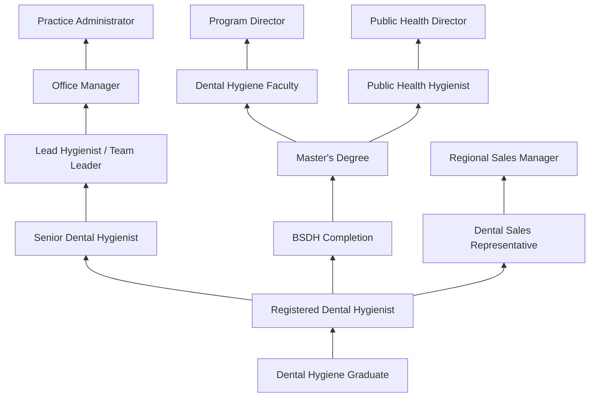
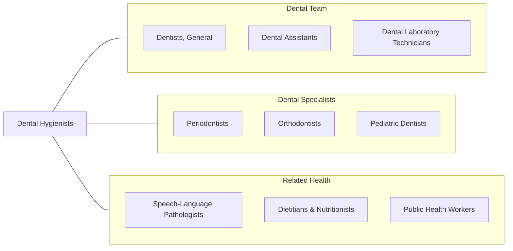

# Dental Hygienists

> Administer oral hygiene care to patients. Assess patient oral hygiene problems or needs and maintain health records. Advise patients on oral health maintenance and disease prevention. May provide advanced care such as providing fluoride treatment or administering topical anesthesia.

## Overview

Dental Hygienists are licensed oral health professionals who focus on preventing and treating oral diseases through clinical care, patient education, and community health promotion. They perform dental cleanings (prophylaxis), remove calculus and plaque deposits, apply preventive materials such as sealants and fluoride, take and develop dental radiographs, and assess patients for signs of oral diseases including periodontal disease and oral cancer.

Working in close collaboration with dentists, dental hygienists are often the primary point of contact for patients during routine dental visits. They conduct comprehensive periodontal assessments, document clinical findings, create individualized oral hygiene plans, and educate patients on proper brushing, flossing, and nutritional habits that support oral health. Many states have expanded the scope of practice for dental hygienists to include local anesthesia administration, nitrous oxide sedation, and restorative functions.

The profession plays a critical role in connecting oral health to overall systemic health, as research increasingly links periodontal disease to cardiovascular disease, diabetes, respiratory infections, and adverse pregnancy outcomes. Dental hygienists serve as frontline screeners for these connections and as advocates for comprehensive preventive care.

## Classification Hierarchy

## Key Statistics

| Metric | Value |
|--------|-------|
| SOC Code | 29-1292.00 |
| Median Annual Salary | $81,400 |
| Employment | ~206,000 |
| Projected Growth | 7% (2022-2032) |
| Job Zone | 3 (Medium Preparation) |
| Category | [Healthcare Practitioners](/occupations/HealthcarePractitioners) |
| Core Tasks | 38 |
| Source | O*NET |

## Core Tasks

### record.PatientMedicalHistories

Dental Hygienists gather and document comprehensive patient health information.

**Actions:**
- `record.PatientMedicalHistories.for.TreatmentPlanning` - Health history documentation
- `review.PatientMedicalHistories.to.IdentifyContraindications` - Safety screening
- `update.PatientRecords.after.EachVisit` - Ongoing documentation
- `chart.PeriodontalFindings.using.ProbingMeasurements` - Clinical assessment

### examine.OralTissues

Dental Hygienists perform thorough oral examinations.

**Actions:**
- `feel.ExamineGums.for.Sores` - Soft tissue assessment
- `feel.ExamineGums.for.Signs.of.Disease` - Disease screening
- `feel.LymphNodes.under.PatientsChin.to.detect.OralCancer` - Cancer screening
- `examine.PeriodontalPockets.using.Probes` - Pocket depth measurement

### clean.TeethAndGums

Dental Hygienists remove deposits and stains from teeth.

**Actions:**
- `clean.CalcareousDeposits.from.Teeth` - Calculus removal
- `clean.Plaque.using.UltrasonicScalers` - Ultrasonic debridement
- `clean.Stains.using.PolishingInstruments` - Stain removal
- `perform.ScalingAndRootPlaning.for.PeriodontalDisease` - Deep cleaning

## Practice Settings

| Setting | Description |
|---------|-------------|
| General Dental Offices | Primary employment setting |
| Periodontal Practices | Specialized gum disease treatment |
| Pediatric Dental Offices | Children's oral health care |
| Community Health Centers | Underserved population care |
| Public Health Departments | Community oral health programs |
| Schools | School-based dental programs |
| Nursing Facilities | Geriatric oral care |
| Corporate Dental Groups | Multi-location dental chains |

## Skills & Competencies

### Technical Skills
- **Scaling & Root Planing** - Expert
- **Periodontal Assessment** - Expert
- **Dental Radiography** - Expert
- **Preventive Applications (Fluoride/Sealants)** - Expert
- **Local Anesthesia Administration** - Advanced
- **Oral Cancer Screening** - Advanced
- **Infection Control** - Expert
- **Instrument Sharpening** - Advanced

### Soft Skills
- **Patient Communication** - Critical
- **Empathy & Rapport Building** - Essential
- **Attention to Detail** - Critical
- **Manual Dexterity** - Critical
- **Time Management** - Essential
- **Patient Education** - Essential
- **Professionalism** - Essential

## Education & Training

| Requirement | Details |
|-------------|---------|
| Minimum Education | Associate degree in Dental Hygiene (2-3 years) |
| Preferred Education | Bachelor of Science in Dental Hygiene (4 years) |
| Advanced Degree | Master's for education or public health roles |
| Licensure | Must pass NBDHE (National Board) and state/regional clinical exam |
| State License | Required in all states |
| Continuing Education | Typically 12-20 hours annually (varies by state) |
| CPR Certification | Required for licensure |

## Certifications

| Certification | Description |
|---------------|-------------|
| NBDHE | National Board Dental Hygiene Examination (required) |
| State Clinical Exam | Regional or state practical examination |
| Local Anesthesia Certification | Authorized to administer local anesthesia |
| Nitrous Oxide Certification | Authorized to administer N2O sedation |
| Laser Certification | Authorized for laser-assisted procedures |
| CPR/BLS | Basic Life Support (required) |
| OSHA Compliance | Occupational safety training |

## Career Progression

## Specializations

| Focus Area | Description |
|------------|-------------|
| Periodontal Therapy | Advanced scaling, root planing, and maintenance |
| Pediatric Dental Hygiene | Children's preventive care |
| Geriatric Dental Hygiene | Elderly and nursing home patient care |
| Public Health | Community-based oral health programs |
| Orthodontic Hygiene | Support for braces and alignment treatment |
| Laser-Assisted Therapy | Laser debridement and bacterial reduction |
| Research | Clinical research and evidence-based practice |
| Education | Academic teaching and curriculum development |

## Technology & Tools

| Technology | Purpose |
|------------|---------|
| Ultrasonic Scalers (Cavitron, Piezo) | Calculus and biofilm removal |
| Digital Radiography (Sensors, Phosphor Plates) | Low-dose dental imaging |
| Intraoral Cameras | Patient education and documentation |
| Diode Lasers | Soft tissue therapy and bacterial reduction |
| Air Polishing Systems (Airflow) | Biofilm and stain removal |
| Caries Detection Devices (DIAGNOdent) | Early decay identification |
| Practice Management Software (Dentrix, Eaglesoft) | Scheduling and charting |
| Electronic Periodontal Probes | Automated pocket depth recording |

## Related Occupations

## Industries

- [Dental Offices](/industries/Healthcare/DentalOffices) - Primary Employment (90%+)
- [Community Health Centers](/industries/Healthcare/CommunityHealthCenters) - Federally Qualified Health Centers
- [Schools](/industries/Education/ElementarySecondary) - School-Based Programs
- [Government](/industries/Government) - Public Health Departments
- [Hospitals](/industries/Healthcare/Hospitals/index) - Hospital Dental Clinics
- [Dental Product Companies](/industries/Manufacturing/MedicalDevices) - Sales and Education

## Departments

This occupation typically works in:
- [Dental Hygiene](/departments/DentalHygiene)
- [Preventive Dentistry](/departments/PreventiveDentistry)
- [Periodontics](/departments/Periodontics)
- [Community Oral Health](/departments/CommunityOralHealth)
- [Patient Education](/departments/PatientEducation)

---

*Source: O*NET 29-1292.00 - ONETOccupation*
