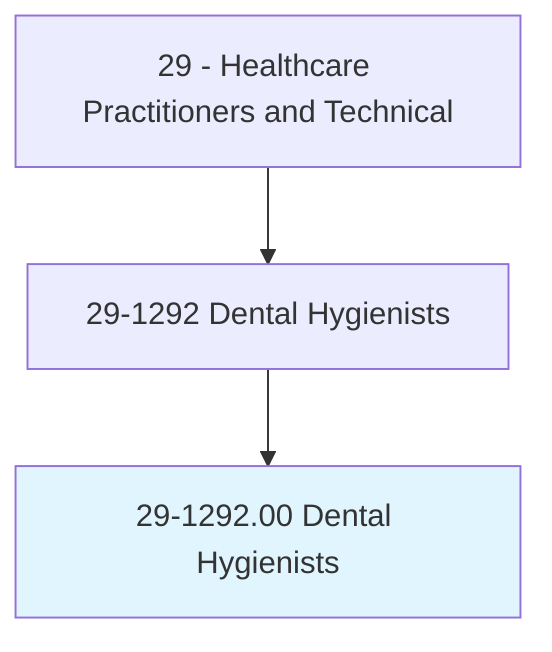
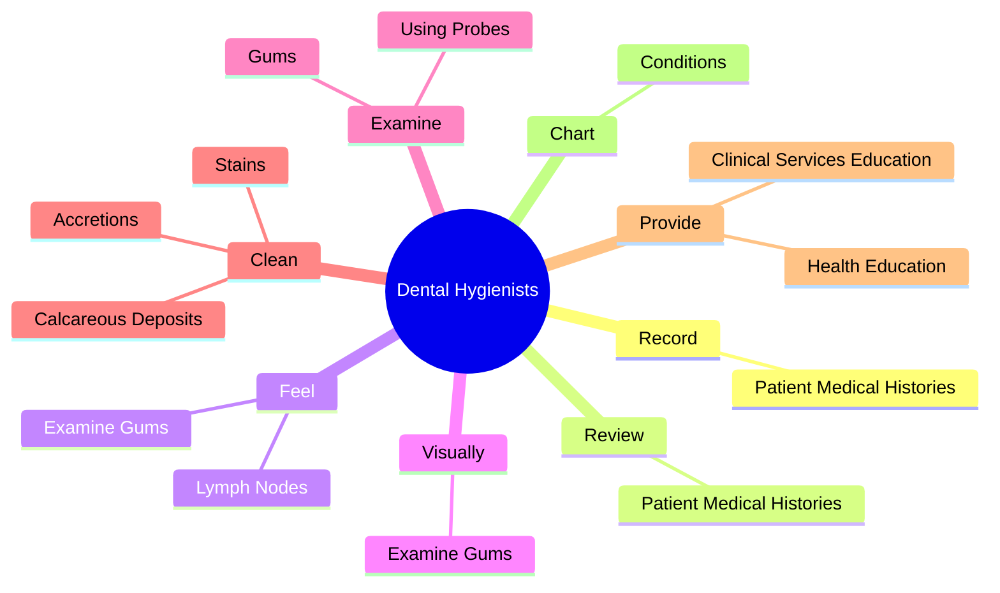
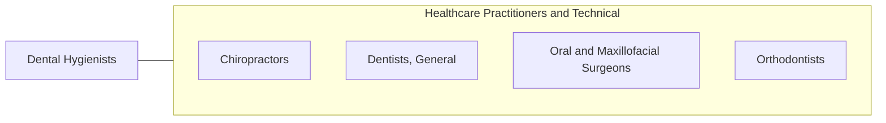

# Dental Hygienists

> Administer oral hygiene care to patients. Assess patient oral hygiene problems or needs and maintain health records. Advise patients on oral health maintenance and disease prevention. May provide advanced care such as providing fluoride treatment or administering topical anesthesia.

## Overview

Dental Hygienists is an occupation within the Healthcare Practitioners and Technical category. Administer oral hygiene care to patients. Assess patient oral hygiene problems or needs and maintain health records.

## Classification Hierarchy

## Key Statistics

| Metric | Value |
|--------|-------|
| SOC Code | 29-1292.00 |
| Category | [Healthcare Practitioners and Technical](/occupations/HealthcarePractitioners) |
| Task Count | 38 |
| Source | O*NET |

## Core Tasks

### record.PatientMedicalHistories

Dental Hygienists record patient medical histories as part of their core responsibilities.

**Actions:**
- `record.PatientMedicalHistories`

### review.PatientMedicalHistories

Dental Hygienists review patient medical histories as part of their core responsibilities.

**Actions:**
- `review.PatientMedicalHistories`

### feel.ExamineGums

Dental Hygienists feel examine gums as part of their core responsibilities.

**Actions:**
- `feel.ExamineGums.for.Sores`
- `feel.ExamineGums.for.Signs.of.Disease`
- `feel.LymphNodes.under.PatientsChin.to.detect.SwellingCouldIndicatePresenceOfOralCancer`
- `feel.LymphNodes.under.PatientsChinToTendernessCouldIndicatePresenceOfOralCancer`

## Skills & Competencies

### Technical Skills
- **Clinical Skills** - Advanced
- **Diagnostic Procedures** - Advanced
- **Patient Care** - Advanced

### Soft Skills
- **Communication** - Essential
- **Problem Solving** - Essential
- **Critical Thinking** - Important
- **Teamwork** - Important
- **Adaptability** - Important

## Related Occupations

## Industries

This occupation is found across multiple industries. See [Industries](/industries) for sector-specific employment data.

## Career Progression

---

*Source: O*NET 29-1292.00 - ONETOccupation*
