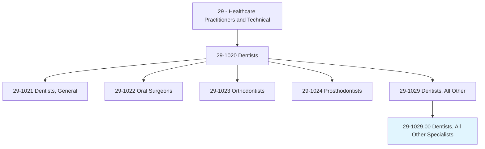
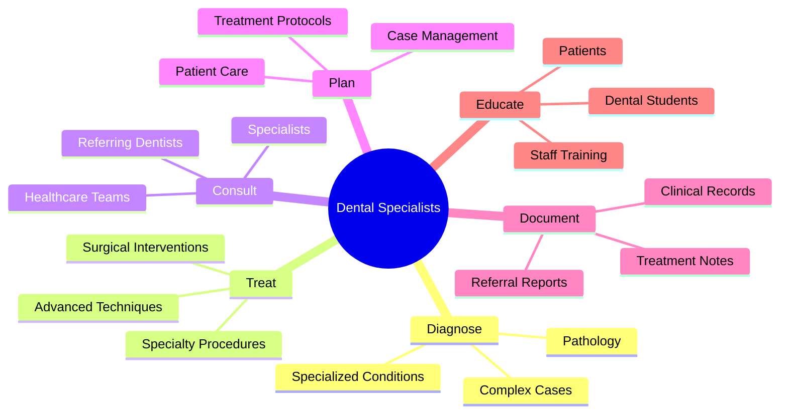
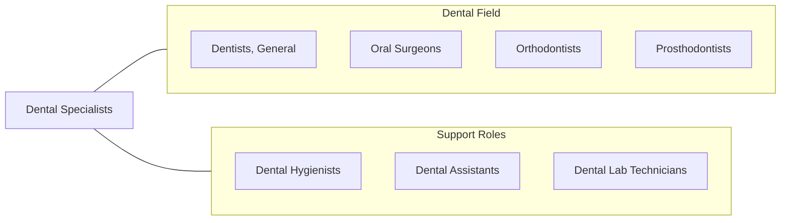
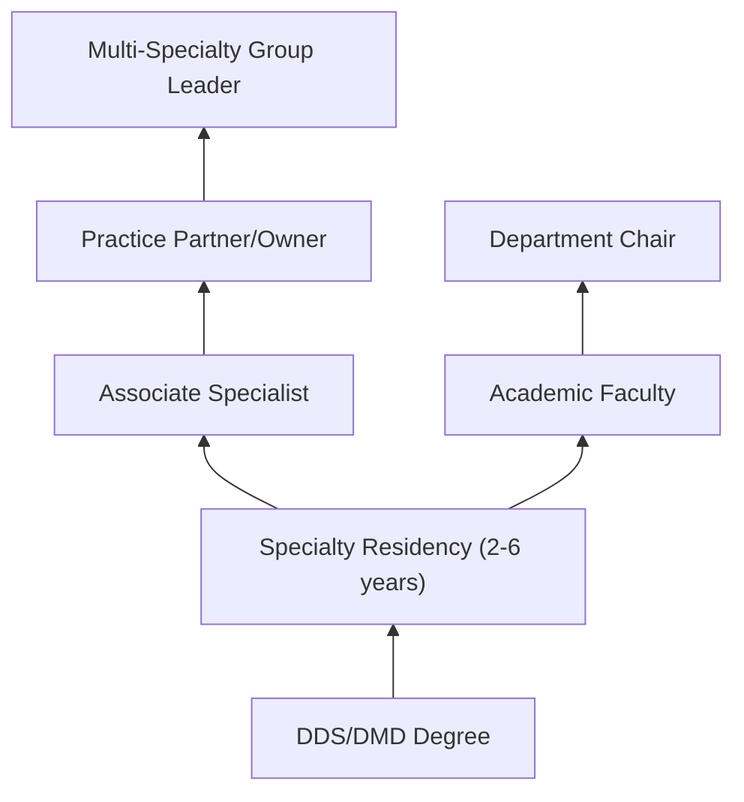

# Dentists, All Other Specialists

> All dentists not listed separately.

## Overview

This category encompasses dental specialists not separately classified in the SOC system, including endodontists (root canal specialists), periodontists (gum disease specialists), and pediatric dentists. These professionals have completed dental school plus additional specialty training in their specific area of expertise. They provide specialized care that goes beyond general dentistry, often working on referral from general practitioners.

## Classification Hierarchy

## Key Statistics

| Metric | Value |
|--------|-------|
| SOC Code | 29-1029.00 |
| Job Zone | 5 (Extensive Preparation) |
| Category | [Healthcare Practitioners](/occupations/HealthcarePractitioners) |
| Specialties | Endodontics, Periodontics, Pediatric Dentistry |
| Source | O*NET |

## Included Specialties

### Endodontists
Specialists in root canal therapy and diseases of dental pulp. They diagnose and treat complex cases of tooth pain and perform surgical procedures to save teeth.

### Periodontists
Focus on prevention, diagnosis, and treatment of periodontal (gum) disease and the placement of dental implants. They treat conditions ranging from mild gingivitis to severe periodontitis.

### Pediatric Dentists
Provide comprehensive oral health care for infants, children, and adolescents, including those with special health care needs. They specialize in behavior management and child-friendly treatment approaches.

### Oral Pathologists
Diagnose diseases of the oral and maxillofacial regions through microscopic, radiographic, and clinical evaluation.

## Core Tasks

## Skills & Competencies

### Technical Skills
- **Specialty Procedures** - Expert
- **Diagnostic Imaging** - Advanced
- **Surgical Techniques** - Expert
- **Treatment Planning** - Expert
- **Patient Assessment** - Expert

### Soft Skills
- **Patient Communication** - Critical
- **Collaboration** - Essential
- **Attention to Detail** - Critical
- **Problem Solving** - Essential

## Related Occupations

## Industries

- [Dental Offices](/industries/DentalOffices) - Specialty Practice
- [Hospitals](/industries/Hospitals) - Hospital Dentistry
- [Academic Institutions](/industries/AcademicInstitutions) - Dental Schools
- [Community Health Centers](/industries/CommunityHealth) - Public Health Dentistry

## Career Progression

## Education & Training

| Requirement | Details |
|-------------|---------|
| Typical Education | DDS/DMD plus 2-6 year specialty residency |
| Work Experience | Residency training varies by specialty |
| Board Certification | Available through respective specialty boards |
| Licensure | State dental license with specialty permit |

---

*Source: O*NET 29-1029.00 - ONETOccupation*
