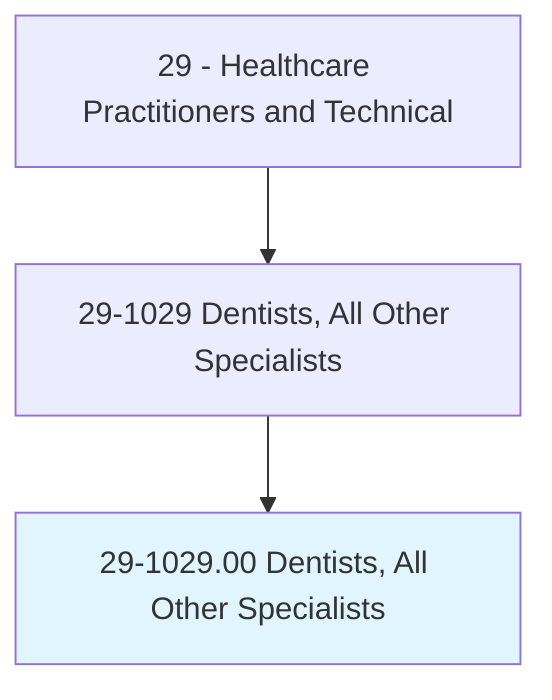
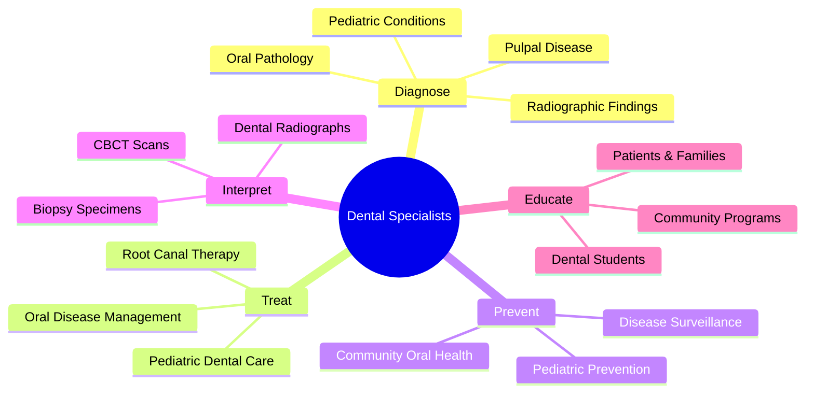
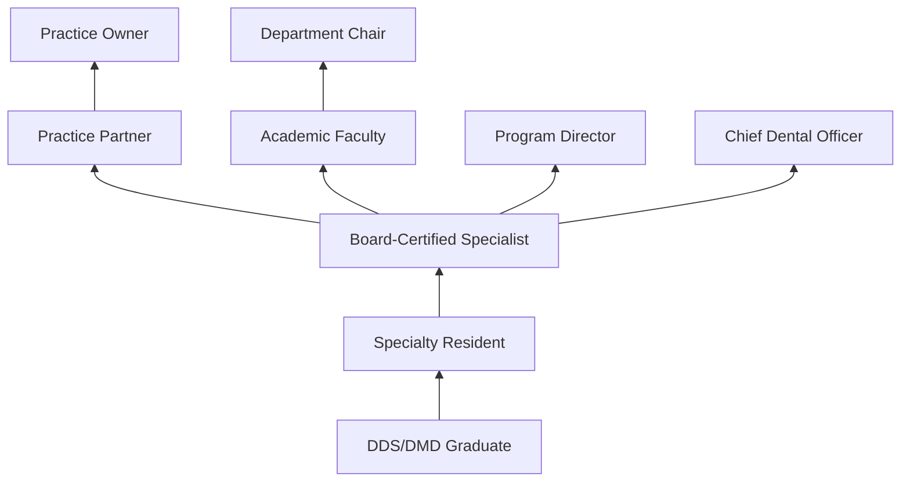
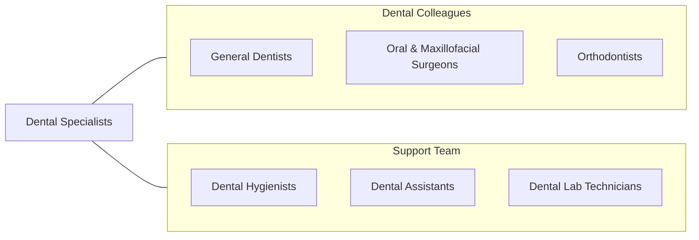

# Dentists, All Other Specialists

> All dentists not listed separately, including dental public health specialists, endodontists, oral and maxillofacial radiologists, oral pathologists, and pediatric dentists.

## Overview

Dentists, All Other Specialists encompasses dental professionals who have completed advanced specialty training beyond general dentistry in recognized specialties not separately classified. This category includes endodontists (root canal specialists), pediatric dentists, oral pathologists, oral and maxillofacial radiologists, and dental public health specialists. Each specialty requires completion of an accredited residency program following dental school.

These specialists provide focused expertise within their domains. Endodontists perform root canal therapy and treat dental pulp diseases. Pediatric dentists manage the oral health of infants, children, and adolescents including those with special healthcare needs. Oral pathologists diagnose diseases affecting the oral and maxillofacial structures through biopsy examination. Oral and maxillofacial radiologists interpret dental and facial imaging. Dental public health specialists address oral health at the population level through policy, prevention, and community programs.

Advanced dental specialties continue to evolve with cone beam computed tomography (CBCT), regenerative endodontics, biomaterial advances, and evidence-based approaches to pediatric behavior management. Interprofessional collaboration and integration with medical care are increasingly emphasized across all dental specialties.

## Classification Hierarchy

## Key Statistics

| Metric | Value |
|--------|-------|
| SOC Code | 29-1029.00 |
| Median Annual Salary | $170,910 |
| Employment | ~37,000 |
| Projected Growth | 4% (2022-2032) |
| Job Zone | 5 (Extensive Preparation) |
| Category | [Healthcare Practitioners](/occupations/HealthcarePractitioners) |
| Core Tasks | 40+ |
| Source | O*NET |

## Core Tasks

### treat.DentalSpecialtyConditions

Dental specialists provide focused treatment.

**Actions:**
- `perform.RootCanalTherapy.for.PulpalDisease` - Endodontic treatment
- `treat.PediatricDentalConditions.using.BehaviorManagement` - Pediatric care
- `diagnose.OralPathology.using.BiopsyExamination` - Oral pathology
- `interpret.DentalImaging.using.CBCTAndPanoramic` - Oral radiology

### prevent.OralDisease

Dental public health specialists address population oral health.

**Actions:**
- `develop.CommunityOralHealthPrograms.for.Prevention` - Public health
- `implement.FluoridationPrograms.for.CariesPrevention` - Preventive programs
- `conduct.EpidemiologicStudies.for.OralDiseaseAssessment` - Research
- `advise.PolicyMakers.regarding.OralHealthPolicy` - Policy development

## Practice Settings

| Setting | Description |
|---------|-------------|
| Specialty Dental Practices | Private specialty offices |
| Dental Schools | Academic teaching and clinics |
| Children's Hospitals | Pediatric dental services |
| Community Health Centers | Public health dentistry |
| Government Agencies | Public health policy and programs |
| Hospital Dental Departments | Inpatient and outpatient dental |

## Skills & Competencies

### Technical Skills
- **Specialty Dental Procedures** - Expert
- **Dental Imaging Interpretation** - Expert
- **Microscopic Diagnosis (Oral Path)** - Expert
- **Behavior Management (Pedo)** - Expert
- **CBCT Interpretation** - Advanced
- **Sedation Dentistry** - Advanced
- **Research Methods** - Advanced

### Soft Skills
- **Patient Communication** - Critical
- **Manual Dexterity** - Essential
- **Empathy** - Essential
- **Leadership** - Important
- **Teaching** - Important

## Education & Training

| Requirement | Details |
|-------------|---------|
| Undergraduate | Bachelor's degree (pre-dental) |
| Dental School | 4-year DDS or DMD program |
| Specialty Residency | 2-4 years depending on specialty |
| Board Certification | Specialty board examination |
| State Licensure | Required in all states |
| Continuing Education | Per state and specialty board requirements |

## Certifications

| Certification | Description |
|---------------|-------------|
| ABE | American Board of Endodontics |
| ABPD | American Board of Pediatric Dentistry |
| ABOP | American Board of Oral Pathology |
| ABOMR | American Board of Oral and Maxillofacial Radiology |
| ABDPH | American Board of Dental Public Health |
| State Dental License | Required for all practice |

## Career Progression

## Specializations

| Specialty | Description |
|-----------|-------------|
| Endodontics | Root canal and pulp therapy |
| Pediatric Dentistry | Children's oral health |
| Oral Pathology | Diagnosis of oral diseases |
| Oral & Maxillofacial Radiology | Dental/facial imaging |
| Dental Public Health | Community oral health |

## Technology & Tools

| Technology | Purpose |
|------------|---------|
| Cone Beam CT (CBCT) | 3D dental imaging |
| Operating Microscopes | Endodontic magnification |
| Rotary Endodontic Systems | Root canal instrumentation |
| Digital Radiography | Dental imaging |
| Nitrous Oxide/Sedation Equipment | Pediatric sedation |
| Histopathology Equipment | Oral pathology diagnosis |

## Related Occupations

## Industries

- [Dental Offices](/industries/Healthcare/DentalOffices) - Specialty Practice
- [Hospitals](/industries/Healthcare/Hospitals/index) - Hospital Dentistry
- [Academic](/industries/Education) - Dental Schools
- [Government](/industries/PublicAdministration) - Public Health Agencies
- [Community Health](/industries/Healthcare/AmbulatoryHealthCare) - FQHCs

## Departments

This occupation typically works in:
- Dental Services
- Endodontics
- Pediatric Dentistry
- Oral Pathology
- Dental Public Health

---

*Source: O*NET 29-1029.00 - ONETOccupation*
