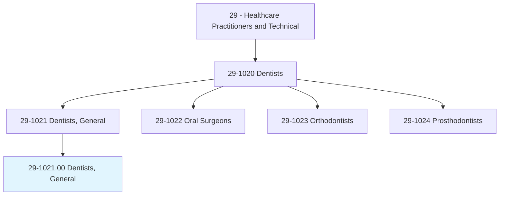
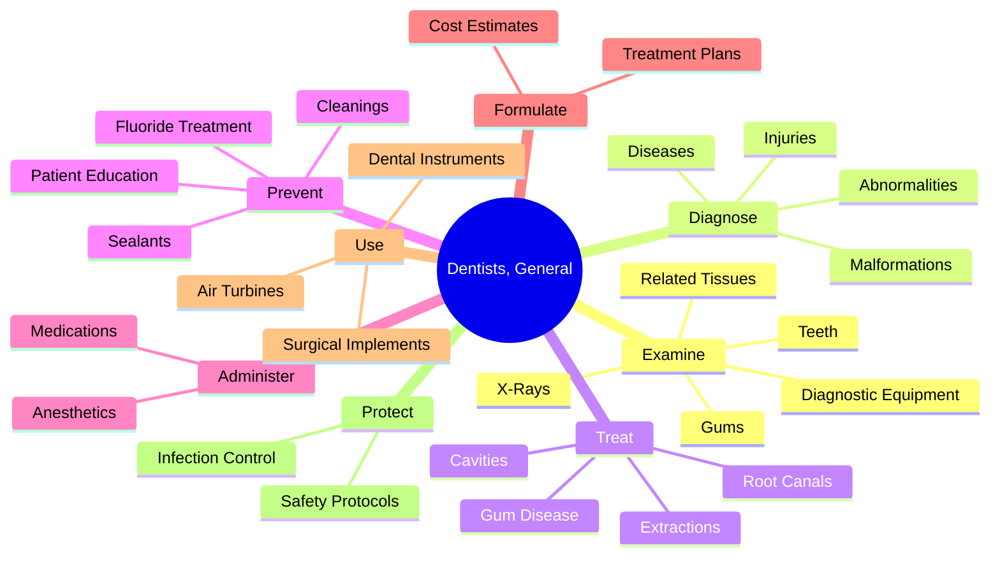
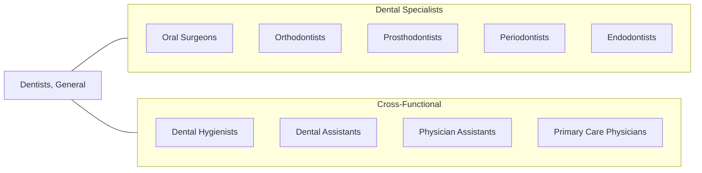
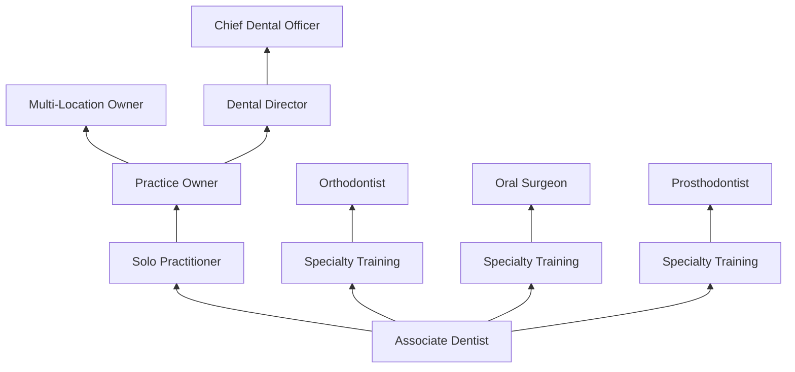

# Dentists, General

> Examine, diagnose, and treat diseases, injuries, and malformations of teeth and gums. May treat diseases of nerve, pulp, and other dental tissues affecting oral hygiene and retention of teeth. May fit dental appliances or provide preventive care.

## Overview

General Dentists are primary oral healthcare providers who diagnose, treat, and manage overall oral health needs. They perform a wide range of dental procedures including examinations, cleanings, fillings, extractions, and preventive care. General dentists serve as the first point of contact for patients seeking dental care and may refer complex cases to dental specialists such as orthodontists, oral surgeons, or periodontists.

## Classification Hierarchy

## Key Statistics

| Metric | Value |
|--------|-------|
| SOC Code | 29-1021.00 |
| Job Zone | 5 (Extensive Preparation) |
| Category | [Healthcare Practitioners](/occupations/HealthcarePractitioners) |
| Core Tasks | 15+ |
| Source | O*NET |

## Core Tasks

### examine.Teeth

General dentists conduct thorough oral examinations to assess dental health and identify problems.

**Actions:**
- `examine.Teeth.to.evaluate.DentalHealth` - Assess overall tooth condition
- `examine.Gums.to.evaluate.DentalHealth` - Check gum health and attachment
- `examine.RelatedTissues.to.diagnose.Diseases` - Identify oral pathology
- `examine.XRays.to.plan.AppropriateTreatments` - Interpret diagnostic imaging

### diagnose.Diseases

Dentists identify oral health conditions through comprehensive evaluation.

**Actions:**
- `diagnose.Diseases.of.Teeth` - Identify tooth decay and damage
- `diagnose.Diseases.of.Gums` - Detect periodontal disease
- `diagnose.Injuries.of.RelatedOralStructures` - Assess trauma damage
- `diagnose.Malformations.of.Teeth` - Identify developmental issues

### formulate.Plan

Dentists develop comprehensive treatment strategies for patients.

**Actions:**
- `formulate.Plan.of.Treatment.for.PatientsTeethTissue` - Create treatment protocols
- `formulate.Plan.of.MouthTissue` - Plan soft tissue interventions

### administer.Anesthetics

Dentists manage patient pain and comfort during procedures.

**Actions:**
- `administer.Anesthetics.to.LimitAmountOfPainExperiencedByPatientsDuringProcedures` - Provide local anesthesia

### use.DentalInstruments

Dentists employ specialized equipment for procedures.

**Actions:**
- `use.DentalAirTurbines` - Operate high-speed drills
- `use.DentalAppliances` - Fit corrective devices
- `use.SurgicalImplements` - Perform surgical procedures
- `use.Masks.to.protect.PatientsFromInfectiousDiseases` - Maintain infection control
- `use.Gloves.to.protect.PatientsFromInfectiousDiseases` - Follow safety protocols
- `use.SafetyGlasses.to.protect.PatientsFromInfectiousDiseases` - Ensure eye protection

## Skills & Competencies

### Technical Skills
- **Oral Examination** - Expert
- **Diagnostic Imaging Interpretation** - Advanced
- **Restorative Procedures** - Expert
- **Periodontal Treatment** - Advanced
- **Endodontic Procedures** - Advanced
- **Oral Surgery (Minor)** - Proficient
- **Prosthodontics (Basic)** - Proficient

### Soft Skills
- **Patient Communication** - Critical
- **Manual Dexterity** - Critical
- **Attention to Detail** - Essential
- **Problem Solving** - Essential
- **Empathy** - Important
- **Time Management** - Important

## Related Occupations

## Industries

- [Dental Offices](/industries/Healthcare/AmbulatoryHealthCare/DentalOffices/index) - Primary Employment
- Health and Personal Care Stores - Retail Clinics
- [Hospitals](/industries/Healthcare/Hospitals/index) - Institutional Settings
- Outpatient Care Centers - Community Health
- [Government](/industries/PublicAdministration) - Public Health Services

## Career Progression

## Education & Training

| Requirement | Details |
|-------------|---------|
| Typical Education | Doctor of Dental Surgery (DDS) or Doctor of Dental Medicine (DMD) |
| Work Experience | Clinical rotations during dental school |
| On-the-Job Training | Optional residency (General Practice Residency) |
| Licensure | State dental license required; National Board Dental Examinations |
| Continuing Education | Mandatory CE credits for license renewal |

## Departments

This occupation typically works in:
- Dental Services
- Oral Health
- Primary Care
- Preventive Services

---

*Source: O*NET 29-1021.00 - ONETOccupation*
