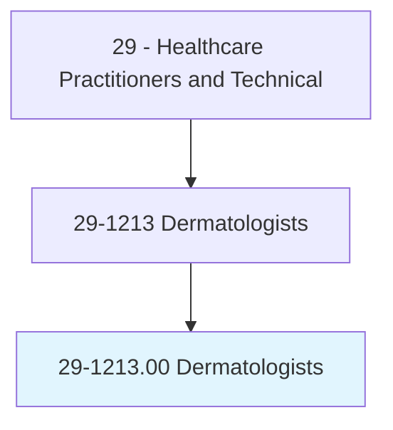
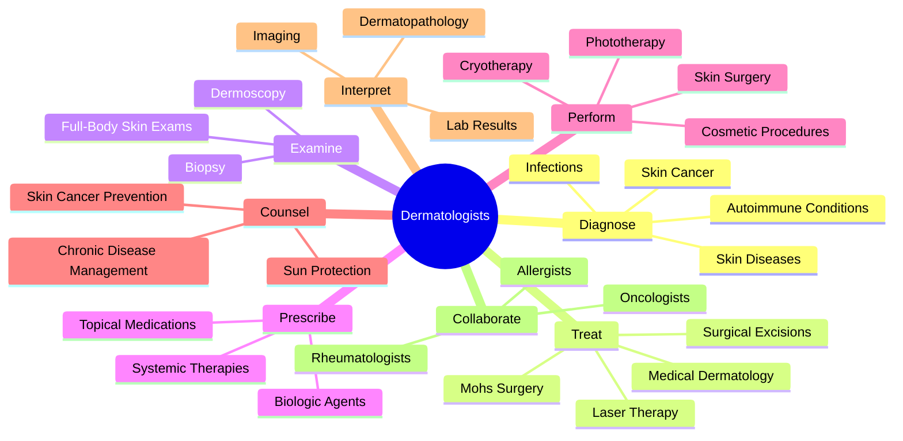
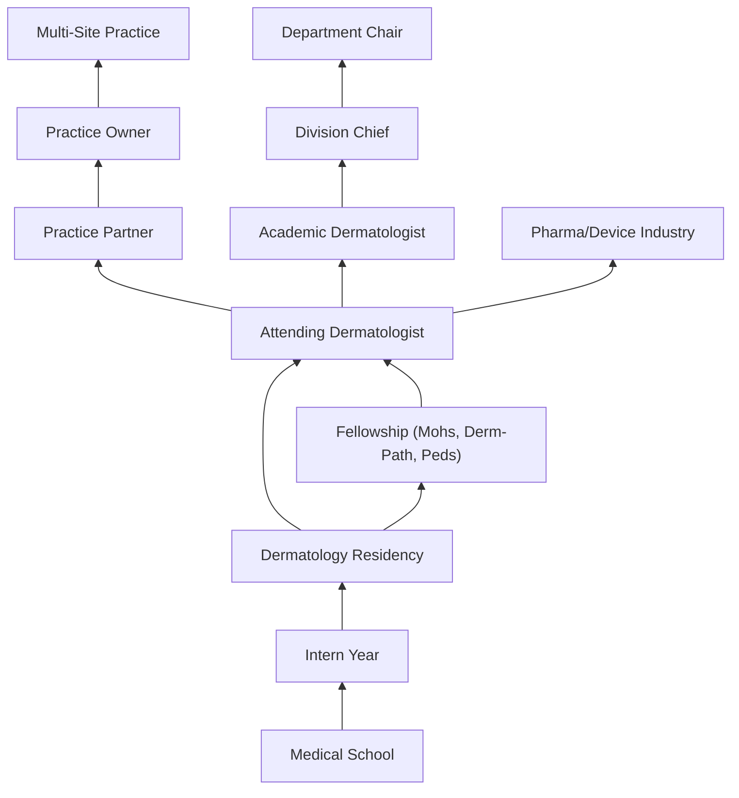
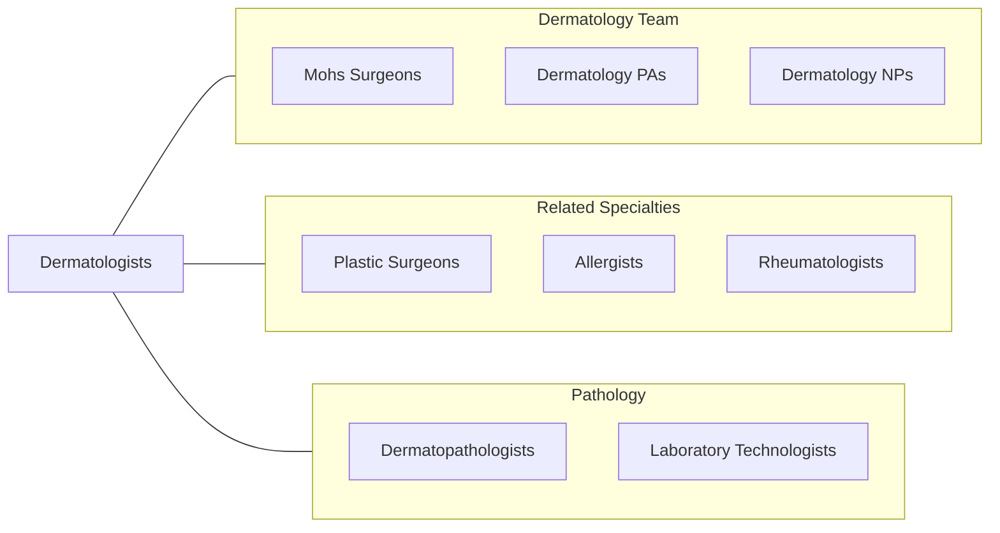

# Dermatologists

> Diagnose and treat diseases relating to the skin, hair, and nails. May perform both medical and dermatologic surgery functions.

## Overview

Dermatologists are physician specialists who diagnose and treat over 3,000 conditions affecting the skin, hair, nails, and mucous membranes. They manage conditions ranging from common disorders such as acne, eczema, psoriasis, and skin infections to complex diseases including melanoma, autoimmune blistering disorders, and cutaneous lymphoma. Dermatologists perform both medical and surgical procedures, making them unique among medical specialties in managing the full spectrum of their organ system.

The specialty encompasses medical dermatology (diagnosis and pharmacological treatment), surgical dermatology (excisions, Mohs micrographic surgery, reconstructive procedures), cosmetic dermatology (laser treatments, injectable fillers, chemical peels), and dermatopathology (microscopic diagnosis of skin diseases). Dermatologists serve as the frontline for skin cancer detection, performing full-body skin examinations and biopsies that can be lifesaving when melanoma or other malignancies are identified early.

Modern dermatology has been transformed by advances in biologic therapies for psoriasis and atopic dermatitis, immunotherapy for melanoma, laser and energy-based devices, and teledermatology platforms. Dermatologists increasingly utilize dermoscopy, confocal microscopy, and artificial intelligence-assisted diagnostic tools to improve diagnostic accuracy and treatment outcomes.

## Classification Hierarchy

## Key Statistics

| Metric | Value |
|--------|-------|
| SOC Code | 29-1213.00 |
| Median Annual Salary | $350,620 |
| Employment | ~13,000 |
| Projected Growth | 3% (2022-2032) |
| Job Zone | 5 (Extensive Preparation) |
| Category | [Healthcare Practitioners](/occupations/HealthcarePractitioners) |
| Core Tasks | 50+ |
| Source | O*NET |

## Core Tasks

### diagnose.SkinConditions

Dermatologists identify skin diseases through clinical and histological evaluation.

**Actions:**
- `diagnose.SkinDiseases.using.ClinicalExamination` - Visual assessment
- `diagnose.SkinCancer.using.Dermoscopy` - Dermatoscopic analysis
- `diagnose.AutoimmuneConditions.using.Biopsy` - Histopathologic diagnosis
- `diagnose.Infections.using.CultureAndSensitivity` - Microbiologic testing

### treat.DermatologicConditions

Dermatologists deliver medical, surgical, and cosmetic treatments.

**Actions:**
- `treat.Psoriasis.using.BiologicTherapy` - Targeted immune therapy
- `treat.SkinCancer.using.MohsSurgery` - Tissue-sparing cancer removal
- `treat.Acne.using.SystemicMedications` - Oral therapy management
- `perform.LaserTherapy.for.VascularLesions` - Energy-based treatment

### perform.DermatologicSurgery

Dermatologists execute surgical procedures on skin structures.

**Actions:**
- `perform.SkinBiopsy.for.DiagnosticEvaluation` - Tissue sampling
- `perform.Excisions.for.SkinCancerRemoval` - Surgical oncology
- `perform.CosmeticProcedures.using.Injectables` - Aesthetic treatments
- `perform.Cryotherapy.for.BenignLesions` - Destructive therapy

## Practice Settings

| Setting | Description |
|---------|-------------|
| Private Dermatology Practice | Primary practice setting |
| Academic Medical Centers | Teaching and complex referrals |
| Hospital Dermatology Clinics | Inpatient consultation services |
| Dermatologic Surgery Centers | Mohs and surgical dermatology |
| Cosmetic Dermatology Clinics | Aesthetic procedures |
| Teledermatology Platforms | Remote consultation services |
| Dermatopathology Laboratories | Microscopic diagnosis |
| Clinical Research Centers | Drug and device trials |

## Skills & Competencies

### Technical Skills
- **Clinical Dermatology Diagnosis** - Expert
- **Dermoscopy** - Expert
- **Dermatologic Surgery** - Expert
- **Mohs Micrographic Surgery** - Advanced (subspecialty)
- **Laser & Energy-Based Devices** - Advanced
- **Dermatopathology** - Advanced
- **Biologic Therapy Management** - Expert
- **Cosmetic Procedures** - Advanced

### Soft Skills
- **Pattern Recognition** - Critical
- **Patient Communication** - Essential
- **Attention to Detail** - Critical
- **Empathy** - Essential
- **Business Management** - Important
- **Aesthetic Judgment** - Important
- **Interdisciplinary Collaboration** - Essential

## Education & Training

| Requirement | Details |
|-------------|---------|
| Undergraduate | 4-year bachelor's degree (pre-med) |
| Medical School | 4-year MD or DO program |
| Transitional/Preliminary Year | 1 year internship |
| Dermatology Residency | 3 years |
| Fellowship | 1-2 years for subspecialty (optional) |
| Total Training | 12-14 years post-high school |
| Licensure | State medical license |
| Board Certification | American Board of Dermatology |

## Certifications

| Certification | Description |
|---------------|-------------|
| ABD Diplomate | American Board of Dermatology certification |
| ABD Dermatopathology | Subspecialty in skin pathology |
| ABD Pediatric Dermatology | Subspecialty in children's skin |
| ACMS Fellow | Mohs micrographic surgery fellowship |
| ASLMS Member | Laser surgery and medicine |
| FAAD | Fellow of the American Academy of Dermatology |
| BLS/ACLS | Life support certifications |

## Career Progression

## Specializations

| Subspecialty | Focus Area |
|-------------|------------|
| Mohs Micrographic Surgery | Skin cancer removal with margin control |
| Dermatopathology | Microscopic diagnosis of skin disease |
| Pediatric Dermatology | Childhood skin conditions |
| Cosmetic Dermatology | Aesthetic procedures and rejuvenation |
| Immunodermatology | Autoimmune blistering and connective tissue diseases |
| Dermato-Oncology | Melanoma and cutaneous malignancies |
| Contact Dermatitis | Patch testing and occupational skin disease |
| Photomedicine | Phototherapy and photodermatology |

## Technology & Tools

| Technology | Purpose |
|------------|---------|
| Dermoscopes (Polarized, Non-polarized) | Skin lesion magnification |
| Laser Systems (CO2, Pulsed Dye, Nd:YAG) | Energy-based treatments |
| Mohs Tissue Processing Equipment | Intraoperative histology |
| Cryotherapy Units | Liquid nitrogen therapy |
| Phototherapy Devices (UVB, PUVA) | Light-based treatment |
| Confocal Microscopy | In vivo skin imaging |
| Teledermatology Platforms | Remote consultation |
| Electronic Health Records | Documentation and photography |

## Related Occupations

## Industries

- [Physician Offices](/industries/Healthcare/PhysicianOffices) - Dermatology Practices
- [Hospitals](/industries/Healthcare/Hospitals/index) - Hospital Dermatology
- [Academic Medical Centers](/industries/Healthcare/Hospitals/Teaching) - Teaching & Research
- [Ambulatory Surgery Centers](/industries/Healthcare/AmbulatoryHealthCare) - Mohs Surgery
- [Cosmetic Industry](/industries/Healthcare/CosmeticServices) - Aesthetic Medicine
- [Pharmaceutical](/industries/Manufacturing/ChemicalManufacturing/Pharmaceutical) - Drug Development

## Departments

This occupation typically works in:
- [Dermatology](/departments/Dermatology)
- [Dermatologic Surgery](/departments/DermatologicSurgery)
- [Dermatopathology](/departments/Dermatopathology)
- [Cosmetic Dermatology](/departments/CosmeticDermatology)
- [Phototherapy](/departments/Phototherapy)

---

*Source: O*NET 29-1213.00 - ONETOccupation*
