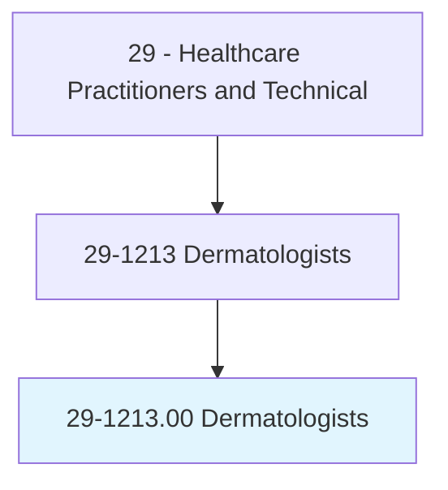
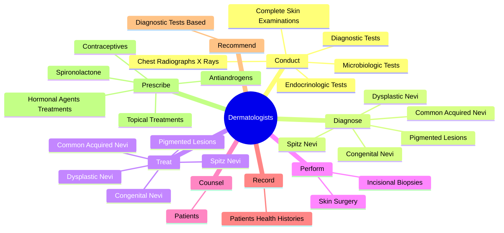
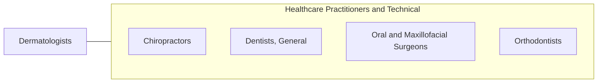

# Dermatologists

> Diagnose and treat diseases relating to the skin, hair, and nails. May perform both medical and dermatological surgery functions.

## Overview

Dermatologists is an occupation within the Healthcare Practitioners and Technical category. Diagnose and treat diseases relating to the skin, hair, and nails. 

## Classification Hierarchy

## Key Statistics

| Metric | Value |
|--------|-------|
| SOC Code | 29-1213.00 |
| Category | [Healthcare Practitioners and Technical](/occupations/HealthcarePractitioners) |
| Task Count | 100 |
| Source | O*NET |

## Core Tasks

### conduct.CompleteSkinExaminations

Dermatologists conduct complete skin examinations as part of their core responsibilities.

**Actions:**
- `conduct.CompleteSkinExaminations`
- `conduct.DiagnosticTests`
- `conduct.ChestRadiographsXRays`
- `conduct.MicrobiologicTests`

### diagnose.PigmentedLesions

Dermatologists diagnose pigmented lesions as part of their core responsibilities.

**Actions:**
- `diagnose.PigmentedLesions`
- `diagnose.CommonAcquiredNevi`
- `diagnose.CongenitalNevi`
- `diagnose.DysplasticNevi`

### treat.PigmentedLesions

Dermatologists treat pigmented lesions as part of their core responsibilities.

**Actions:**
- `treat.PigmentedLesions`
- `treat.CommonAcquiredNevi`
- `treat.CongenitalNevi`
- `treat.DysplasticNevi`

## Skills & Competencies

### Technical Skills
- **Clinical Skills** - Advanced
- **Diagnostic Procedures** - Advanced
- **Patient Care** - Advanced

### Soft Skills
- **Communication** - Essential
- **Problem Solving** - Essential
- **Critical Thinking** - Important
- **Teamwork** - Important
- **Adaptability** - Important

## Related Occupations

## Industries

This occupation is found across multiple industries. See [Industries](/industries) for sector-specific employment data.

## Career Progression

---

*Source: O*NET 29-1213.00 - ONETOccupation*
