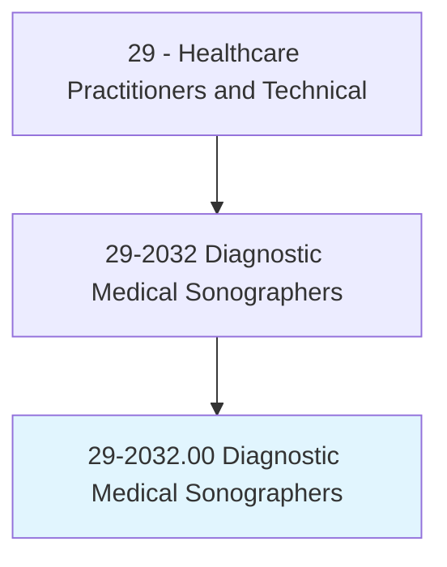
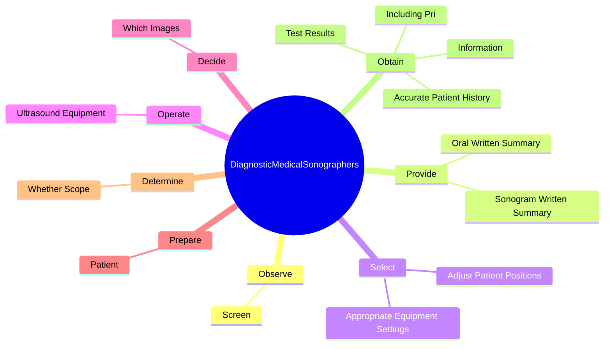
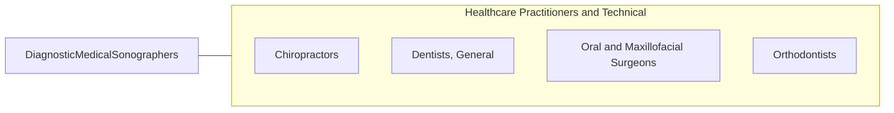

# Diagnostic Medical Sonographers

> Produce ultrasonic recordings of internal organs for use by physicians. Includes vascular technologists.

## Overview

Diagnostic Medical Sonographers is an occupation within the Healthcare Practitioners and Technical category. Produce ultrasonic recordings of internal organs for use by physicians. 

## Classification Hierarchy

## Key Statistics

| Metric | Value |
|--------|-------|
| SOC Code | 29-2032.00 |
| Category | [Healthcare Practitioners and Technical](/occupations/HealthcarePractitioners) |
| Task Count | 118 |
| Source | O*NET |

## Core Tasks

### observe.Screen

Diagnostic Medical Sonographers observe screen as part of their core responsibilities.

**Actions:**
- `observe.Screen.during.Scan.to.ensure.ImageProducedIsSatisfactoryForDiagnosticPurposes`
- `observe.Screen.during.ScanToMakingAdjustmentsToEquipmentAsRequired`

### provide.SonogramWrittenSummary

Diagnostic Medical Sonographers provide sonogram written summary as part of their core responsibilities.

**Actions:**
- `provide.SonogramWrittenSummary.of.TechnicalFindingsToPhysicianForUseInMedicalDiagnosis`
- `provide.OralWrittenSummary.of.TechnicalFindingsToPhysicianForUseInMedicalDiagnosis`

### select.AppropriateEquipmentSettings

Diagnostic Medical Sonographers select appropriate equipment settings as part of their core responsibilities.

**Actions:**
- `select.AppropriateEquipmentSettings.to.obtain.BestSites`
- `select.AppropriateEquipmentSettings.to.Angles`
- `select.AdjustPatientPositions.to.obtain.BestSites`
- `select.AdjustPatientPositions.to.Angles`

## Skills & Competencies

### Technical Skills
- **Clinical Skills** - Advanced
- **Diagnostic Procedures** - Advanced
- **Patient Care** - Advanced

### Soft Skills
- **Communication** - Essential
- **Problem Solving** - Essential
- **Critical Thinking** - Important
- **Teamwork** - Important
- **Adaptability** - Important

## Related Occupations

## Industries

This occupation is found across multiple industries. See [Industries](/industries) for sector-specific employment data.

## Career Progression

---

*Source: O*NET 29-2032.00 - ONETOccupation*
