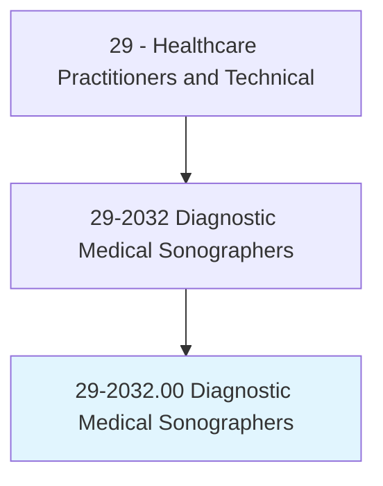
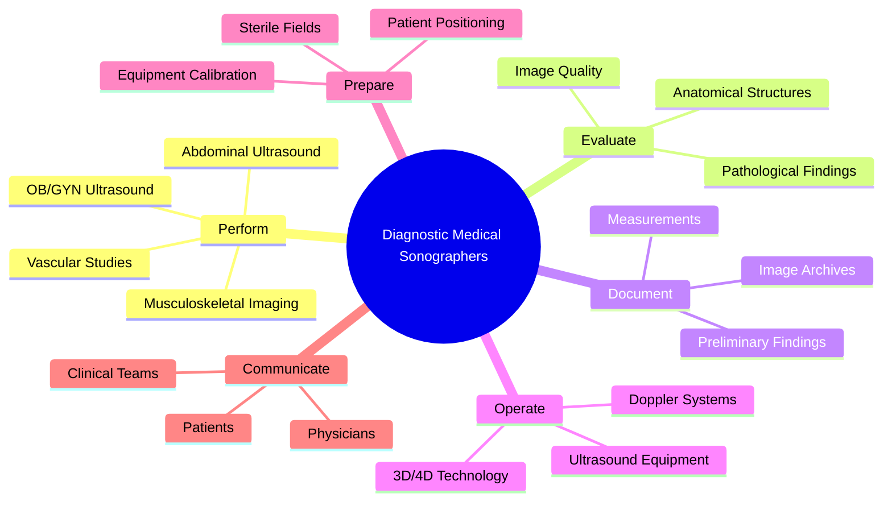
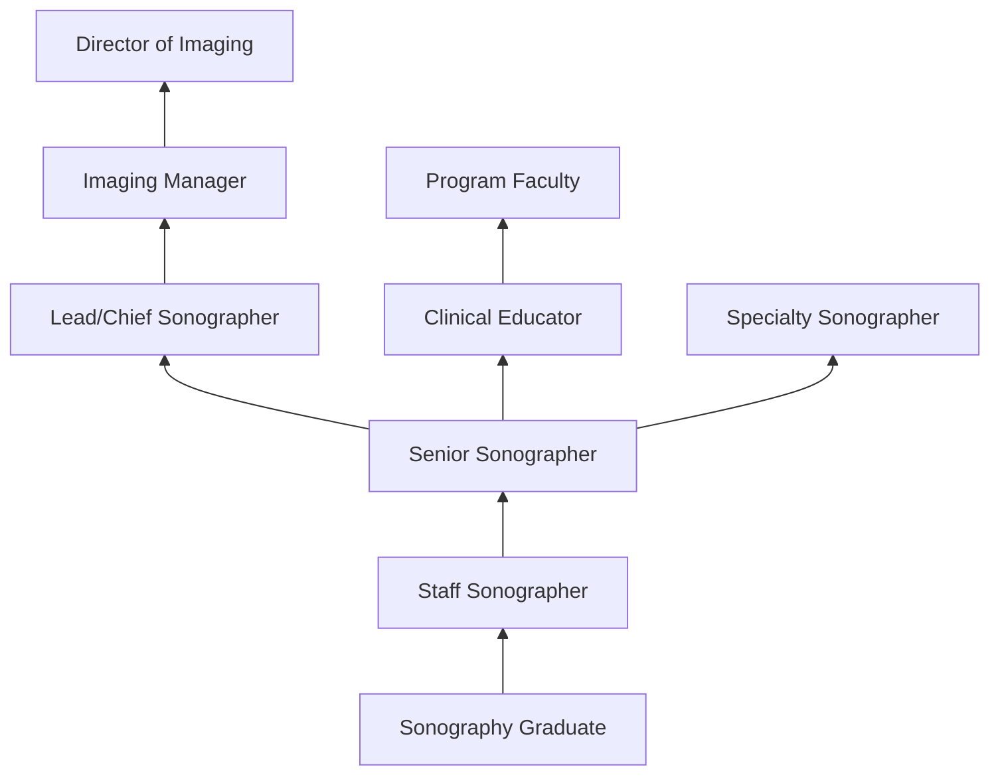
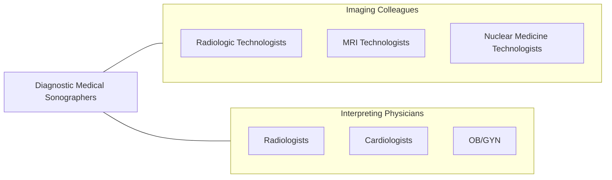

# Diagnostic Medical Sonographers

> Produce ultrasonic recordings of internal organs for use by physicians. Includes vascular technologists.

## Overview

Diagnostic Medical Sonographers are skilled healthcare professionals who use specialized ultrasound equipment to create images of structures inside the body. These images, called sonograms, are used by physicians to diagnose and monitor medical conditions including pregnancy, heart disease, vascular disorders, abdominal pathology, and musculoskeletal injuries. Sonographers are responsible for patient positioning, transducer manipulation, image optimization, and preliminary assessment of findings.

Sonographers specialize in specific body systems including abdominal (liver, kidneys, gallbladder), obstetric/gynecologic (fetal development, reproductive organs), vascular (arteries and veins), cardiac (echocardiography), musculoskeletal, and neurosonology. They work independently during examinations, using their knowledge of anatomy, physiology, and pathology to identify normal and abnormal structures, documenting findings for physician interpretation.

The field has evolved with advances in 3D/4D imaging, contrast-enhanced ultrasound, elastography, and point-of-care ultrasound. Sonographers increasingly work in diverse settings beyond hospitals, including mobile imaging services, physician offices, and research facilities. The profession is in high demand due to ultrasound's safety profile, portability, real-time imaging capability, and cost-effectiveness compared to other imaging modalities.

## Classification Hierarchy

## Key Statistics

| Metric | Value |
|--------|-------|
| SOC Code | 29-2032.00 |
| Median Annual Salary | $81,350 |
| Employment | ~79,000 |
| Projected Growth | 10% (2022-2032, faster than average) |
| Job Zone | 3 (Medium Preparation) |
| Category | [Healthcare Practitioners](/occupations/HealthcarePractitioners) |
| Core Tasks | 40+ |
| Source | O*NET |

## Core Tasks

### perform.UltrasoundExaminations

Sonographers conduct specialized ultrasound studies.

**Actions:**
- `perform.AbdominalUltrasound.for.OrganAssessment` - Abdominal imaging
- `perform.OBGYNUltrasound.for.FetalAssessment` - Obstetric imaging
- `perform.VascularStudies.for.BloodFlowEvaluation` - Vascular assessment
- `perform.MusculoskeletalUltrasound.for.SoftTissueEvaluation` - MSK imaging

### evaluate.ImageFindings

Sonographers assess image quality and identify pathology.

**Actions:**
- `evaluate.ImageQuality.for.DiagnosticAdequacy` - Quality assessment
- `evaluate.AnatomicalStructures.for.NormalVariants` - Anatomy identification
- `evaluate.PathologicalFindings.for.PhysicianReview` - Abnormality detection
- `document.Measurements.using.StandardizedProtocols` - Quantitative analysis

## Practice Settings

| Setting | Description |
|---------|-------------|
| Hospitals | Inpatient and outpatient imaging |
| Outpatient Imaging Centers | Ambulatory diagnostic services |
| Physician Offices | Office-based ultrasound |
| Mobile Imaging Services | On-site portable ultrasound |
| Maternal-Fetal Medicine | High-risk OB imaging |
| Vascular Labs | Peripheral and cerebrovascular |
| Research Institutions | Clinical studies |

## Skills & Competencies

### Technical Skills
- **Sonographic Imaging** - Expert
- **Anatomy & Physiology** - Expert
- **Pathology Recognition** - Advanced
- **Doppler Technology** - Advanced
- **3D/4D Imaging** - Advanced
- **Image Optimization** - Expert
- **Patient Positioning** - Expert

### Soft Skills
- **Attention to Detail** - Critical
- **Patient Communication** - Essential
- **Physical Stamina** - Essential
- **Problem Solving** - Essential
- **Adaptability** - Important

## Education & Training

| Requirement | Details |
|-------------|---------|
| Education | Associate or bachelor's degree in Diagnostic Medical Sonography |
| Clinical Training | Supervised clinical rotations |
| Certification | ARDMS credential required |
| Continuing Education | 30 CME credits per 3-year cycle |

## Certifications

| Certification | Description |
|---------------|-------------|
| RDMS | Registered Diagnostic Medical Sonographer (ARDMS) |
| RVT | Registered Vascular Technologist |
| RDCS | Registered Diagnostic Cardiac Sonographer |
| RT(S) | Registered Technologist - Sonography (ARRT) |
| RMSKS | Registered Musculoskeletal Sonographer |

## Career Progression

## Specializations

| Focus Area | Description |
|------------|-------------|
| Abdominal | Liver, kidneys, gallbladder, pancreas |
| OB/GYN | Pregnancy and reproductive organs |
| Vascular | Arterial and venous studies |
| Cardiac (Echocardiography) | Heart imaging |
| Musculoskeletal | Joint and soft tissue |
| Neurosonology | Brain and cerebrovascular |
| Breast | Breast ultrasound |
| Pediatric | Neonatal and pediatric imaging |

## Technology & Tools

| Technology | Purpose |
|------------|---------|
| Ultrasound Systems (GE, Philips, Siemens) | Diagnostic imaging |
| Doppler Technology | Blood flow assessment |
| 3D/4D Imaging Software | Volume imaging |
| Contrast-Enhanced Ultrasound (CEUS) | Enhanced tissue characterization |
| Elastography | Tissue stiffness measurement |
| PACS/Image Archiving | Image storage and retrieval |
| Ergonomic Equipment | Injury prevention |

## Related Occupations

## Industries

- [Hospitals](/industries/Healthcare/Hospitals/index) - Primary Employment
- [Outpatient Imaging](/industries/Healthcare/AmbulatoryHealthCare) - Imaging Centers
- [Physician Offices](/industries/Healthcare/PhysicianOffices) - Office-Based
- [Mobile Imaging](/industries/Healthcare/MobileImaging) - Portable Services

## Departments

This occupation typically works in:
- [Diagnostic Imaging](/departments/DiagnosticImaging)
- [Ultrasound/Sonography](/departments/Ultrasound)
- [Vascular Lab](/departments/VascularLab)
- [Maternal-Fetal Medicine](/departments/MFM)
- [Echocardiography Lab](/departments/EchoLab)

---

*Source: O*NET 29-2032.00 - ONETOccupation*
