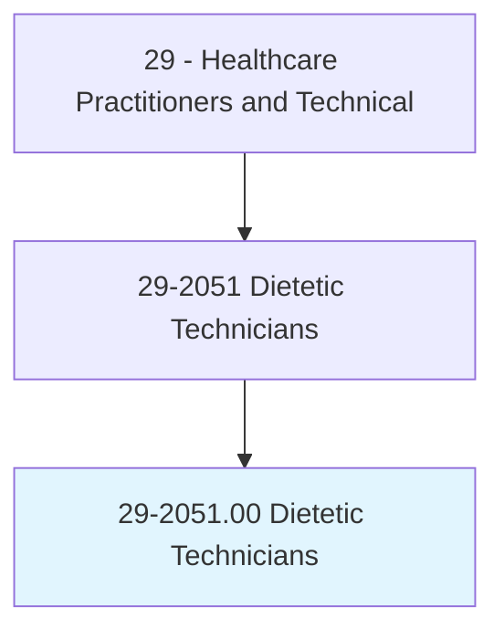
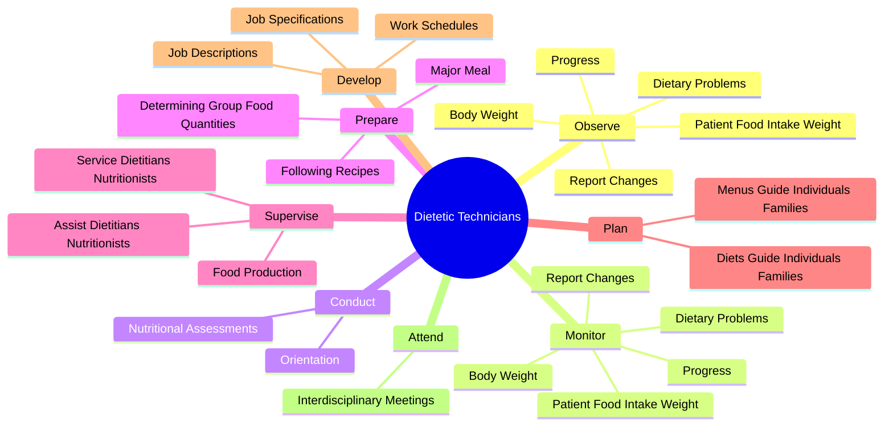
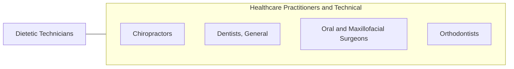

# Dietetic Technicians

> Assist in the provision of food service and nutritional programs, under the supervision of a dietitian. May plan and produce meals based on established guidelines, teach principles of food and nutrition, or counsel individuals.

## Overview

Dietetic Technicians is an occupation within the Healthcare Practitioners and Technical category. Assist in the provision of food service and nutritional programs, under the supervision of a dietitian. 

## Classification Hierarchy

## Key Statistics

| Metric | Value |
|--------|-------|
| SOC Code | 29-2051.00 |
| Category | [Healthcare Practitioners and Technical](/occupations/HealthcarePractitioners) |
| Task Count | 54 |
| Source | O*NET |

## Core Tasks

### observe.PatientFoodIntakeWeight

Dietetic Technicians observe patient food intake weight as part of their core responsibilities.

**Actions:**
- `observe.PatientFoodIntakeWeight.to.Dietician`
- `observe.BodyWeight.to.Dietician`
- `observe.ReportChanges.to.Dietician`
- `observe.Progress.to.Dietician`

### monitor.PatientFoodIntakeWeight

Dietetic Technicians monitor patient food intake weight as part of their core responsibilities.

**Actions:**
- `monitor.PatientFoodIntakeWeight.to.Dietician`
- `monitor.BodyWeight.to.Dietician`
- `monitor.ReportChanges.to.Dietician`
- `monitor.Progress.to.Dietician`

### conduct.NutritionalAssessments

Dietetic Technicians conduct nutritional assessments as part of their core responsibilities.

**Actions:**
- `conduct.NutritionalAssessments.of.Individuals`
- `conduct.NutritionalAssessments.of.IncludingObtaining`
- `conduct.NutritionalAssessments.of.EvaluatingIndividualsDietaryHistories`
- `conduct.NutritionalAssessments.of.plan.NutritionalPrograms`

## Skills & Competencies

### Technical Skills
- **Clinical Skills** - Advanced
- **Diagnostic Procedures** - Advanced
- **Patient Care** - Advanced

### Soft Skills
- **Communication** - Essential
- **Problem Solving** - Essential
- **Critical Thinking** - Important
- **Teamwork** - Important
- **Adaptability** - Important

## Related Occupations

## Industries

This occupation is found across multiple industries. See [Industries](/industries) for sector-specific employment data.

## Career Progression

---

*Source: O*NET 29-2051.00 - ONETOccupation*
