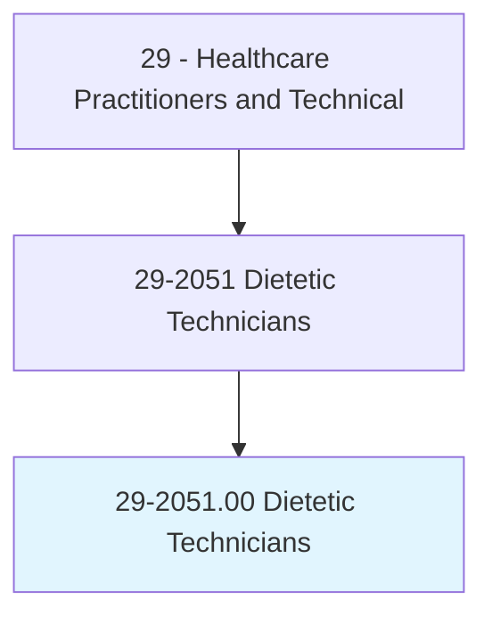
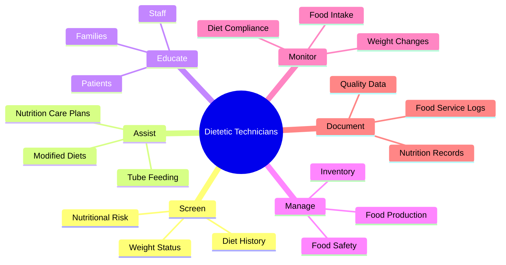
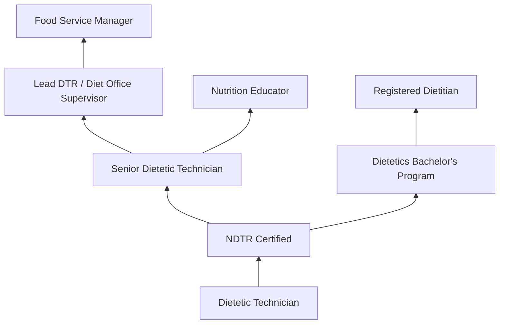
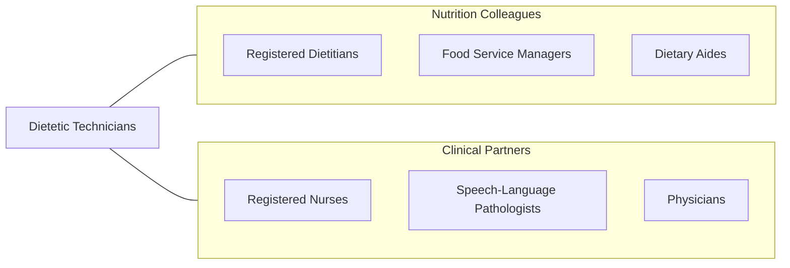

# Dietetic Technicians

> Assist in the provision of food service and nutritional programs, under the supervision of a dietitian. May plan and produce meals based on established guidelines, teach principles of food and nutrition, or counsel individuals.

## Overview

Dietetic Technicians, Registered (DTRs) are nutrition professionals who work under the supervision of registered dietitians to provide food service management and nutritional care. They assist with screening patients for nutritional risk, implementing nutrition care plans, monitoring food intake, educating patients on modified diets, and managing food service operations in healthcare facilities, schools, and community settings.

The role encompasses both clinical nutrition support and food service management. In clinical settings, dietetic technicians collect dietary histories, calculate nutrient intake, monitor weight changes, assist with tube feeding management, and reinforce dietary education provided by registered dietitians. In food service, they supervise food production, ensure compliance with food safety regulations, manage inventory, and oversee modified diet preparation.

The profession has evolved with electronic health records, computerized nutrient analysis software, food service management technology, and evidence-based nutrition protocols. Dietetic technicians increasingly support population health initiatives, wellness programs, and chronic disease management alongside registered dietitians.

## Classification Hierarchy

## Key Statistics

| Metric | Value |
|--------|-------|
| SOC Code | 29-2051.00 |
| Median Annual Salary | $35,960 |
| Employment | ~30,000 |
| Projected Growth | 8% (2022-2032) |
| Job Zone | 3 (Medium Preparation) |
| Category | [Healthcare Practitioners](/occupations/HealthcarePractitioners) |
| Core Tasks | 25+ |
| Source | O*NET |

## Core Tasks

### screen.NutritionalStatus

Dietetic Technicians assess patient nutrition needs.

**Actions:**
- `screen.Patients.for.NutritionalRisk` - Nutrition screening
- `collect.DietaryHistory.from.PatientInterviews` - Diet assessment
- `calculate.NutrientIntake.using.AnalysisSoftware` - Intake analysis
- `monitor.WeightChanges.for.NutritionIntervention` - Weight monitoring

### manage.FoodServiceOperations

Dietetic Technicians oversee food production and service.

**Actions:**
- `supervise.FoodProduction.per.MenuPlans` - Production management
- `ensure.FoodSafety.per.HACCPGuidelines` - Safety compliance
- `manage.Inventory.for.FoodServiceOperations` - Supply management
- `prepare.ModifiedDiets.per.PhysicianOrders` - Therapeutic diets

## Practice Settings

| Setting | Description |
|---------|-------------|
| Hospitals | Clinical nutrition support |
| Long-Term Care Facilities | Geriatric nutrition and food service |
| Schools | School nutrition programs |
| Community Health Centers | Nutrition education |
| Corporate Wellness | Employee health programs |
| Food Service Companies | Contract food management |

## Skills & Competencies

### Technical Skills
- **Nutrition Screening** - Advanced
- **Diet Calculation** - Advanced
- **Food Service Management** - Advanced
- **Food Safety (HACCP)** - Advanced
- **Nutrient Analysis Software** - Advanced
- **Modified Diet Preparation** - Advanced
- **Patient Education** - Advanced

### Soft Skills
- **Communication** - Essential
- **Empathy** - Essential
- **Organization** - Essential
- **Teamwork** - Essential
- **Customer Service** - Essential

## Education & Training

| Requirement | Details |
|-------------|---------|
| Education | Associate degree in dietetics or food service |
| Accreditation | ACEND-accredited dietetic technician program |
| Supervised Practice | 450+ hours supervised practice |
| Certification | NDTR credential through CDR |
| Continuing Education | 50 CPEUs per 5-year cycle |

## Certifications

| Certification | Description |
|---------------|-------------|
| NDTR | Nutrition and Dietetics Technician, Registered (CDR) |
| DTR | Dietetic Technician, Registered (legacy credential) |
| ServSafe | Food safety certification |
| CDM, CFPP | Certified Dietary Manager (optional) |

## Career Progression

## Specializations

| Focus Area | Description |
|------------|-------------|
| Clinical Nutrition | Patient nutrition support |
| Food Service Management | Production and service oversight |
| Long-Term Care Nutrition | Geriatric nutrition |
| School Nutrition | K-12 meal programs |
| Community Nutrition | Public health programs |
| Renal Nutrition | Dialysis diet support |

## Technology & Tools

| Technology | Purpose |
|------------|---------|
| Nutrient Analysis Software (ESHA, Computrition) | Diet calculation |
| Electronic Health Records | Documentation |
| Food Service Management Systems | Menu planning and inventory |
| Temperature Monitoring Systems | Food safety |
| Diet Office Software | Modified diet orders |
| Body Composition Analyzers | Nutrition assessment |

## Related Occupations

## Industries

- [Hospitals](/industries/Healthcare/Hospitals/index) - Clinical Nutrition
- [Nursing Facilities](/industries/Healthcare/NursingCare) - Long-Term Care
- [Schools](/industries/Education/ElementarySecondary) - School Nutrition
- Food Service - Contract Food Management
- [Community Health](/industries/Healthcare/AmbulatoryHealthCare) - Public Health

## Departments

This occupation typically works in:
- Clinical Nutrition
- Food and Nutrition Services
- Dietary Services
- Patient Food Services

---

*Source: O*NET 29-2051.00 - ONETOccupation*
