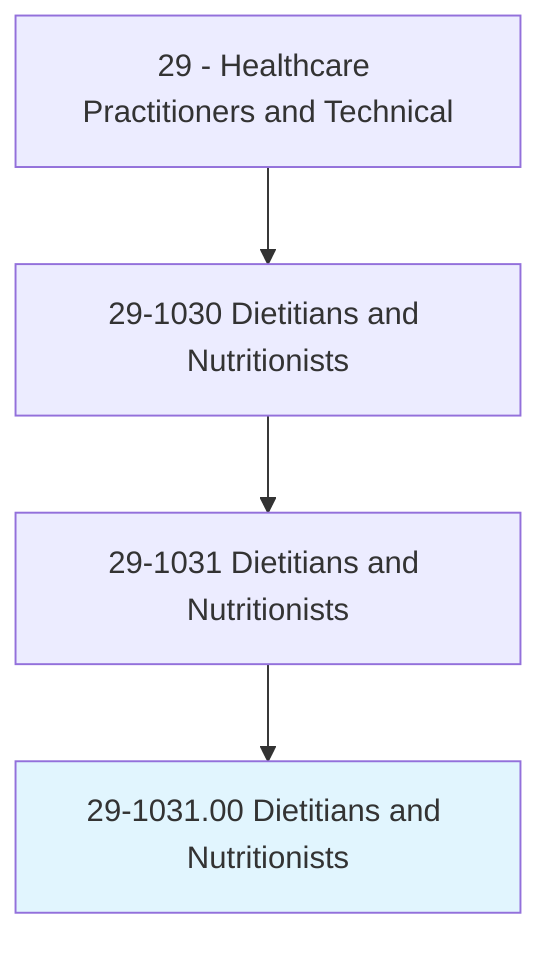
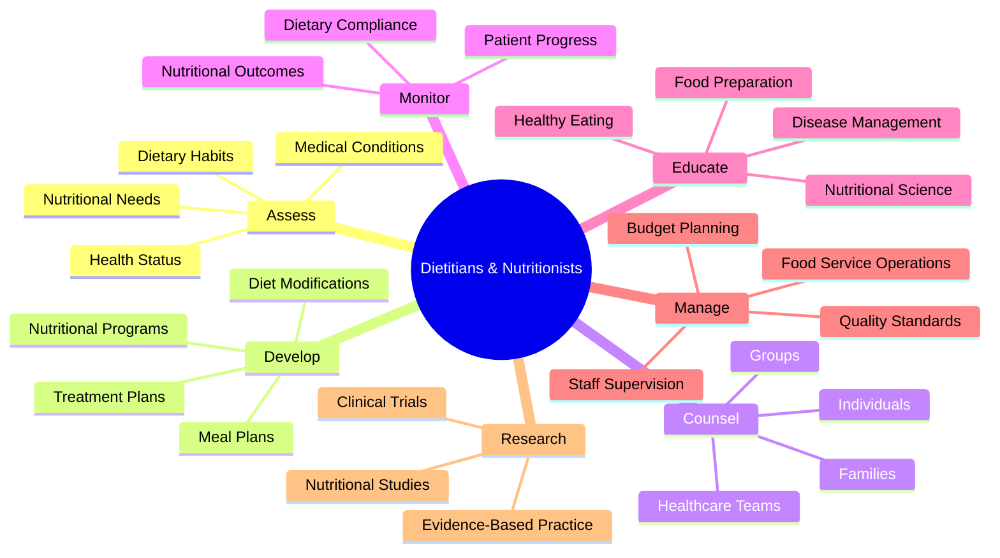
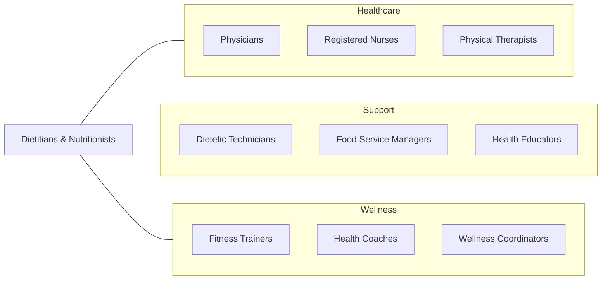
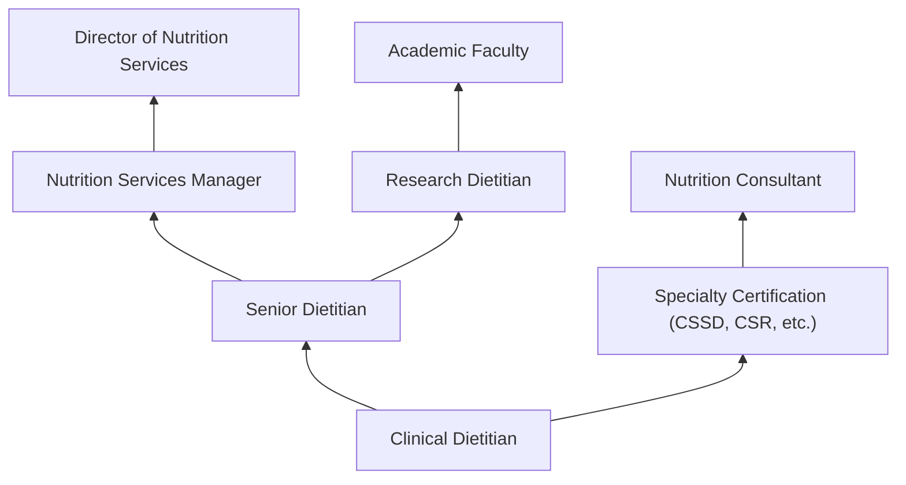

# Dietitians and Nutritionists

> Plan and conduct food service or nutritional programs to assist in the promotion of health and control of disease. May supervise activities of a department providing quantity food services, counsel individuals, or conduct nutritional research.

## Overview

Dietitians and Nutritionists are healthcare professionals who specialize in food and nutrition science. They assess patients' nutritional needs, develop personalized meal plans, and educate individuals and groups about healthy eating habits. Working across healthcare settings, food service operations, and community programs, they play a crucial role in disease prevention, chronic disease management, and overall wellness promotion.

## Classification Hierarchy

## Key Statistics

| Metric | Value |
|--------|-------|
| SOC Code | 29-1031.00 |
| Job Zone | 5 (Extensive Preparation) |
| Category | [Healthcare Practitioners](/occupations/HealthcarePractitioners) |
| Core Tasks | 15+ |
| Source | O*NET |

## Core Tasks

### assess.NutritionalNeeds

Dietitians evaluate patients' nutritional status and requirements.

**Actions:**
- `assess.NutritionalHealthNeeds.of.ClientsPatients` - Evaluate dietary needs
- `assess.NutritionalHealthNeeds.based.MedicalConditions` - Consider health factors
- `assess.NutritionalHealthNeeds.based.DiagnosticTests` - Review lab results

### develop.MealPlans

Dietitians create individualized nutrition programs.

**Actions:**
- `develop.MealPlans.for.ClientsPatients` - Create diet plans
- `develop.MealPlans.based.NutritionalNeeds` - Tailor to requirements
- `develop.MealPlans.based.FoodPreferences` - Consider preferences

### counsel.ClientsPatients

Dietitians provide nutrition education and guidance.

**Actions:**
- `counsel.ClientsPatients.about.NutritionalPrinciples` - Teach nutrition basics
- `counsel.ClientsPatients.about.DietaryModifications` - Guide diet changes
- `counsel.ClientsPatients.about.FoodSelection` - Advise on food choices

### monitor.NutritionalStatus

Dietitians track patient progress and outcomes.

**Actions:**
- `monitor.NutritionalStatus.of.Patients` - Track progress
- `monitor.DietaryCompliance.of.Patients` - Assess adherence
- `adjust.MealPlans.based.Progress` - Modify as needed

## Specialty Areas

| Specialty | Focus Area | Settings |
|-----------|------------|----------|
| Clinical Dietitian | Medical nutrition therapy | Hospitals, clinics |
| Community Dietitian | Public health nutrition | Health departments, nonprofits |
| Management Dietitian | Food service operations | Healthcare facilities, schools |
| Sports Dietitian | Athletic performance | Sports teams, fitness centers |
| Renal Dietitian | Kidney disease nutrition | Dialysis centers, hospitals |
| Pediatric Dietitian | Children's nutrition | Pediatric hospitals, clinics |
| Oncology Dietitian | Cancer patient nutrition | Cancer centers |

## Skills & Competencies

### Technical Skills
- **Nutritional Assessment** - Expert
- **Medical Nutrition Therapy** - Expert
- **Meal Planning** - Expert
- **Food Service Management** - Advanced
- **Dietary Software** - Proficient
- **Research Methods** - Advanced

### Soft Skills
- **Patient Communication** - Critical
- **Counseling** - Essential
- **Teaching** - Essential
- **Cultural Competency** - Critical
- **Empathy** - Essential

## Related Occupations

## Industries

- [Hospitals](/industries/Healthcare/Hospitals/index) - Primary Employment
- [Nursing Care Facilities](/industries/NursingCare) - Long-term Care
- [Outpatient Care Centers](/industries/OutpatientCare) - Clinical Settings
- [Government](/industries/Government) - Public Health Programs
- [Schools](/industries/Education) - School Nutrition Programs
- [Corporate Wellness](/industries/CorporateWellness) - Employee Health

## Career Progression

## Education & Training

| Requirement | Details |
|-------------|---------|
| Typical Education | Bachelor's degree in dietetics, nutrition, or related field; Master's increasingly required |
| Supervised Practice | 1,000+ hours of supervised practice (dietetic internship) |
| Credentialing | Registered Dietitian Nutritionist (RDN) through CDR |
| Licensure | Most states require licensure or certification |
| Continuing Education | 75 credits every 5 years for RDN maintenance |

## Certifications

| Certification | Description |
|---------------|-------------|
| RDN | Registered Dietitian Nutritionist (entry credential) |
| CNSC | Certified Nutrition Support Clinician |
| CSR | Certified Specialist in Renal Nutrition |
| CSSD | Certified Specialist in Sports Dietetics |
| CSO | Certified Specialist in Oncology Nutrition |
| CSP | Certified Specialist in Pediatric Nutrition |
| CDE | Certified Diabetes Educator |

## Departments

This occupation typically works in:
- [Clinical Nutrition](/departments/ClinicalNutrition)
- [Food and Nutrition Services](/departments/FoodNutrition)
- [Diabetes Education](/departments/DiabetesEducation)
- [Community Health](/departments/CommunityHealth)
- [Wellness Programs](/departments/Wellness)

---

*Source: O*NET 29-1031.00 - ONETOccupation*
