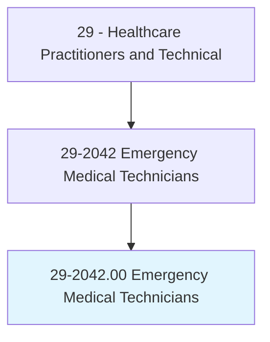
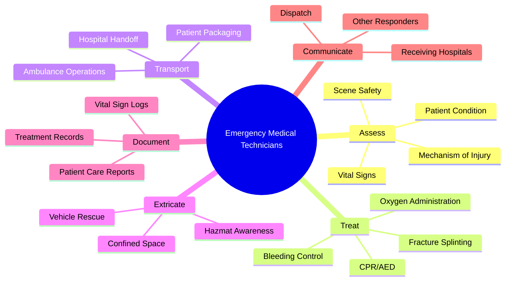
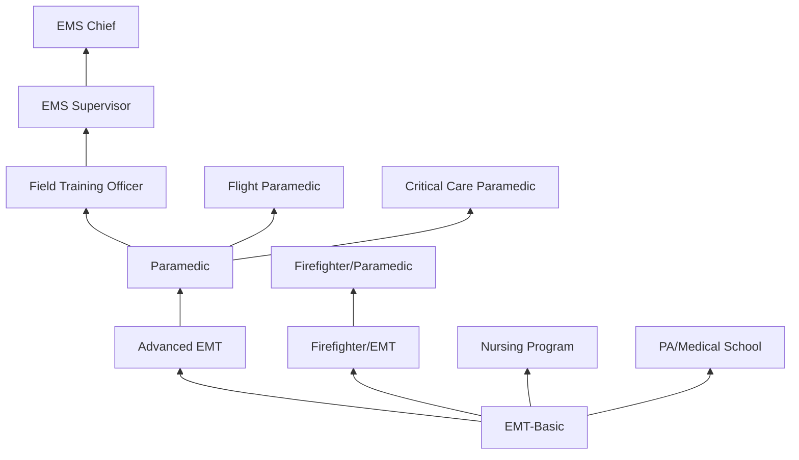
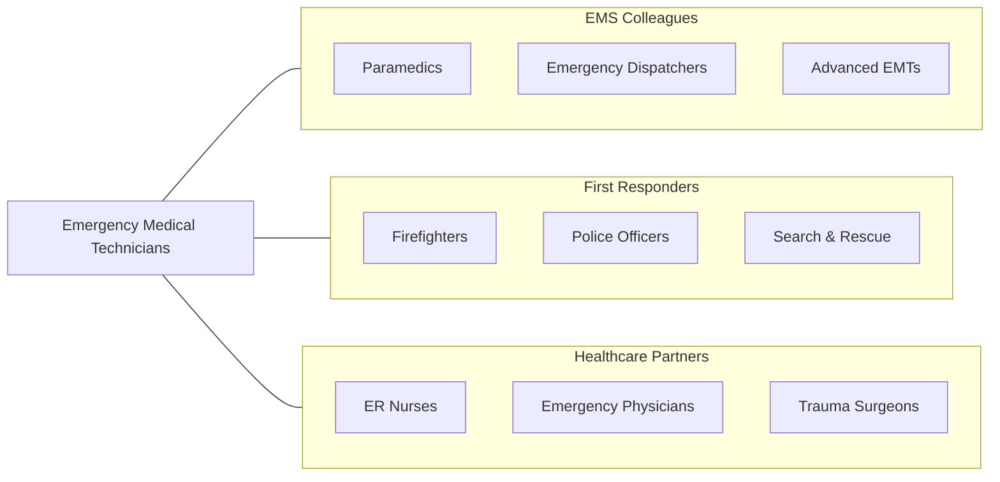

# Emergency Medical Technicians

> Assess injuries, administer emergency medical care, and extricate trapped individuals. Transport injured or sick persons to medical facilities.

## Overview

Emergency Medical Technicians (EMTs) are frontline emergency healthcare providers who respond to 911 calls, assess patient conditions, provide basic life support (BLS), and transport patients to emergency departments. EMTs perform CPR, control bleeding, splint fractures, manage airways with basic adjuncts, administer oxygen, use automated external defibrillators (AEDs), and assist patients with prescribed medications such as epinephrine auto-injectors and nitroglycerin.

EMTs operate in unpredictable and often hazardous environments including accident scenes, homes, workplaces, and public spaces. They perform rapid patient assessments, determine transport priorities using triage protocols, communicate with emergency dispatchers and receiving hospitals, and document patient care using electronic patient care reporting systems. EMTs also perform vehicle extrication, manage hazardous material scenes with appropriate precautions, and provide emergency care during mass casualty incidents.

The EMT profession has evolved with advances in prehospital protocols, telemedicine consultation, point-of-care testing, community paramedicine models, and mobile integrated healthcare. EMTs increasingly serve in expanded roles including community health assessment, injury prevention, and chronic disease management programs beyond traditional emergency response.

## Classification Hierarchy

## Key Statistics

| Metric | Value |
|--------|-------|
| SOC Code | 29-2042.00 |
| Median Annual Salary | $36,930 |
| Employment | ~167,000 |
| Projected Growth | 5% (2022-2032) |
| Job Zone | 2 (Some Preparation) |
| Category | [Healthcare Practitioners](/occupations/HealthcarePractitioners) |
| Core Tasks | 35+ |
| Source | O*NET |

## Core Tasks

### assess.EmergencyPatients

EMTs perform rapid patient assessments in the field.

**Actions:**
- `assess.PatientCondition.using.PrimarySecondarySurvey` - Patient assessment
- `evaluate.SceneSafety.for.ResponderProtection` - Scene size-up
- `assess.MechanismOfInjury.for.TraumaTriage` - Trauma assessment
- `monitor.VitalSigns.using.PortableEquipment` - Vital signs

### treat.EmergencyConditions

EMTs provide basic life support interventions.

**Actions:**
- `perform.CPR.using.AED.for.CardiacArrest` - Cardiac resuscitation
- `control.Hemorrhage.using.DirectPressureAndTourniquets` - Bleeding control
- `manage.Airway.using.BasicAdjuncts` - Airway management
- `splint.Fractures.for.InjuryStabilization` - Fracture management

## Practice Settings

| Setting | Description |
|---------|-------------|
| Fire Departments | Fire-based EMS |
| Private Ambulance Services | Commercial EMS transport |
| Municipal EMS Agencies | Government-operated EMS |
| Hospital-Based EMS | Hospital ambulance services |
| Industrial/Corporate | Workplace emergency response |
| Event Medical Services | Concert and sporting event coverage |
| Air Medical (Ground Support) | Helicopter EMS support |

## Skills & Competencies

### Technical Skills
- **Basic Life Support (BLS)** - Expert
- **Patient Assessment** - Expert
- **Trauma Care** - Advanced
- **Ambulance Operations** - Advanced
- **Medical Equipment Operation** - Advanced
- **Extrication Techniques** - Advanced
- **Triage** - Advanced

### Soft Skills
- **Decision Making Under Pressure** - Critical
- **Communication** - Essential
- **Physical Fitness** - Essential
- **Teamwork** - Essential
- **Emotional Resilience** - Essential
- **Adaptability** - Essential

## Education & Training

| Requirement | Details |
|-------------|---------|
| Education | High school diploma (minimum) |
| EMT Course | 120-150 hour EMT training program |
| Certification | NREMT (National Registry of EMTs) |
| State Licensure | Required in all states |
| CPR Certification | BLS for Healthcare Providers |
| Continuing Education | Per state and NREMT requirements |

## Certifications

| Certification | Description |
|---------------|-------------|
| NREMT-B | National Registry EMT-Basic |
| State EMT License | State-specific certification |
| CPR/BLS | Basic Life Support certification |
| EVOC/CEVO | Emergency Vehicle Operations |
| Hazmat Awareness | Hazardous materials awareness |
| ICS/NIMS | Incident Command System |
| Stop the Bleed | Hemorrhage control |

## Career Progression

## Specializations

| Focus Area | Description |
|------------|-------------|
| Fire-Based EMS | Combined firefighting and EMS |
| Wilderness EMS | Backcountry emergency care |
| Tactical EMS | Law enforcement medical support |
| Event Medicine | Mass gathering medical coverage |
| Community Paramedicine | Preventive community health |
| Industrial EMS | Workplace emergency response |

## Technology & Tools

| Technology | Purpose |
|------------|---------|
| Automated External Defibrillators (AEDs) | Cardiac arrest treatment |
| Pulse Oximeters | Oxygen monitoring |
| Portable Suction Devices | Airway clearance |
| Spinal Immobilization Equipment | Trauma stabilization |
| Stair Chairs and Stretchers | Patient transport |
| ePCR Systems (ESO, ImageTrend) | Electronic documentation |
| Portable Radios | Field communication |
| Tourniquets and Hemostatic Agents | Hemorrhage control |

## Related Occupations

## Industries

- [Fire Protection](/industries/Government/FireProtection) - Fire-Based EMS
- [Ambulance Services](/industries/Healthcare/AmbulatoryHealthCare) - Private EMS
- [Government](/industries/Government) - Municipal EMS
- [Hospitals](/industries/Healthcare/Hospitals/index) - Hospital-Based EMS
- [Events](/industries/ArtsEntertainment) - Event Medical Services

## Departments

This occupation typically works in:
- [Emergency Medical Services](/departments/EMS)
- [Fire Department](/departments/FireDepartment)
- [Emergency Department](/departments/EmergencyDepartment)
- [Transport Services](/departments/TransportServices)

---

*Source: O*NET 29-2042.00 - ONETOccupation*
