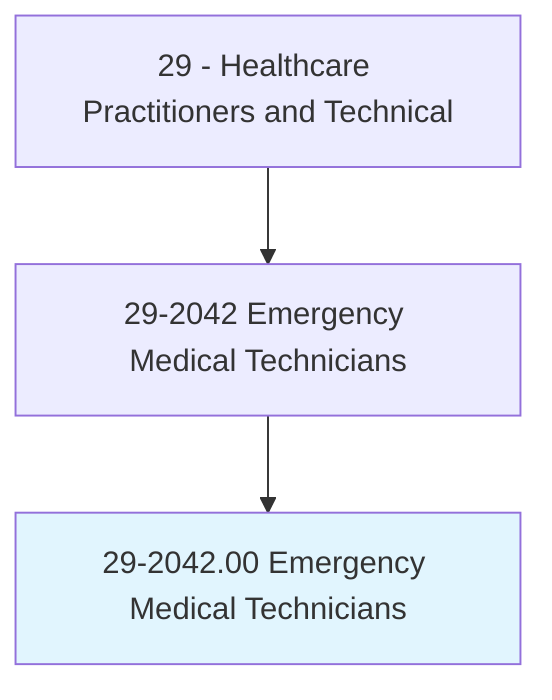
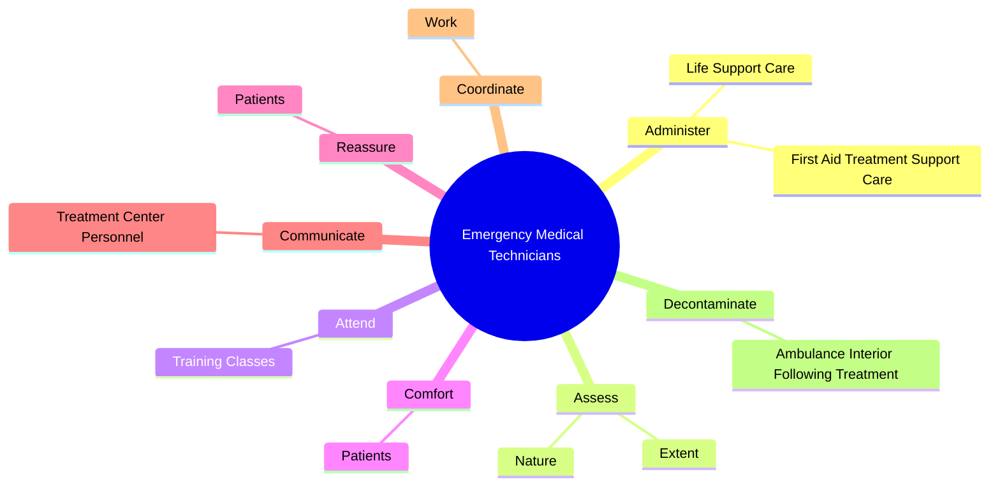
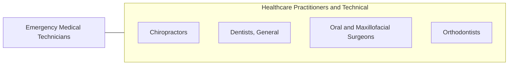

# Emergency Medical Technicians

> Assess injuries and illnesses and administer basic emergency medical care. May transport injured or sick persons to medical facilities.

## Overview

Emergency Medical Technicians is an occupation within the Healthcare Practitioners and Technical category. Assess injuries and illnesses and administer basic emergency medical care. 

## Classification Hierarchy

## Key Statistics

| Metric | Value |
|--------|-------|
| SOC Code | 29-2042.00 |
| Category | [Healthcare Practitioners and Technical](/occupations/HealthcarePractitioners) |
| Task Count | 52 |
| Source | O*NET |

## Core Tasks

### administer.FirstAidTreatmentSupportCare

Emergency Medical Technicians administer first aid treatment support care as part of their core responsibilities.

**Actions:**
- `administer.FirstAidTreatmentSupportCare.to.SickPersonsInPrehospitalSettings`
- `administer.FirstAidTreatmentSupportCare.to.InjuredPersonsInPrehospitalSettings`
- `administer.LifeSupportCare.to.SickPersonsInPrehospitalSettings`
- `administer.LifeSupportCare.to.InjuredPersonsInPrehospitalSettings`

### assess.Nature

Emergency Medical Technicians assess nature as part of their core responsibilities.

**Actions:**
- `assess.Nature.of.Illness.to.establish.PrioritizeMedicalProcedures`
- `assess.Nature.of.Injury.to.establish.PrioritizeMedicalProcedures`
- `assess.Extent.of.Illness.to.establish.PrioritizeMedicalProcedures`
- `assess.Extent.of.Injury.to.establish.PrioritizeMedicalProcedures`

### attend.TrainingClasses

Emergency Medical Technicians attend training classes as part of their core responsibilities.

**Actions:**
- `attend.TrainingClasses.to.maintain.CertificationLicensure`
- `attend.TrainingClasses.to.keep.AbreastOfNewDevelopmentsInField`
- `attend.TrainingClasses.to.maintain.ExistingKnowledge`

## Skills & Competencies

### Technical Skills
- **Clinical Skills** - Advanced
- **Diagnostic Procedures** - Advanced
- **Patient Care** - Advanced

### Soft Skills
- **Communication** - Essential
- **Problem Solving** - Essential
- **Critical Thinking** - Important
- **Teamwork** - Important
- **Adaptability** - Important

## Related Occupations

## Industries

This occupation is found across multiple industries. See [Industries](/industries) for sector-specific employment data.

## Career Progression

---

*Source: O*NET 29-2042.00 - ONETOccupation*
