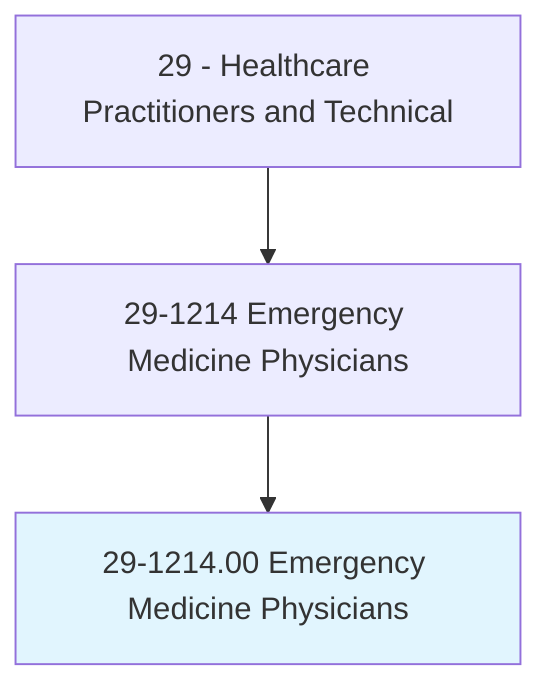
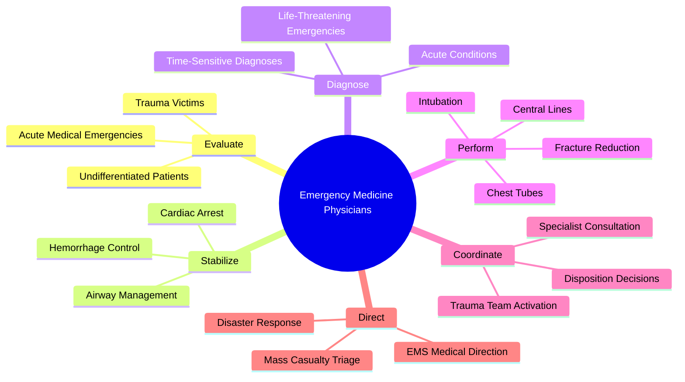
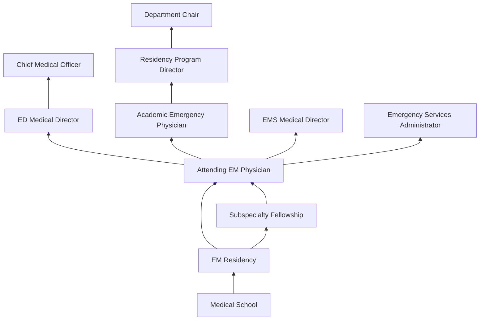
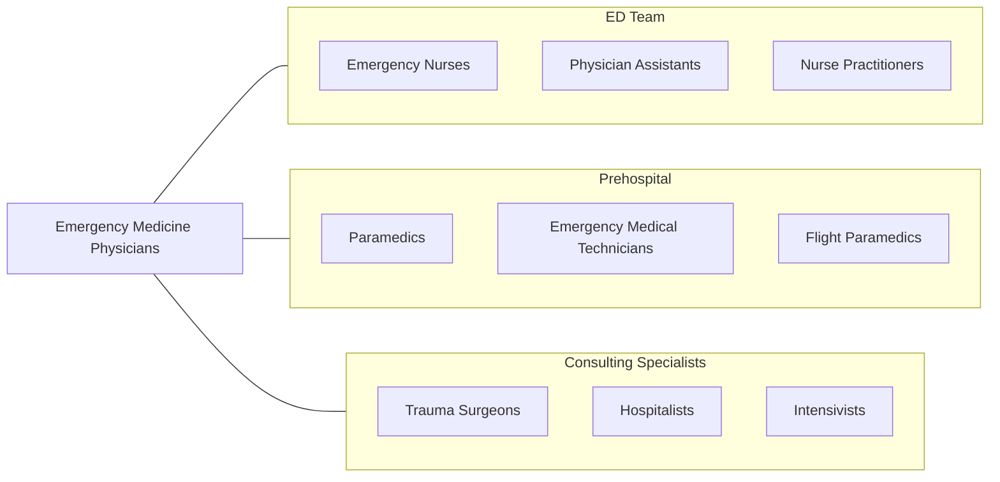

# Emergency Medicine Physicians

> Make immediate medical decisions and act to prevent death or further disability. Provide immediate recognition, evaluation, care, stabilization, and disposition of patients.

## Overview

Emergency Medicine Physicians are specialists trained to evaluate, stabilize, and manage patients presenting with acute illness or injury across the full spectrum of medical, surgical, and psychiatric emergencies. They serve as the frontline of acute care, treating undifferentiated patients of all ages and acuity levels in emergency departments, trauma centers, and urgent care settings. Their expertise spans resuscitation, trauma management, toxicology, procedural sedation, and critical care stabilization.

Emergency physicians must make rapid, high-stakes decisions with incomplete information, prioritizing multiple patients simultaneously. They perform a wide range of procedures including intubation, central venous access, chest tube placement, fracture reduction, laceration repair, lumbar puncture, and point-of-care ultrasound. The specialty requires expertise in disaster medicine, mass casualty management, and prehospital medical direction.

The field has evolved to include emergency medical services (EMS) oversight, toxicology consultation, sports medicine, palliative emergency care, and clinical informatics. Advances in point-of-care ultrasound, telemedicine for stroke evaluation, and sepsis protocols have expanded the emergency physician's diagnostic and therapeutic capabilities.

## Classification Hierarchy

## Key Statistics

| Metric | Value |
|--------|-------|
| SOC Code | 29-1214.00 |
| Median Annual Salary | $250,404 |
| Employment | ~42,000 |
| Projected Growth | 5% (2022-2032) |
| Job Zone | 5 (Extensive Preparation) |
| Category | [Healthcare Practitioners](/occupations/HealthcarePractitioners) |
| Core Tasks | 65+ |
| Source | O*NET |

## Core Tasks

### evaluate.UndifferentiatedPatients

Emergency physicians assess patients with unknown diagnoses.

**Actions:**
- `evaluate.UndifferentiatedPatients.using.RapidAssessment` - Primary survey
- `evaluate.TraumaVictims.using.ATLSProtocol` - Trauma evaluation
- `diagnose.AcuteConditions.using.PointOfCareUltrasound` - Bedside imaging
- `stabilize.CriticalPatients.using.Resuscitation` - Emergency stabilization

### perform.EmergencyProcedures

Emergency physicians execute life-saving interventions.

**Actions:**
- `perform.EndotrachealIntubation.for.AirwayManagement` - Airway control
- `perform.CentralVenousAccess.for.ResuscitationAccess` - Vascular access
- `perform.ChestTubePlacement.for.Pneumothorax` - Pleural drainage
- `perform.ProceduralSedation.for.PainfulProcedures` - Sedation management

### coordinate.EmergencyCare

Emergency physicians orchestrate multidisciplinary emergency response.

**Actions:**
- `coordinate.TraumaTeamActivation.for.MajorTrauma` - Trauma leadership
- `coordinate.SpecialistConsultation.for.AcuteConditions` - Consult coordination
- `direct.EMSMedicalDirection.for.PrehospitalCare` - EMS oversight
- `manage.DisasterResponse.using.IncidentCommandSystem` - Mass casualty management

## Practice Settings

| Setting | Description |
|---------|-------------|
| Hospital Emergency Departments | Primary practice setting |
| Level I-IV Trauma Centers | Trauma team leadership |
| Freestanding Emergency Departments | Community emergency care |
| Urgent Care Centers | Lower-acuity emergencies |
| Air Medical Services | Flight physician |
| Disaster Response Teams | DMAT and field hospitals |
| Telemedicine | Tele-ED consultation |
| Military/Tactical Medicine | Combat casualty care |

## Skills & Competencies

### Technical Skills
- **Resuscitation & ACLS/ATLS** - Expert
- **Airway Management** - Expert
- **Point-of-Care Ultrasound** - Expert
- **Procedural Skills** - Expert
- **Trauma Management** - Expert
- **Toxicology** - Advanced
- **Critical Care Stabilization** - Advanced
- **Pediatric Emergency Medicine** - Advanced

### Soft Skills
- **Rapid Decision Making** - Critical
- **Multitasking** - Critical
- **Crisis Leadership** - Critical
- **Communication** - Essential
- **Stress Tolerance** - Essential
- **Teamwork** - Essential
- **Adaptability** - Essential

## Education & Training

| Requirement | Details |
|-------------|---------|
| Undergraduate | 4-year bachelor's degree (pre-med) |
| Medical School | 4-year MD or DO program |
| EM Residency | 3-4 years |
| Fellowship | 1-2 years for subspecialization |
| Total Training | 11-14 years post-high school |
| Licensure | State medical license |
| Board Certification | ABEM (American Board of Emergency Medicine) |
| MOC | Continuous certification requirements |

## Certifications

| Certification | Description |
|---------------|-------------|
| ABEM Emergency Medicine | Primary board certification |
| ABEM EMS | Emergency Medical Services subspecialty |
| ABEM Toxicology | Medical toxicology subspecialty |
| ABEM Sports Medicine | Sports medicine subspecialty |
| ATLS | Advanced Trauma Life Support |
| ACLS | Advanced Cardiovascular Life Support |
| PALS | Pediatric Advanced Life Support |
| FACEP | Fellow of ACEP |

## Career Progression

## Specializations

| Subspecialty | Focus Area |
|-------------|------------|
| Pediatric Emergency Medicine | Pediatric emergencies |
| Medical Toxicology | Poisoning and overdose |
| Emergency Medical Services | Prehospital medicine |
| Wilderness Medicine | Austere environment care |
| Sports Medicine | Athletic emergencies |
| Ultrasound | Advanced bedside imaging |
| Critical Care | Emergency critical care |
| Disaster Medicine | Mass casualty and disaster |

## Technology & Tools

| Technology | Purpose |
|------------|---------|
| Point-of-Care Ultrasound (POCUS) | Bedside diagnostic imaging |
| Cardiac Monitors & Defibrillators | Rhythm monitoring and intervention |
| Video Laryngoscopes (GlideScope, C-MAC) | Advanced airway management |
| CT Scanner (Rapid Protocol) | Emergency diagnostic imaging |
| Electronic Health Records (with ED modules) | Documentation and tracking |
| Patient Tracking Boards | ED flow management |
| Telemedicine Systems (Telestroke) | Remote specialist consultation |
| Trauma Bay Equipment | Full resuscitation capability |

## Related Occupations

## Industries

- [Hospitals](/industries/Healthcare/Hospitals/index) - Primary Employment
- [Freestanding EDs](/industries/Healthcare/AmbulatoryHealthCare) - Emergency Centers
- [Academic Medical Centers](/industries/Healthcare/Hospitals/Teaching) - Teaching & Research
- [Government](/industries/Government) - Military and VA
- [Air Medical Services](/industries/Transportation/AirAmbulance) - Flight Medicine
- [Locum Tenens](/industries/Healthcare/StaffingAgencies) - Temporary Coverage

## Departments

This occupation typically works in:
- [Emergency Department](/departments/EmergencyDepartment)
- [Trauma Services](/departments/TraumaServices)
- [Emergency Medical Services](/departments/EMS)
- [Observation Medicine](/departments/ObservationMedicine)
- [Disaster Preparedness](/departments/DisasterPreparedness)

---

*Source: O*NET 29-1214.00 - ONETOccupation*
