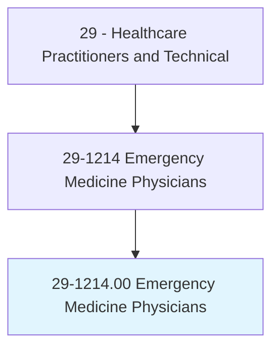
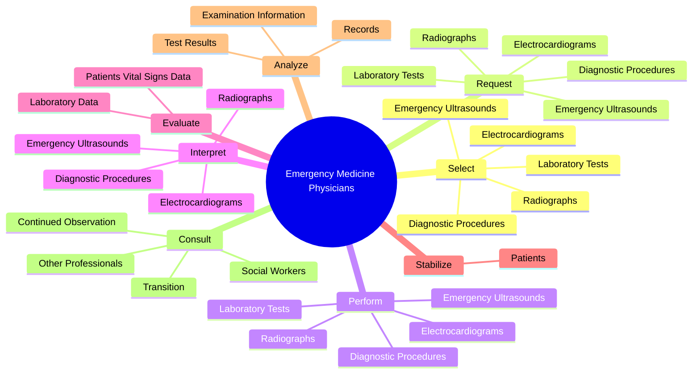
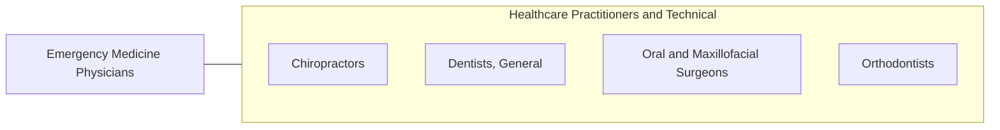

# Emergency Medicine Physicians

> Make immediate medical decisions and act to prevent death or further disability. Provide immediate recognition, evaluation, care, stabilization, and disposition of patients. May direct emergency medical staff in an emergency department.

## Overview

Emergency Medicine Physicians is an occupation within the Healthcare Practitioners and Technical category. Make immediate medical decisions and act to prevent death or further disability. Provide immediate recognition, evaluation, care, stabilization, and disposition of patients.

## Classification Hierarchy

## Key Statistics

| Metric | Value |
|--------|-------|
| SOC Code | 29-1214.00 |
| Category | [Healthcare Practitioners and Technical](/occupations/HealthcarePractitioners) |
| Task Count | 78 |
| Source | O*NET |

## Core Tasks

### select.DiagnosticProcedures

Emergency Medicine Physicians select diagnostic procedures as part of their core responsibilities.

**Actions:**
- `select.DiagnosticProcedures`
- `select.LaboratoryTests`
- `select.Electrocardiograms`
- `select.EmergencyUltrasounds`

### request.DiagnosticProcedures

Emergency Medicine Physicians request diagnostic procedures as part of their core responsibilities.

**Actions:**
- `request.DiagnosticProcedures`
- `request.LaboratoryTests`
- `request.Electrocardiograms`
- `request.EmergencyUltrasounds`

### perform.DiagnosticProcedures

Emergency Medicine Physicians perform diagnostic procedures as part of their core responsibilities.

**Actions:**
- `perform.DiagnosticProcedures`
- `perform.LaboratoryTests`
- `perform.Electrocardiograms`
- `perform.EmergencyUltrasounds`

## Skills & Competencies

### Technical Skills
- **Clinical Skills** - Advanced
- **Diagnostic Procedures** - Advanced
- **Patient Care** - Advanced

### Soft Skills
- **Communication** - Essential
- **Problem Solving** - Essential
- **Critical Thinking** - Important
- **Teamwork** - Important
- **Adaptability** - Important

## Related Occupations

## Industries

This occupation is found across multiple industries. See [Industries](/industries) for sector-specific employment data.

## Career Progression

---

*Source: O*NET 29-1214.00 - ONETOccupation*
