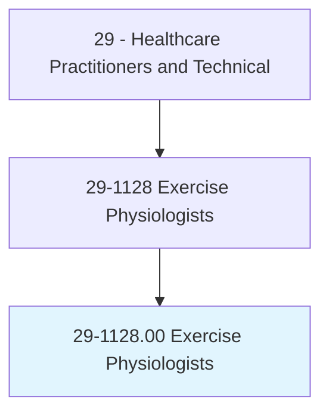
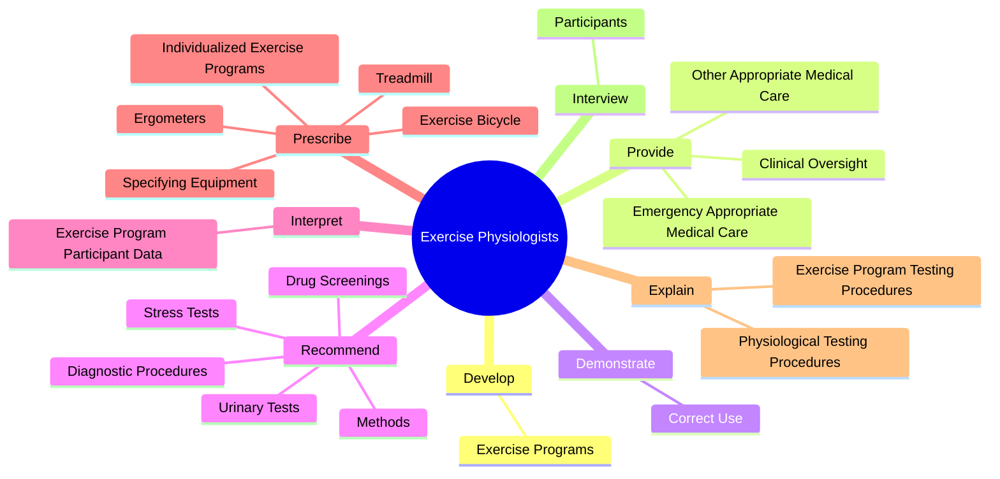
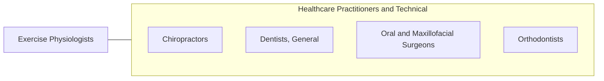

# Exercise Physiologists

> Assess, plan, or implement fitness programs that include exercise or physical activities such as those designed to improve cardiorespiratory function, body composition, muscular strength, muscular endurance, or flexibility.

## Overview

Exercise Physiologists is classified under Healthcare Practitioners and Technical (SOC 29). Assess, plan, or implement fitness programs that include exercise or physical activities such as those designed to improve cardiorespiratory function, body composition, muscular strength, muscular endurance, or flexibility.

## Classification Hierarchy

## Key Statistics

| Metric | Value |
|--------|-------|
| SOC Code | 29-1128.00 |
| Category | [Healthcare Practitioners and Technical](/occupations/HealthcarePractitioners) |
| Task Count | 89 |
| Source | O*NET |

## Core Tasks

### develop.ExercisePrograms

Exercise Physiologists develop exercise programs as part of their core responsibilities.

**Actions:**
- `develop.ExercisePrograms.to.improve.ParticipantStrength`
- `develop.ExercisePrograms.to.Flexibility`
- `develop.ExercisePrograms.to.Endurance`
- `develop.ExercisePrograms.to.CirculatoryFunctioning`

### provide.EmergencyAppropriateMedicalCare

Exercise Physiologists provide emergency appropriate medical care as part of their core responsibilities.

**Actions:**
- `provide.EmergencyAppropriateMedicalCare.to.ParticipantsWithSymptoms`
- `provide.EmergencyAppropriateMedicalCare.to.signs.OfPhysicalDistress`
- `provide.OtherAppropriateMedicalCare.to.ParticipantsWithSymptoms`
- `provide.OtherAppropriateMedicalCare.to.signs.OfPhysicalDistress`

### demonstrate.CorrectUse

Exercise Physiologists demonstrate correct use as part of their core responsibilities.

**Actions:**
- `demonstrate.CorrectUse.of.ExerciseEquipment.of.ExerciseRoutines`
- `demonstrate.CorrectUse.of.Performance.of.ExerciseRoutines`

## Skills & Competencies

### Technical Skills
- **Clinical Skills** - Advanced
- **Diagnostic Procedures** - Advanced
- **Patient Care** - Advanced

### Soft Skills
- **Communication** - Essential
- **Problem Solving** - Essential
- **Critical Thinking** - Important
- **Teamwork** - Important
- **Adaptability** - Important

## Related Occupations

## Industries

This occupation is found across multiple industries. See [Industries](/industries) for sector-specific employment data.

## Career Progression

---

*Source: O*NET 29-1128.00 - ONETOccupation*
