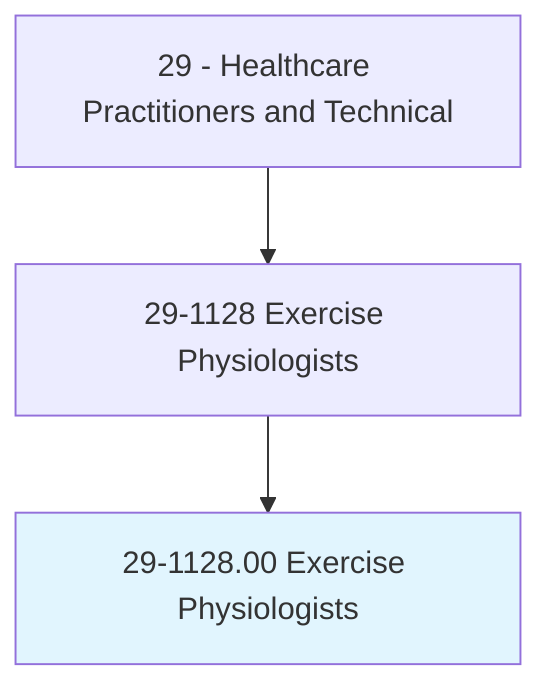
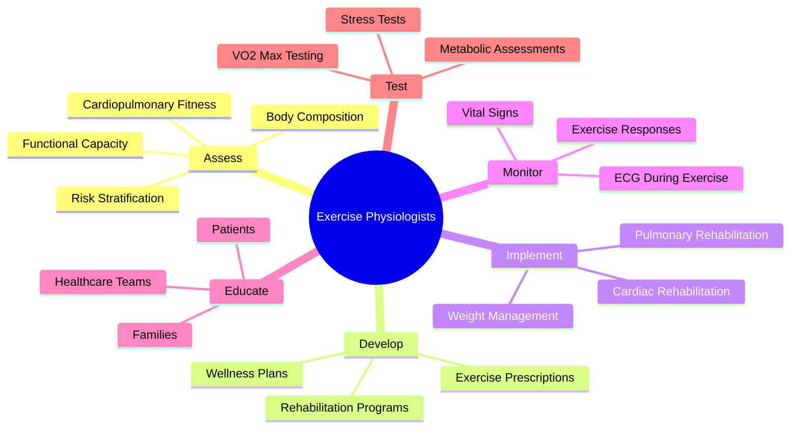
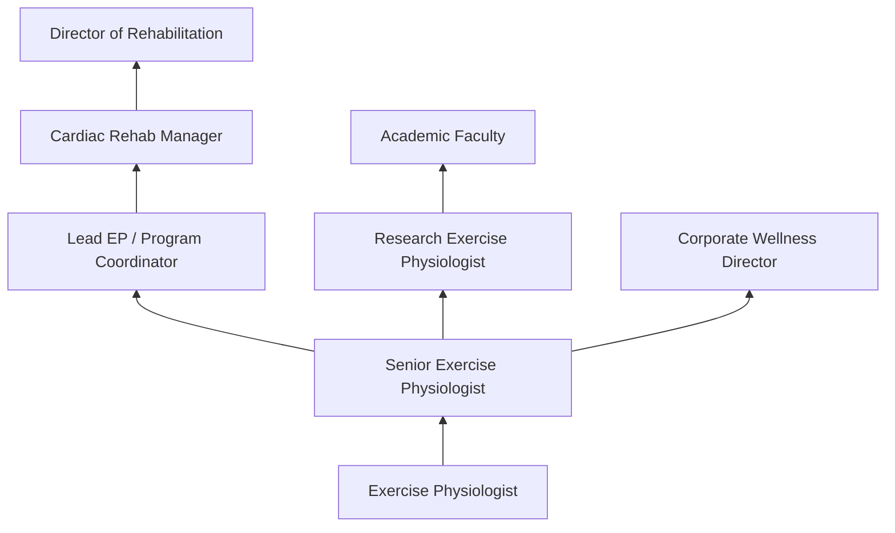
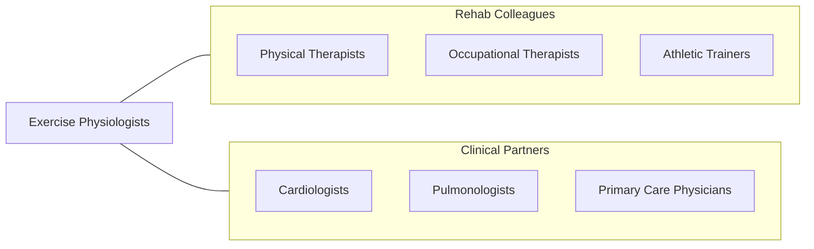

# Exercise Physiologists

> Develop and implement fitness and exercise programs that help patients recover from chronic diseases and improve cardiovascular function, body composition, and flexibility.

## Overview

Exercise Physiologists are healthcare professionals who develop and implement exercise programs for patients with chronic diseases, cardiovascular conditions, pulmonary disorders, and metabolic conditions. They perform clinical exercise testing, interpret physiological responses to exercise, and design individualized rehabilitation programs that improve functional capacity, reduce disease risk, and enhance quality of life.

The scope of exercise physiology encompasses cardiac rehabilitation (Phase I-IV), pulmonary rehabilitation, metabolic testing, exercise stress testing, body composition analysis, and chronic disease management through structured physical activity programs. Exercise physiologists work with patients recovering from heart attacks, cardiac surgery, heart failure, COPD, diabetes, obesity, and cancer, using evidence-based exercise prescriptions tailored to individual pathology and functional capacity.

Modern exercise physiology has expanded with wearable fitness technology, remote patient monitoring, telehealth exercise programs, high-intensity interval training protocols for clinical populations, and integration of exercise as medicine in primary care settings. Exercise physiologists increasingly collaborate with multidisciplinary teams to address the exercise component of chronic disease prevention and management.

## Classification Hierarchy

## Key Statistics

| Metric | Value |
|--------|-------|
| SOC Code | 29-1128.00 |
| Median Annual Salary | $51,350 |
| Employment | ~14,000 |
| Projected Growth | 13% (2022-2032, much faster than average) |
| Job Zone | 4 (Considerable Preparation) |
| Category | [Healthcare Practitioners](/occupations/HealthcarePractitioners) |
| Core Tasks | 30+ |
| Source | O*NET |

## Core Tasks

### assess.ExerciseCapacity

Exercise Physiologists evaluate patient fitness and function.

**Actions:**
- `perform.ExerciseStressTests.for.CardiacEvaluation` - Stress testing
- `assess.BodyComposition.using.DXAAndBioimpedance` - Body composition
- `measure.VO2Max.using.MetabolicCart` - Metabolic testing
- `stratify.ExerciseRisk.for.SafeProgramDesign` - Risk assessment

### implement.RehabilitationPrograms

Exercise Physiologists deliver clinical exercise programs.

**Actions:**
- `implement.CardiacRehabilitation.for.PostCardiacEvent` - Cardiac rehab
- `implement.PulmonaryRehabilitation.for.ChronicLungDisease` - Pulmonary rehab
- `monitor.ECGAndVitalSigns.during.ExerciseSessions` - Exercise monitoring
- `prescribe.ExerciseIntensity.using.HeartRateAndRPE` - Exercise prescription

## Practice Settings

| Setting | Description |
|---------|-------------|
| Hospital Cardiac Rehab | Inpatient and outpatient cardiac rehabilitation |
| Outpatient Rehab Centers | Ambulatory exercise programs |
| Physician Offices | Clinical exercise testing |
| University Wellness Centers | Research and community programs |
| Corporate Wellness | Employee fitness programs |
| Community Health Centers | Chronic disease exercise programs |

## Skills & Competencies

### Technical Skills
- **Exercise Stress Testing** - Expert
- **ECG Interpretation** - Advanced
- **Exercise Prescription** - Expert
- **Cardiac Rehabilitation** - Expert
- **Metabolic Testing** - Advanced
- **Body Composition Assessment** - Advanced
- **Pulmonary Rehabilitation** - Advanced

### Soft Skills
- **Patient Motivation** - Critical
- **Communication** - Essential
- **Empathy** - Essential
- **Adaptability** - Essential
- **Teamwork** - Essential

## Education & Training

| Requirement | Details |
|-------------|---------|
| Education | Bachelor's degree in exercise physiology (minimum); master's preferred |
| Clinical Training | Supervised clinical internship |
| Certification | ACSM-CEP or ACSM-RCEP |
| BLS/ACLS | Required for clinical settings |
| Continuing Education | Per certification requirements |

## Certifications

| Certification | Description |
|---------------|-------------|
| ACSM-CEP | Certified Exercise Physiologist |
| ACSM-RCEP | Registered Clinical Exercise Physiologist |
| ACSM-CET | Certified Exercise Testing Technologist |
| ACLS | Advanced Cardiovascular Life Support |
| CCRP | Certified Cardiac Rehabilitation Professional |

## Career Progression

## Specializations

| Focus Area | Description |
|------------|-------------|
| Cardiac Rehabilitation | Heart disease exercise management |
| Pulmonary Rehabilitation | COPD and lung disease |
| Oncology Exercise | Cancer rehabilitation |
| Metabolic/Diabetes | Metabolic disease management |
| Pediatric Exercise | Youth chronic disease |
| Geriatric Exercise | Aging and fall prevention |

## Technology & Tools

| Technology | Purpose |
|------------|---------|
| Treadmills and Ergometers | Exercise testing and training |
| 12-Lead ECG Systems | Cardiac monitoring |
| Metabolic Carts (COSMED, Parvo) | VO2 and metabolic testing |
| Telemetry Monitoring | Wireless ECG during exercise |
| Body Composition Analyzers (DXA, BIA) | Body composition |
| Wearable Heart Rate Monitors | Exercise intensity monitoring |
| EHR Systems | Patient documentation |

## Related Occupations

## Industries

- [Hospitals](/industries/Healthcare/Hospitals/index) - Cardiac Rehabilitation
- [Outpatient Care](/industries/Healthcare/AmbulatoryHealthCare) - Outpatient Rehab
- [Physician Offices](/industries/Healthcare/PhysicianOffices) - Clinical Testing
- Fitness - Corporate Wellness
- [Academic](/industries/Education) - University Programs

## Departments

This occupation typically works in:
- Cardiac Rehabilitation
- Pulmonary Rehabilitation
- Rehabilitation Services
- Wellness Programs

---

*Source: O*NET 29-1128.00 - ONETOccupation*
