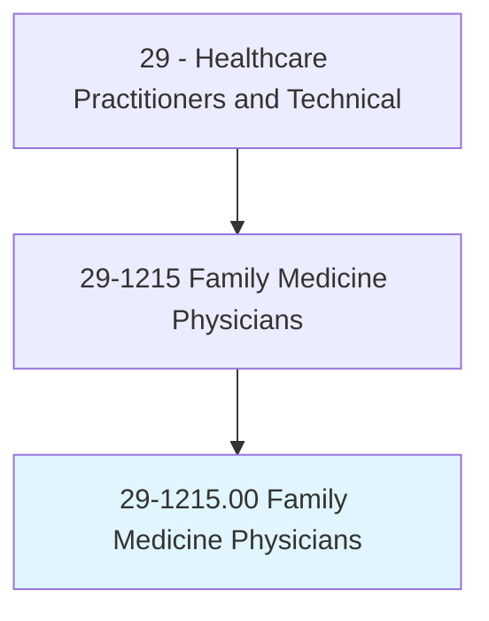
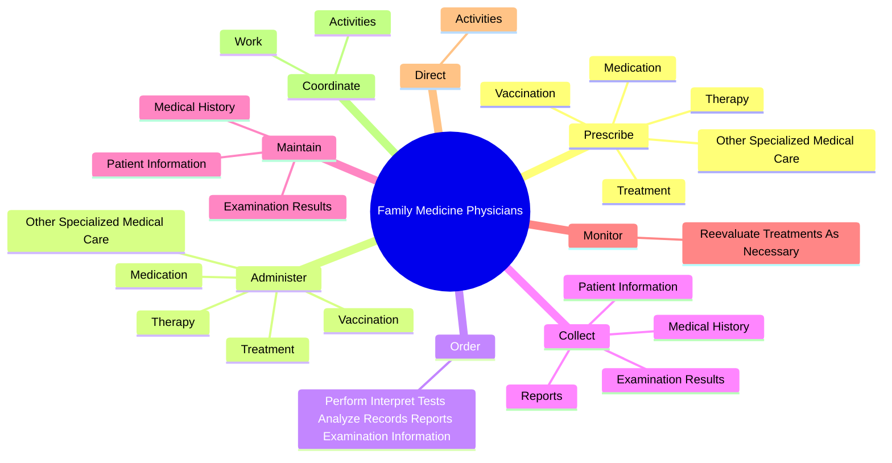
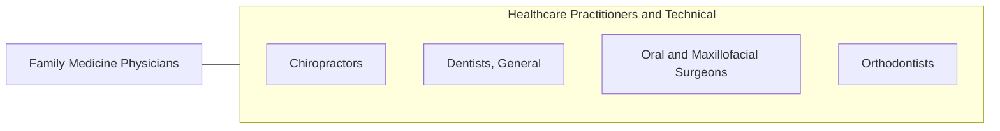

# Family Medicine Physicians

> Diagnose, treat, and provide preventive care to individuals and families across the lifespan. May refer patients to specialists when needed for further diagnosis or treatment.

## Overview

Family Medicine Physicians is an occupation within the Healthcare Practitioners and Technical category. Diagnose, treat, and provide preventive care to individuals and families across the lifespan. 

## Classification Hierarchy

## Key Statistics

| Metric | Value |
|--------|-------|
| SOC Code | 29-1215.00 |
| Category | [Healthcare Practitioners and Technical](/occupations/HealthcarePractitioners) |
| Task Count | 94 |
| Source | O*NET |

## Core Tasks

### prescribe.Treatment

Family Medicine Physicians prescribe treatment as part of their core responsibilities.

**Actions:**
- `prescribe.Treatment.to.treat.Illness`
- `prescribe.Treatment.to.prevent.Illness`
- `prescribe.Treatment.to.Disease`
- `prescribe.Treatment.to.Injury`

### administer.Treatment

Family Medicine Physicians administer treatment as part of their core responsibilities.

**Actions:**
- `administer.Treatment.to.treat.Illness`
- `administer.Treatment.to.prevent.Illness`
- `administer.Treatment.to.Disease`
- `administer.Treatment.to.Injury`

### order.PerformInterpretTestsAnalyzeRecordsReportsExaminationInformation

Family Medicine Physicians order perform interpret tests analyze records reports examination information as part of their core responsibilities.

**Actions:**
- `order.PerformInterpretTestsAnalyzeRecordsReportsExaminationInformation.to.diagnose.PatientsCondition`

## Skills & Competencies

### Technical Skills
- **Clinical Skills** - Advanced
- **Diagnostic Procedures** - Advanced
- **Patient Care** - Advanced

### Soft Skills
- **Communication** - Essential
- **Problem Solving** - Essential
- **Critical Thinking** - Important
- **Teamwork** - Important
- **Adaptability** - Important

## Related Occupations

## Industries

This occupation is found across multiple industries. See [Industries](/industries) for sector-specific employment data.

## Career Progression

---

*Source: O*NET 29-1215.00 - ONETOccupation*
