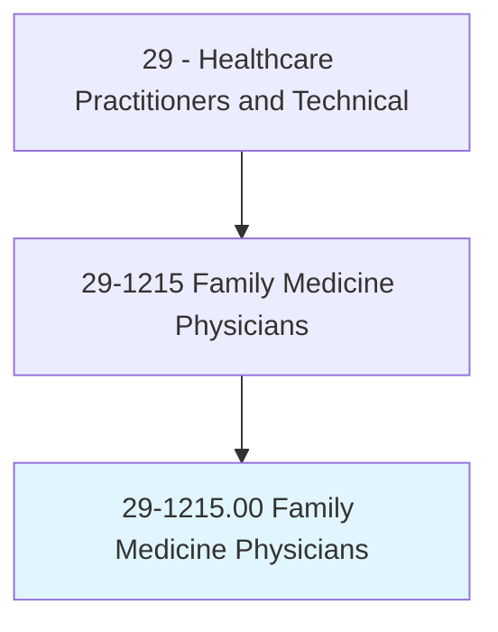
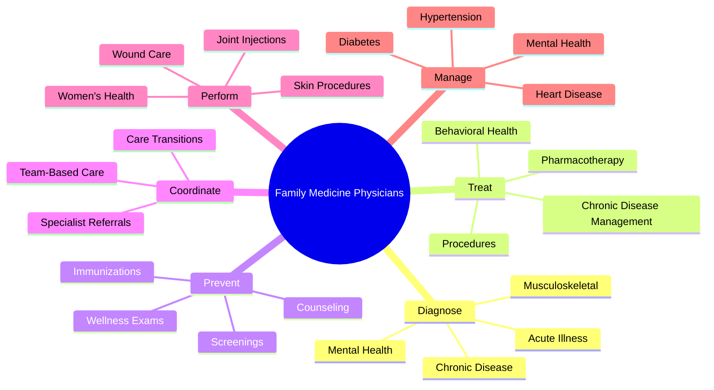
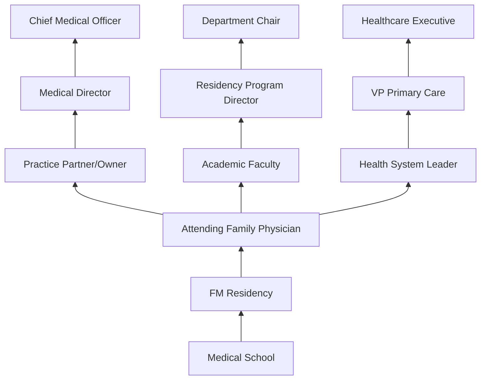
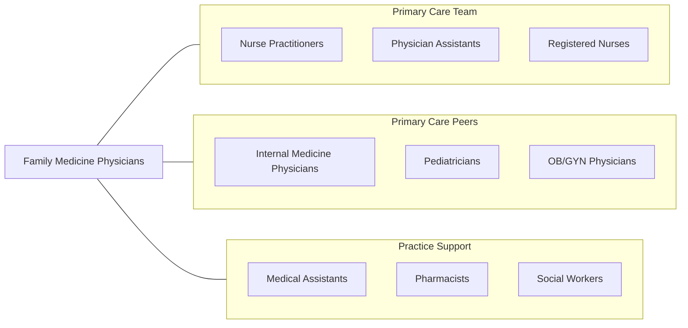

# Family Medicine Physicians

> Diagnose, treat, and provide preventive care to individuals and families across all ages, genders, diseases, and parts of the body.

## Overview

Family Medicine Physicians are primary care specialists trained to provide comprehensive, continuous healthcare to individuals and families across the entire lifespan, from newborns to the elderly. They diagnose and treat a broad spectrum of acute and chronic conditions, perform preventive health screenings, manage chronic diseases, and coordinate specialty referrals. As the most broadly trained physicians, family medicine doctors serve as the entry point to the healthcare system for the majority of patients.

The scope of family medicine is uniquely comprehensive, encompassing internal medicine, pediatrics, gynecology, psychiatry, geriatrics, sports medicine, and minor surgical procedures. Family physicians build long-term relationships with patients and families, understanding health within the context of family dynamics, community, and social determinants. They perform office-based procedures including skin biopsies, joint injections, colposcopy, and fracture management.

The specialty has evolved to emphasize value-based care, patient-centered medical homes, population health management, and team-based care models. Family physicians increasingly utilize health informatics, telehealth, and point-of-care testing to improve access and outcomes. With approximately one in five office visits in the United States occurring with a family physician, the specialty remains the cornerstone of the American healthcare system.

## Classification Hierarchy

## Key Statistics

| Metric | Value |
|--------|-------|
| SOC Code | 29-1215.00 |
| Median Annual Salary | $211,300 |
| Employment | ~115,000 |
| Projected Growth | 5% (2022-2032) |
| Job Zone | 5 (Extensive Preparation) |
| Category | [Healthcare Practitioners](/occupations/HealthcarePractitioners) |
| Core Tasks | 75+ |
| Source | O*NET |

## Core Tasks

### diagnose.ComprehensiveConditions

Family physicians evaluate the full spectrum of medical conditions.

**Actions:**
- `diagnose.AcuteIllness.using.ClinicalExamination` - Acute evaluation
- `diagnose.ChronicDisease.using.LaboratoryAndImaging` - Chronic care assessment
- `diagnose.MentalHealth.using.ScreeningTools` - Behavioral health screening
- `diagnose.MusculoskeletalConditions.using.PhysicalExam` - MSK evaluation

### prevent.Disease

Family physicians deliver comprehensive preventive care.

**Actions:**
- `prevent.Disease.using.AgeBased.Screenings` - Preventive screenings
- `administer.Immunizations.per.CDCSchedule` - Vaccination services
- `counsel.Patients.regarding.LifestyleModification` - Health behavior change
- `perform.WellnessExams.for.AllAgeGroups` - Annual health assessments

### manage.ChronicConditions

Family physicians provide longitudinal chronic disease management.

**Actions:**
- `manage.Diabetes.using.EvidenceBasedGuidelines` - Glucose control
- `manage.Hypertension.using.TitrationProtocols` - Blood pressure management
- `manage.HeartDisease.using.RiskReduction` - Cardiovascular prevention
- `coordinate.CareTransitions.with.Specialists` - Referral management

## Practice Settings

| Setting | Description |
|---------|-------------|
| Private/Group Practice | Traditional outpatient practice |
| Community Health Centers | Federally qualified health centers |
| Hospital-Employed Practice | Health system primary care |
| Rural Health Clinics | Underserved community care |
| Academic Family Medicine | Teaching and residency |
| Urgent Care | Walk-in acute care |
| Telehealth | Virtual primary care |
| Concierge/Direct Primary Care | Membership-based practice |

## Skills & Competencies

### Technical Skills
- **Comprehensive Primary Care** - Expert
- **Chronic Disease Management** - Expert
- **Preventive Medicine** - Expert
- **Office Procedures** - Advanced
- **Mental Health Treatment** - Advanced
- **Pediatric Care** - Advanced
- **Women's Health** - Advanced
- **Geriatric Care** - Advanced

### Soft Skills
- **Patient-Centered Communication** - Critical
- **Relationship Building** - Critical
- **Clinical Reasoning** - Essential
- **Empathy** - Essential
- **Cultural Competency** - Essential
- **Team Leadership** - Essential
- **Time Management** - Essential

## Education & Training

| Requirement | Details |
|-------------|---------|
| Undergraduate | 4-year bachelor's degree (pre-med) |
| Medical School | 4-year MD or DO program |
| Family Medicine Residency | 3 years |
| Fellowship | 1-2 years for subspecialization (optional) |
| Total Training | 11-13 years post-high school |
| Licensure | State medical license |
| Board Certification | ABFM (American Board of Family Medicine) |
| MOC | Continuous certification every 10 years |

## Certifications

| Certification | Description |
|---------------|-------------|
| ABFM Diplomate | Primary family medicine certification |
| ABFM Sports Medicine | CAQ in Sports Medicine |
| ABFM Hospice/Palliative | CAQ in Hospice and Palliative Medicine |
| ABFM Geriatric Medicine | CAQ in Geriatric Medicine |
| ABFM Adolescent Medicine | CAQ in Adolescent Medicine |
| BLS/ACLS | Life support certifications |
| FAAFP | Fellow of AAFP |

## Career Progression

## Specializations

| Focus Area | Description |
|------------|-------------|
| Sports Medicine | Athletic care and musculoskeletal |
| Geriatric Medicine | Elderly patient care |
| Hospice & Palliative Care | End-of-life and comfort care |
| Obstetrics | Prenatal care and delivery |
| Adolescent Medicine | Teen health |
| Rural Medicine | Full-scope rural practice |
| Integrative Medicine | Complementary approaches |
| Global Health | International health missions |

## Technology & Tools

| Technology | Purpose |
|------------|---------|
| Electronic Health Records (Epic, Cerner) | Documentation and population health |
| Patient Portal Systems | Patient engagement |
| Telehealth Platforms | Virtual visits |
| Point-of-Care Testing | In-office diagnostics |
| Dermoscopes | Skin lesion evaluation |
| Spirometers | Lung function testing |
| Health Risk Assessment Tools | Preventive screening |
| Population Health Dashboards | Panel management |

## Related Occupations

## Industries

- [Physician Offices](/industries/Healthcare/PhysicianOffices) - Primary Practice
- [Community Health Centers](/industries/Healthcare/CommunityHealthCenters) - FQHCs
- [Hospitals](/industries/Healthcare/Hospitals/index) - Employed Practice
- [Government](/industries/Government) - VA, Military, Public Health
- [Urgent Care](/industries/Healthcare/AmbulatoryHealthCare) - Walk-In Care
- [Academic](/industries/Education) - Teaching Programs

## Departments

This occupation typically works in:
- [Family Medicine](/departments/FamilyMedicine)
- [Primary Care](/departments/PrimaryCare)
- [Outpatient Clinic](/departments/OutpatientClinic)
- [Urgent Care](/departments/UrgentCare)
- [Population Health](/departments/PopulationHealth)

---

*Source: O*NET 29-1215.00 - ONETOccupation*
