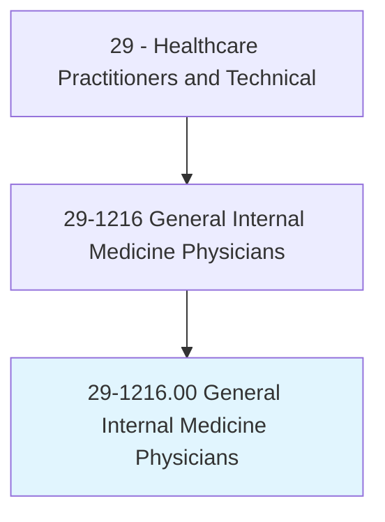
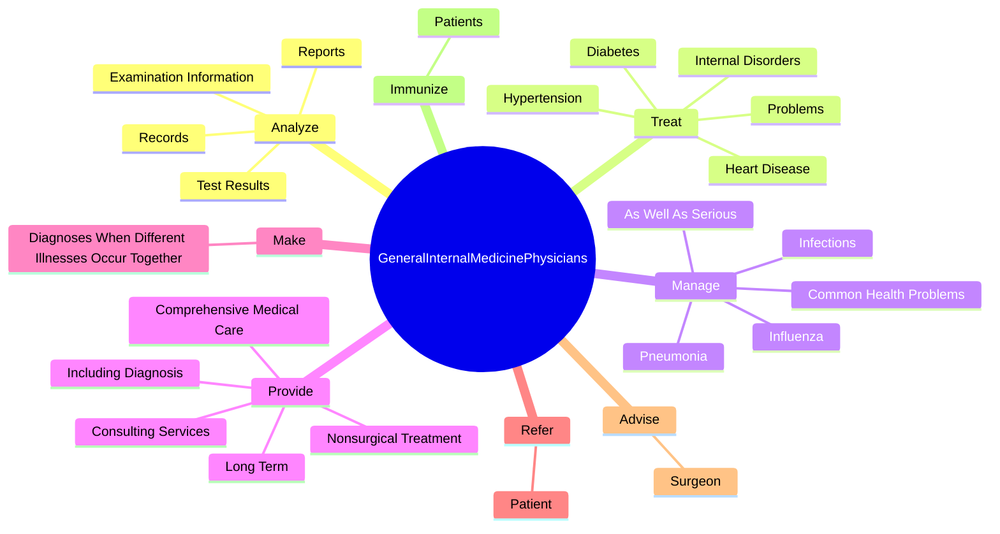
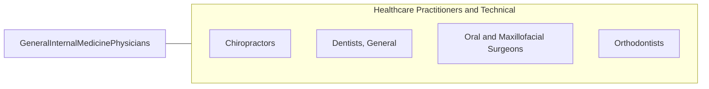

# General Internal Medicine Physicians

> Diagnose and provide nonsurgical treatment for a wide range of diseases and injuries of internal organ systems. Provide care mainly for adults and adolescents, and are based primarily in an outpatient care setting.

## Overview

General Internal Medicine Physicians is an occupation within the Healthcare Practitioners and Technical category. Diagnose and provide nonsurgical treatment for a wide range of diseases and injuries of internal organ systems. 

## Classification Hierarchy

## Key Statistics

| Metric | Value |
|--------|-------|
| SOC Code | 29-1216.00 |
| Category | [Healthcare Practitioners and Technical](/occupations/HealthcarePractitioners) |
| Task Count | 123 |
| Source | O*NET |

## Core Tasks

### analyze.Records

General Internal Medicine Physicians analyze records as part of their core responsibilities.

**Actions:**
- `analyze.Records.to.diagnose.MedicalConditionOfPatient`
- `analyze.Reports.to.diagnose.MedicalConditionOfPatient`
- `analyze.TestResults.to.diagnose.MedicalConditionOfPatient`
- `analyze.ExaminationInformation.to.diagnose.MedicalConditionOfPatient`

### treat.InternalDisorders

General Internal Medicine Physicians treat internal disorders as part of their core responsibilities.

**Actions:**
- `treat.InternalDisorders.of.Lung`
- `treat.InternalDisorders.of.Brain`
- `treat.InternalDisorders.of.Kidney`
- `treat.InternalDisorders.of.GastrointestinalTract`

### manage.CommonHealthProblems

General Internal Medicine Physicians manage common health problems as part of their core responsibilities.

**Actions:**
- `manage.CommonHealthProblems.in.Adolescents`
- `manage.CommonHealthProblems.in.Adults`
- `manage.CommonHealthProblems.in.Elderly`
- `manage.Infections.in.Adolescents`

## Skills & Competencies

### Technical Skills
- **Clinical Skills** - Advanced
- **Diagnostic Procedures** - Advanced
- **Patient Care** - Advanced

### Soft Skills
- **Communication** - Essential
- **Problem Solving** - Essential
- **Critical Thinking** - Important
- **Teamwork** - Important
- **Adaptability** - Important

## Related Occupations

## Industries

This occupation is found across multiple industries. See [Industries](/industries) for sector-specific employment data.

## Career Progression

---

*Source: O*NET 29-1216.00 - ONETOccupation*
