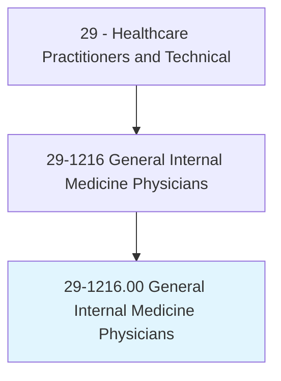
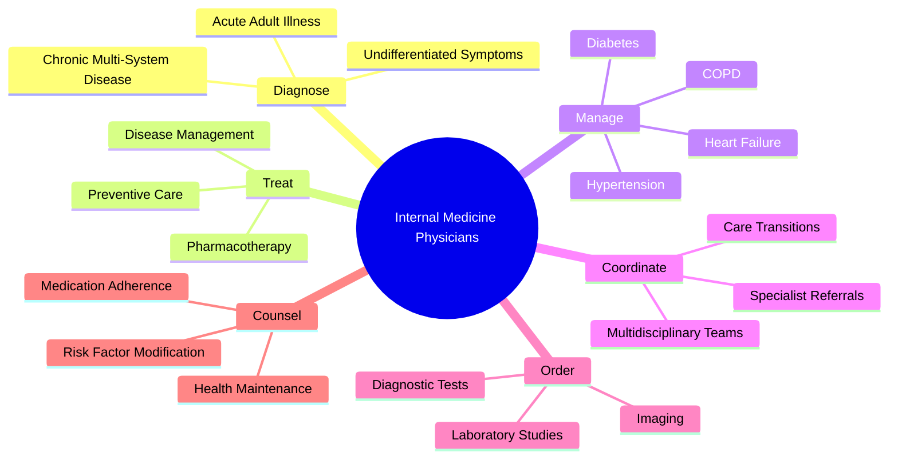
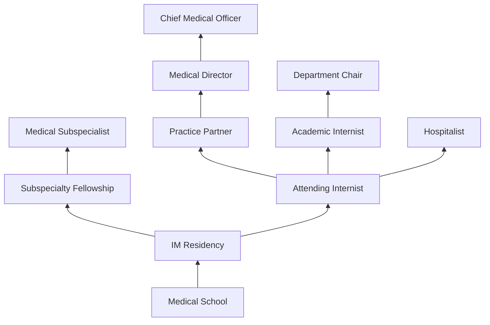
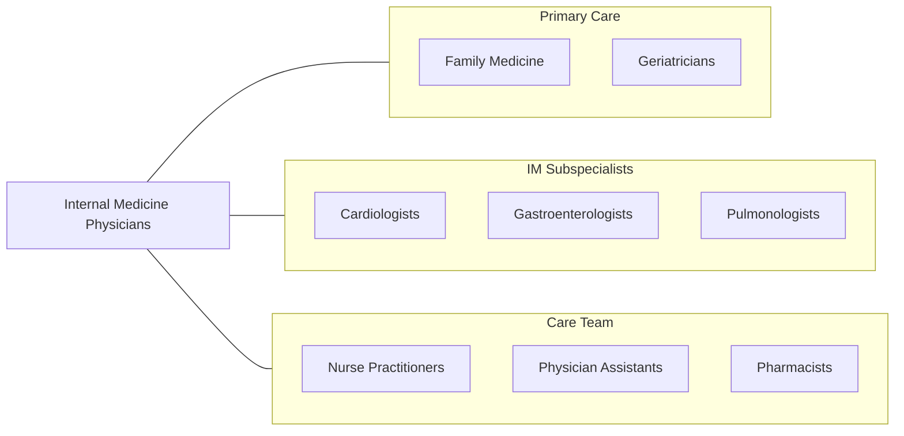

# General Internal Medicine Physicians

> Diagnose and provide nonsurgical treatment for a wide range of diseases and injuries of internal organ systems. Provide care mainly for adults and adolescents, and are based primarily in an outpatient care setting.

## Overview

General Internal Medicine Physicians (Internists) are primary care specialists who focus on the prevention, diagnosis, and treatment of adult diseases. They manage complex, multi-system conditions and are experts in diagnostic reasoning, making them the "doctor's doctor" for adult medicine. Internists handle the full spectrum of adult health concerns from routine preventive care to the management of chronic diseases such as diabetes, hypertension, heart failure, COPD, and chronic kidney disease.

Internists are trained in the comprehensive evaluation of undifferentiated symptoms and the management of patients with multiple comorbidities. Their expertise in diagnostic workup and evidence-based medicine makes them essential for coordinating care among specialists and ensuring that treatment plans are integrated and patient-centered. They perform detailed histories and physical examinations, order and interpret diagnostic studies, and develop longitudinal treatment plans.

The specialty has embraced population health management, value-based care, and patient-centered medical home models. Internists increasingly use telemedicine, health informatics, and shared decision-making tools to improve outcomes and patient engagement. Many internists serve dual roles as outpatient primary care providers and hospital-based physicians.

## Classification Hierarchy

## Key Statistics

| Metric | Value |
|--------|-------|
| SOC Code | 29-1216.00 |
| Median Annual Salary | $214,370 |
| Employment | ~80,000 |
| Projected Growth | 4% (2022-2032) |
| Job Zone | 5 (Extensive Preparation) |
| Category | [Healthcare Practitioners](/occupations/HealthcarePractitioners) |
| Core Tasks | 70+ |
| Source | O*NET |

## Core Tasks

### diagnose.AdultMedicalConditions

Internists evaluate complex adult medical presentations.

**Actions:**
- `diagnose.AcuteIllness.using.SystematicWorkup` - Diagnostic evaluation
- `diagnose.ChronicDisease.using.LaboratoryAndImaging` - Disease identification
- `diagnose.UndifferentiatedSymptoms.using.ClinicalReasoning` - Diagnostic reasoning
- `interpret.DiagnosticTests.for.ClinicalDecisionMaking` - Results analysis

### manage.ChronicConditions

Internists provide longitudinal chronic disease management.

**Actions:**
- `manage.Diabetes.using.ADAGuidelines` - Glycemic management
- `manage.Hypertension.using.JNC.Guidelines` - Blood pressure control
- `manage.HeartFailure.using.GDMT` - Heart failure optimization
- `manage.COPD.using.GOLDGuidelines` - Pulmonary disease management

### coordinate.ComprehensiveCare

Internists orchestrate multidisciplinary adult care.

**Actions:**
- `coordinate.SpecialistReferrals.for.ComplexConditions` - Referral management
- `coordinate.CareTransitions.between.InpatientAndOutpatient` - Transition planning
- `counsel.Patients.regarding.PreventiveCare` - Health maintenance
- `manage.Polypharmacy.for.MultimorbidPatients` - Medication optimization

## Practice Settings

| Setting | Description |
|---------|-------------|
| Outpatient Internal Medicine | Primary adult care office |
| Hospital-Based Practice | Inpatient medicine |
| Academic Medical Centers | Teaching and research |
| Community Health Centers | Safety-net primary care |
| Concierge/DPC Practice | Membership-based medicine |
| VA Medical Centers | Veteran primary care |
| Telehealth | Virtual primary care |

## Skills & Competencies

### Technical Skills
- **Diagnostic Reasoning** - Expert
- **Chronic Disease Management** - Expert
- **Preventive Medicine** - Expert
- **Pharmacotherapy** - Expert
- **Evidence-Based Medicine** - Expert
- **Procedure Skills (bedside)** - Advanced
- **Electronic Health Records** - Advanced

### Soft Skills
- **Clinical Judgment** - Critical
- **Communication** - Essential
- **Patient Education** - Essential
- **Empathy** - Essential
- **Systems Thinking** - Essential
- **Team Leadership** - Essential

## Education & Training

| Requirement | Details |
|-------------|---------|
| Undergraduate | 4-year bachelor's degree (pre-med) |
| Medical School | 4-year MD or DO program |
| Internal Medicine Residency | 3 years |
| Fellowship | 2-3 years for subspecialization |
| Total Training | 11-14 years post-high school |
| Licensure | State medical license |
| Board Certification | ABIM (American Board of Internal Medicine) |

## Certifications

| Certification | Description |
|---------------|-------------|
| ABIM Internal Medicine | Primary IM board certification |
| ABIM Geriatric Medicine | Geriatric subspecialty |
| ABIM Hospice/Palliative | End-of-life care |
| FACP | Fellow of ACP |
| BLS/ACLS | Life support |

## Career Progression

## Specializations

| Subspecialty | Focus Area |
|-------------|------------|
| Cardiology | Heart disease |
| Gastroenterology | GI disorders |
| Pulmonology | Lung disease |
| Nephrology | Kidney disease |
| Endocrinology | Hormonal disorders |
| Rheumatology | Autoimmune disease |
| Infectious Disease | Infections |
| Geriatric Medicine | Elderly care |

## Technology & Tools

| Technology | Purpose |
|------------|---------|
| Electronic Health Records | Documentation and population health |
| Clinical Decision Support | Evidence-based alerting |
| Telehealth Platforms | Virtual visits |
| Point-of-Care Ultrasound | Bedside imaging |
| Patient Portal Systems | Patient engagement |
| Risk Calculators | Cardiovascular and disease risk |

## Related Occupations

## Industries

- [Physician Offices](/industries/Healthcare/PhysicianOffices) - Primary Practice
- [Hospitals](/industries/Healthcare/Hospitals/index) - Hospital Medicine
- [Academic Medical Centers](/industries/Healthcare/Hospitals/Teaching) - Teaching
- [Community Health Centers](/industries/Healthcare/CommunityHealthCenters) - FQHCs
- [Government](/industries/Government) - VA and Military

## Departments

This occupation typically works in:
- [Internal Medicine](/departments/InternalMedicine)
- [Primary Care](/departments/PrimaryCare)
- [Hospital Medicine](/departments/HospitalMedicine)
- [Geriatric Medicine](/departments/GeriatricMedicine)

---

*Source: O*NET 29-1216.00 - ONETOccupation*
