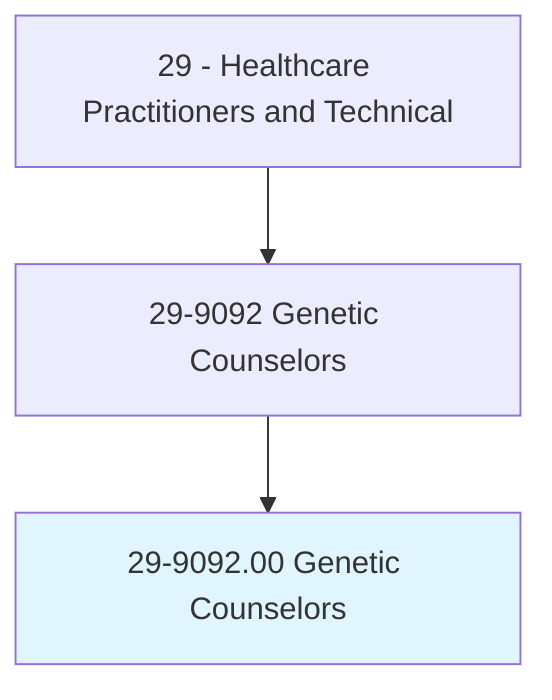
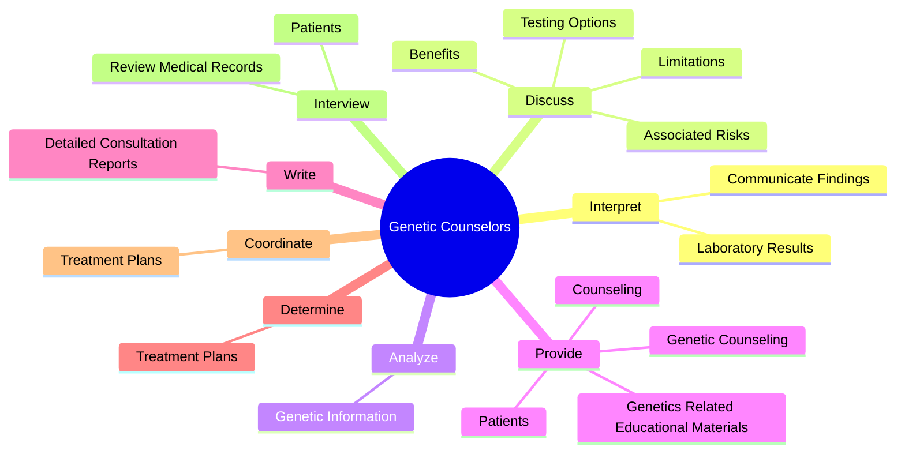
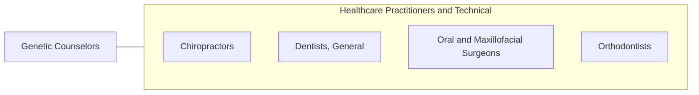

# Genetic Counselors

> Assess individual or family risk for a variety of inherited conditions, such as genetic disorders and birth defects. Provide information to other healthcare providers or to individuals and families concerned with the risk of inherited conditions. Advise individuals and families to support informed decisionmaking and coping methods for those at risk. May help conduct research related to genetic conditions or genetic counseling.

## Overview

Genetic Counselors is an occupation within the Healthcare Practitioners and Technical category. Assess individual or family risk for a variety of inherited conditions, such as genetic disorders and birth defects. Provide information to other healthcare providers or to individuals and families concerned with the risk of inherited conditions.

## Classification Hierarchy

## Key Statistics

| Metric | Value |
|--------|-------|
| SOC Code | 29-9092.00 |
| Category | [Healthcare Practitioners and Technical](/occupations/HealthcarePractitioners) |
| Task Count | 102 |
| Source | O*NET |

## Core Tasks

### interpret.LaboratoryResults

Genetic Counselors interpret laboratory results as part of their core responsibilities.

**Actions:**
- `interpret.LaboratoryResults.to.Patients`
- `interpret.LaboratoryResults.to.Physicians`
- `interpret.CommunicateFindings.to.Patients`
- `interpret.CommunicateFindings.to.Physicians`

### discuss.TestingOptions

Genetic Counselors discuss testing options as part of their core responsibilities.

**Actions:**
- `discuss.TestingOptions.with.Patients.to.assist.ThemInMakingInformedDecisions`
- `discuss.TestingOptions.with.Families.to.assist.ThemInMakingInformedDecisions`
- `discuss.AssociatedRisks.with.Patients.to.assist.ThemInMakingInformedDecisions`
- `discuss.AssociatedRisks.with.Families.to.assist.ThemInMakingInformedDecisions`

### analyze.GeneticInformation

Genetic Counselors analyze genetic information as part of their core responsibilities.

**Actions:**
- `analyze.GeneticInformation.to.identify.PatientsAtRiskForSpecificDisordersSyndromes`
- `analyze.GeneticInformation.to.FamiliesAtRiskForSpecificDisordersSyndromes`

## Skills & Competencies

### Technical Skills
- **Clinical Skills** - Advanced
- **Diagnostic Procedures** - Advanced
- **Patient Care** - Advanced

### Soft Skills
- **Communication** - Essential
- **Problem Solving** - Essential
- **Critical Thinking** - Important
- **Teamwork** - Important
- **Adaptability** - Important

## Related Occupations

## Industries

This occupation is found across multiple industries. See [Industries](/industries) for sector-specific employment data.

## Career Progression

---

*Source: O*NET 29-9092.00 - ONETOccupation*
