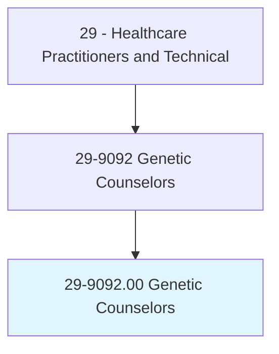
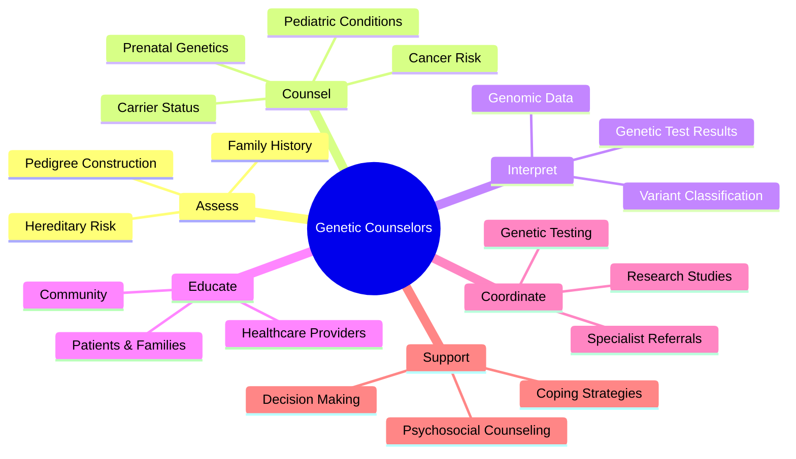
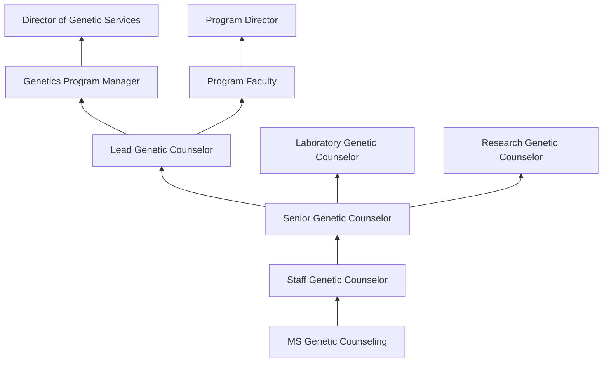
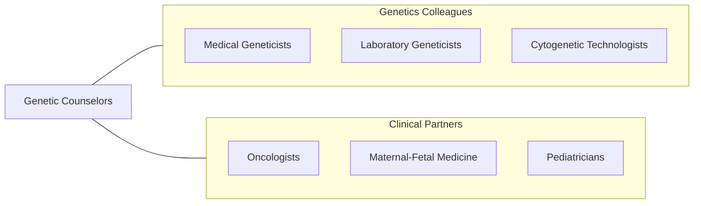

# Genetic Counselors

> Assess individual or family risk for a variety of inherited conditions, such as genetic disorders and birth defects. Provide information to other healthcare providers or to individuals and families concerned with the risk of inherited conditions. Advise individuals and families with genetic disorders on the course of action to take, considering the risks.

## Overview

Genetic Counselors are master's-level healthcare professionals who help individuals and families understand genetic information, assess hereditary disease risk, interpret genetic test results, and make informed decisions about genetic testing and management. They provide counseling for prenatal genetic conditions, cancer predisposition syndromes, pediatric genetic disorders, cardiovascular genetics, and pharmacogenomics.

The role encompasses risk assessment using family history analysis and pedigree construction, ordering and interpreting genetic tests (chromosomal microarray, whole exome sequencing, targeted gene panels), communicating complex genetic information in understandable terms, addressing psychosocial aspects of genetic diagnoses, and coordinating care with medical geneticists and other specialists. Genetic counselors serve as advocates who empower patients to make autonomous decisions about their healthcare.

The field has expanded dramatically with the genomic revolution, direct-to-consumer genetic testing, precision medicine, and expanded carrier screening. Genetic counselors now work in specialty areas including cancer genomics, prenatal screening (NIPT, carrier screening), neurogenetics, cardio-genetics, and laboratory genomics. Telegenetics has expanded access to genetic counseling services in underserved areas.

## Classification Hierarchy

## Key Statistics

| Metric | Value |
|--------|-------|
| SOC Code | 29-9092.00 |
| Median Annual Salary | $85,700 |
| Employment | ~5,100 |
| Projected Growth | 18% (2022-2032, much faster than average) |
| Job Zone | 5 (Extensive Preparation) |
| Category | [Healthcare Practitioners](/occupations/HealthcarePractitioners) |
| Core Tasks | 30+ |
| Source | O*NET |

## Core Tasks

### assess.GeneticRisk

Genetic Counselors evaluate hereditary disease risk.

**Actions:**
- `assess.FamilyHistory.using.PedigreeAnalysis` - Risk assessment
- `calculate.HereditaryRisk.using.RiskModels` - Statistical modeling
- `evaluate.GeneticTestResults.for.ClinicalSignificance` - Result interpretation
- `classify.GeneticVariants.using.ACMGGuidelines` - Variant interpretation

### counsel.PatientsAndFamilies

Genetic Counselors provide supportive genetic counseling.

**Actions:**
- `counsel.Patients.regarding.InheritancePatterns` - Genetic education
- `counsel.Families.regarding.ReproductiveOptions` - Prenatal counseling
- `support.Patients.through.GeneticDiagnosis` - Psychosocial support
- `facilitate.InformedDecisionMaking.for.GeneticTesting` - Informed consent

## Practice Settings

| Setting | Description |
|---------|-------------|
| Academic Medical Centers | Comprehensive genetics services |
| Cancer Centers | Hereditary cancer risk assessment |
| Prenatal Clinics | Prenatal genetic counseling |
| Pediatric Hospitals | Pediatric genetics |
| Genetic Testing Laboratories | Variant interpretation |
| Telegenetics | Remote genetic counseling |
| Private Practice | Independent counseling |

## Skills & Competencies

### Technical Skills
- **Pedigree Analysis** - Expert
- **Genetic Test Interpretation** - Expert
- **Risk Assessment Models** - Expert
- **Variant Classification (ACMG)** - Expert
- **Genomic Medicine** - Advanced
- **Psychosocial Counseling** - Advanced
- **Research Methods** - Advanced

### Soft Skills
- **Empathy** - Critical
- **Communication** - Critical
- **Active Listening** - Essential
- **Cultural Sensitivity** - Essential
- **Critical Thinking** - Essential

## Education & Training

| Requirement | Details |
|-------------|---------|
| Undergraduate | Bachelor's degree in genetics, biology, or related field |
| Graduate | Master's degree from ACGC-accredited program (2 years) |
| Clinical Training | Supervised clinical rotations in multiple specialties |
| Certification | ABGC board certification |
| State Licensure | Required in most states |
| Continuing Education | Per ABGC requirements |

## Certifications

| Certification | Description |
|---------------|-------------|
| CGC | Certified Genetic Counselor (ABGC) |
| State License | State-specific genetic counselor license |
| ABMGG | American Board of Medical Genetics (lab geneticist pathway) |

## Career Progression

## Specializations

| Focus Area | Description |
|------------|-------------|
| Cancer Genetics | Hereditary cancer syndromes |
| Prenatal Genetics | Fetal anomalies and carrier screening |
| Pediatric Genetics | Childhood genetic disorders |
| Cardiovascular Genetics | Inherited heart conditions |
| Neurogenetics | Huntington's, ALS, hereditary neuropathies |
| Laboratory Genomics | Variant interpretation and reporting |
| Pharmacogenomics | Drug-gene interactions |

## Technology & Tools

| Technology | Purpose |
|------------|---------|
| Genetic Testing Platforms (Illumina, PacBio) | Sequencing technology |
| Variant Interpretation Tools (ClinVar, gnomAD) | Variant classification |
| Pedigree Software (Progeny, Cyrillic) | Family history documentation |
| Risk Calculation Models (BRCAPRO, Tyrer-Cuzick) | Cancer risk modeling |
| Telehealth Platforms | Remote counseling |
| EHR Genetics Modules | Documentation |

## Related Occupations

## Industries

- [Hospitals](/industries/Healthcare/Hospitals/index) - Clinical Genetics
- [Academic Medical Centers](/industries/Education) - Research and Teaching
- [Genetic Testing Labs](/industries/Healthcare/MedicalLaboratories) - Lab Genomics
- [Pharmaceutical](/industries/Manufacturing/ChemicalManufacturing/Pharmaceutical) - Clinical Trials
- [Telehealth](/industries/Healthcare/AmbulatoryHealthCare) - Remote Counseling

## Departments

This occupation typically works in:
- [Medical Genetics](/departments/MedicalGenetics)
- [Cancer Genetics](/departments/CancerGenetics)
- [Prenatal Genetics](/departments/PrenatalGenetics)
- [Genomic Medicine](/departments/GenomicMedicine)

---

*Source: O*NET 29-9092.00 - ONETOccupation*
