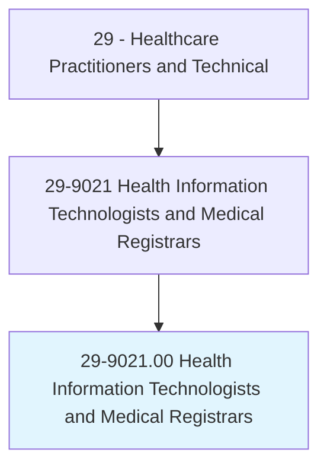
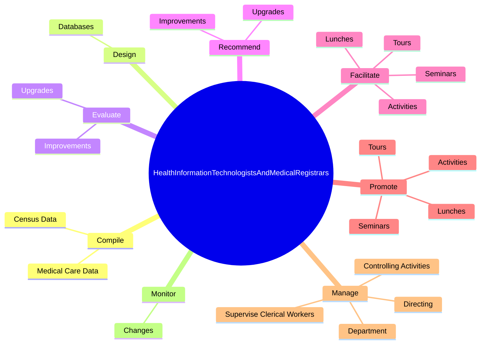

# Health Information Technologists and Medical Registrars

> Apply knowledge of healthcare and information systems to assist in the design, development, and continued modification and analysis of computerized healthcare systems. Abstract, collect, and analyze treatment and followup information of patients. May educate staff and assist in problem solving to promote the implementation of the healthcare information system. May design, develop, test, and implement databases with complete history, diagnosis, treatment, and health status to help monitor diseases.

## Overview

Health Information Technologists and Medical Registrars is an occupation within the Healthcare Practitioners and Technical category. Apply knowledge of healthcare and information systems to assist in the design, development, and continued modification and analysis of computerized healthcare systems. Abstract, collect, and analyze treatment and followup information of patients.

## Classification Hierarchy

## Key Statistics

| Metric | Value |
|--------|-------|
| SOC Code | 29-9021.00 |
| Category | [Healthcare Practitioners and Technical](/occupations/HealthcarePractitioners) |
| Task Count | 60 |
| Source | O*NET |

## Core Tasks

### compile.MedicalCareData

Health Information Technologists and Medical Registrars compile medical care data as part of their core responsibilities.

**Actions:**
- `compile.MedicalCareData.for.StatisticalReports.on.DiseasesTreated`
- `compile.MedicalCareData.for.SurgeryPerformed`
- `compile.MedicalCareData.for.Use.of.HospitalBeds`
- `compile.CensusData.for.StatisticalReports.on.DiseasesTreated`

### design.Databases

Health Information Technologists and Medical Registrars design databases as part of their core responsibilities.

**Actions:**
- `design.Databases.to.support.HealthcareApplications`
- `design.Databases.to.EnsuringSecurity`

### evaluate.Upgrades

Health Information Technologists and Medical Registrars evaluate upgrades as part of their core responsibilities.

**Actions:**
- `evaluate.Upgrades.to.ExistingComputerizedHealthcareSystems`
- `evaluate.Improvements.to.ExistingComputerizedHealthcareSystems`

## Skills & Competencies

### Technical Skills
- **Clinical Skills** - Advanced
- **Diagnostic Procedures** - Advanced
- **Patient Care** - Advanced

### Soft Skills
- **Communication** - Essential
- **Problem Solving** - Essential
- **Critical Thinking** - Important
- **Teamwork** - Important
- **Adaptability** - Important

## Related Occupations

## Industries

This occupation is found across multiple industries. See [Industries](/industries) for sector-specific employment data.

## Career Progression

---

*Source: O*NET 29-9021.00 - ONETOccupation*
