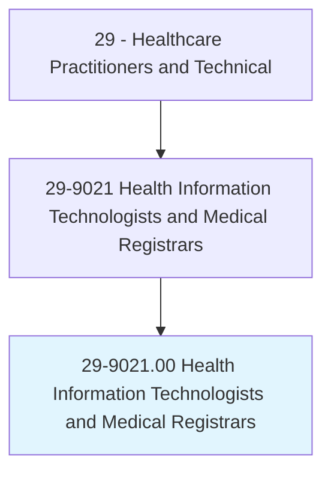
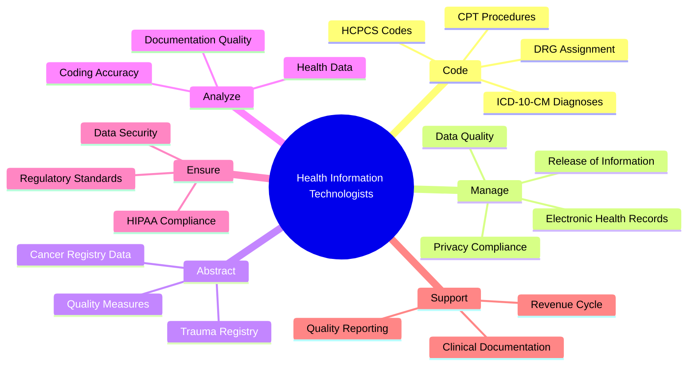
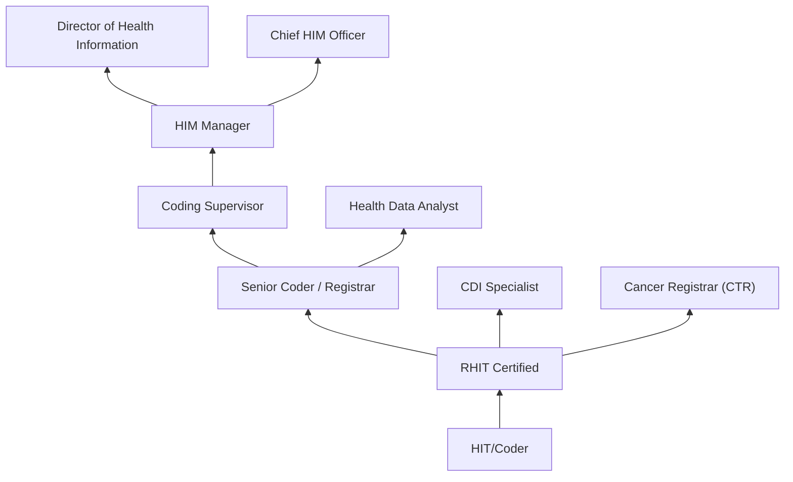
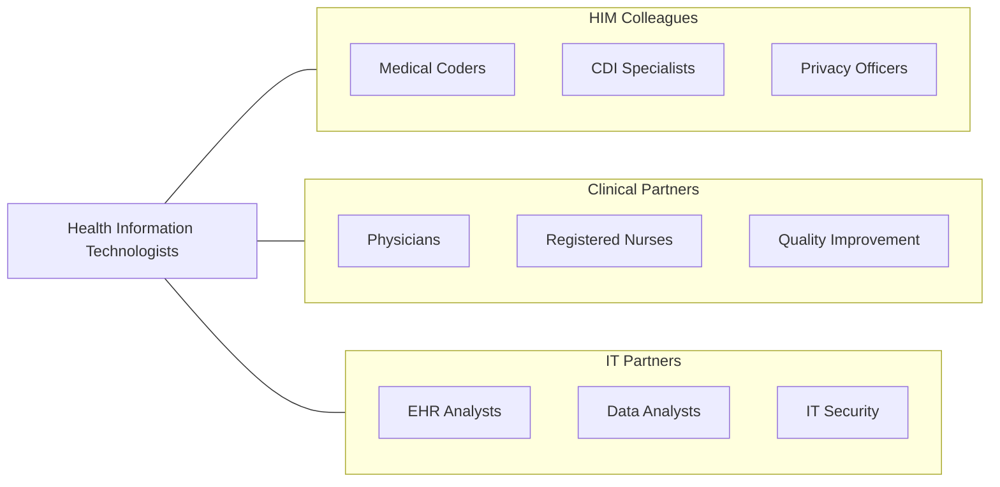

# Health Information Technologists and Medical Registrars

> Compile, process, and maintain medical records of hospital and clinic patients in a manner consistent with medical, administrative, ethical, legal, and regulatory requirements of the health care system.

## Overview

Health Information Technologists and Medical Registrars are professionals who manage, organize, and protect patient health information and medical records. They ensure the accuracy, accessibility, and security of clinical data by assigning diagnostic and procedural codes (ICD-10-CM, CPT, HCPCS), maintaining electronic health records, abstracting clinical data for registries, managing release of information requests, and ensuring compliance with HIPAA privacy regulations and healthcare documentation standards.

The role encompasses medical coding, health data analysis, cancer registry management, clinical documentation improvement (CDI), health information exchange, and data governance. Medical registrars specifically maintain disease-specific databases such as cancer registries (following Commission on Cancer and NAACCR standards), trauma registries, and transplant registries, abstracting complex clinical information for epidemiologic surveillance and outcomes research.

The field has been transformed by electronic health records, interoperability standards (HL7 FHIR), artificial intelligence in coding, natural language processing for clinical documentation, and the growing emphasis on data analytics in population health management. Health information professionals are essential to healthcare quality measurement, value-based payment models, and clinical research data infrastructure.

## Classification Hierarchy

## Key Statistics

| Metric | Value |
|--------|-------|
| SOC Code | 29-9021.00 |
| Median Annual Salary | $58,250 |
| Employment | ~108,000 |
| Projected Growth | 16% (2022-2032, much faster than average) |
| Job Zone | 3 (Medium Preparation) |
| Category | [Healthcare Practitioners](/occupations/HealthcarePractitioners) |
| Core Tasks | 35+ |
| Source | O*NET |

## Core Tasks

### code.MedicalRecords

Health Information Technologists assign standardized codes.

**Actions:**
- `assign.DiagnosisCodes.using.ICD10CM` - Diagnosis coding
- `assign.ProcedureCodes.using.CPTAndHCPCS` - Procedure coding
- `validate.CodingAccuracy.for.ReimbursementCompliance` - Code auditing
- `improve.ClinicalDocumentation.for.AccurateCoding` - CDI

### manage.HealthInformation

Health Information Technologists maintain data integrity.

**Actions:**
- `manage.ElectronicHealthRecords.for.DataIntegrity` - EHR management
- `process.ReleaseOfInformation.per.HIPAARegulations` - ROI processing
- `abstract.ClinicalData.for.CancerRegistry` - Registry abstraction
- `ensure.DataSecurity.per.PrivacyRegulations` - Security compliance

## Practice Settings

| Setting | Description |
|---------|-------------|
| Hospitals | Inpatient health information services |
| Physician Offices | Outpatient coding and records |
| Insurance Companies | Claims review and coding |
| Government Agencies | Public health data management |
| Health IT Companies | EHR and software vendors |
| Consulting Firms | Coding audit and compliance |
| Cancer Registries | Tumor registry management |

## Skills & Competencies

### Technical Skills
- **Medical Coding (ICD-10, CPT)** - Expert
- **Electronic Health Records** - Expert
- **HIPAA Compliance** - Expert
- **Cancer Registry Abstraction** - Advanced
- **Clinical Documentation Improvement** - Advanced
- **Health Data Analytics** - Advanced
- **Revenue Cycle Management** - Advanced

### Soft Skills
- **Attention to Detail** - Critical
- **Analytical Thinking** - Essential
- **Communication** - Essential
- **Ethics/Integrity** - Critical
- **Organization** - Essential

## Education & Training

| Requirement | Details |
|-------------|---------|
| Education | Associate or bachelor's degree in health information |
| Accreditation | CAHIIM-accredited program |
| Certification | RHIT or RHIA credential |
| Continuing Education | Per AHIMA requirements |

## Certifications

| Certification | Description |
|---------------|-------------|
| RHIT | Registered Health Information Technician (AHIMA) |
| RHIA | Registered Health Information Administrator (AHIMA) |
| CCS | Certified Coding Specialist (AHIMA) |
| CPC | Certified Professional Coder (AAPC) |
| CTR | Certified Tumor Registrar (NCRA) |
| CDIP | Certified Documentation Improvement Practitioner |
| CHPS | Certified in Healthcare Privacy and Security |

## Career Progression

## Specializations

| Focus Area | Description |
|------------|-------------|
| Medical Coding | ICD-10 and CPT coding specialist |
| Cancer Registry | Tumor data abstraction and reporting |
| Clinical Documentation Improvement | CDI specialist |
| Health Data Analytics | Population health data analysis |
| Privacy and Security | HIPAA compliance officer |
| Revenue Cycle | Coding and billing optimization |

## Technology & Tools

| Technology | Purpose |
|------------|---------|
| EHR Systems (Epic, Cerner, Meditech) | Health record management |
| Coding Software (3M, Optum) | Computer-assisted coding |
| Cancer Registry Software (CNEXT, METRIQ) | Registry abstraction |
| CDI Tools (Nuance, Iodine) | Documentation improvement |
| Health Information Exchanges | Data interoperability |
| Analytics Platforms | Health data analysis |

## Related Occupations

## Industries

- [Hospitals](/industries/Healthcare/Hospitals/index) - Inpatient HIM
- [Physician Offices](/industries/Healthcare/PhysicianOffices) - Outpatient Coding
- [Insurance](/industries/Insurance) - Claims Review
- [Government](/industries/Government) - Public Health Data
- [Health IT](/industries/Information/SoftwarePublishers) - EHR Vendors

## Departments

This occupation typically works in:
- [Health Information Management](/departments/HealthInformationManagement)
- [Medical Coding](/departments/MedicalCoding)
- [Cancer Registry](/departments/CancerRegistry)
- [Revenue Cycle](/departments/RevenueCycle)
- [Compliance](/departments/Compliance)

---

*Source: O*NET 29-9021.00 - ONETOccupation*
