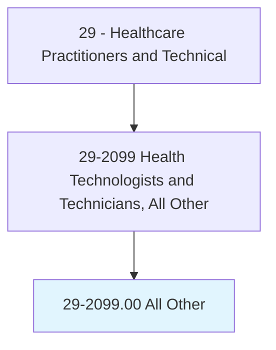
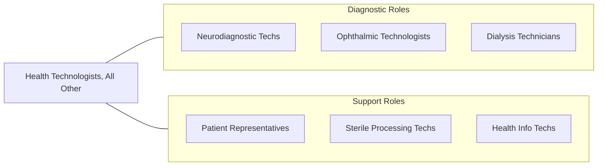

# Health Technologists and Technicians, All Other

> All health technologists and technicians not listed separately.

## Overview

Health Technologists and Technicians, All Other encompasses specialized health technology professionals not separately classified in the SOC system. This includes neurodiagnostic technologists, ophthalmic medical technologists, patient representatives, dialysis technicians, sterile processing technicians, surgical neurophysiologists, and other technical healthcare workers who require specialized training and certification to perform diagnostic, therapeutic, or support functions.

These professionals operate specialized equipment, perform technical procedures, collect and analyze clinical data, and support licensed practitioners in delivering healthcare services. They typically hold associate degrees or certificates, maintain professional certifications, and work under the supervision of physicians, advanced practice providers, or other licensed healthcare professionals.

The category continues to grow as medical technology advances create new specialized roles in areas such as telehealth support, remote patient monitoring, point-of-care testing, and clinical informatics support.

## Classification Hierarchy

## Key Statistics

| Metric | Value |
|--------|-------|
| SOC Code | 29-2099.00 |
| Median Annual Salary | $48,820 |
| Employment | ~85,000 |
| Projected Growth | 8% (2022-2032) |
| Job Zone | 3 (Medium Preparation) |
| Category | [Healthcare Practitioners](/occupations/HealthcarePractitioners) |
| Source | O*NET |

## Included Occupations

| Specialty | SOC Code |
|-----------|----------|
| [Neurodiagnostic Technologists](/occupations/HealthcarePractitioners/NeurodiagnosticTechnologists) | 29-2099.01 |
| [Ophthalmic Medical Technologists](/occupations/HealthcarePractitioners/OphthalmicMedicalTechnologists) | 29-2099.05 |
| [Patient Representatives](/occupations/HealthcarePractitioners/PatientRepresentatives) | 29-2099.08 |
| Dialysis Technicians | 29-2099.XX |
| Other Health Technicians | Various |

## Related Occupations

## Industries

- [Hospitals](/industries/Healthcare/Hospitals/index) - Various Departments
- [Ambulatory Healthcare](/industries/Healthcare/AmbulatoryHealthCare) - Outpatient Services
- [Physician Offices](/industries/Healthcare/PhysicianOffices) - Medical Practice

## Departments

This occupation category typically works in:
- [Various Technical Departments](/departments/ClinicalServices)
- [Diagnostic Services](/departments/DiagnosticServices)
- [Patient Support Services](/departments/PatientSupport)

---

*Source: O*NET 29-2099.00 - ONETOccupation*
